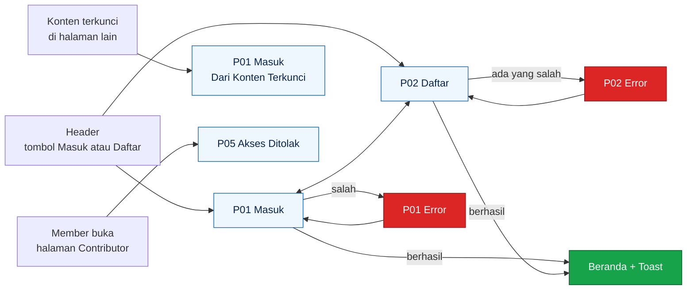

# UI Auth Build Sheet

Lembar kerja buat ngegambar halaman autentikasi Sparein di Figma: **Masuk (P01)**, **Daftar (P02)**, **Akses ditolak (P05)**, plus komponen yang dibutuhin dan teks yang tampil di tiap state. Ukuran, warna, dan gaya ngikutin [`UI-Specs.md`](UI-Specs.md) dan [`DESIGN-SYSTEM.md`](DESIGN-SYSTEM.md). Kalau ada yang beda, `UI-Specs.md` yang menang, kecuali di bagian [Catatan penyesuaian](#9-catatan-penyesuaian) yang sengaja nyebutin bedanya.

Tinggal ikutin urutan dari atas ke bawah. Semua angka dalam piksel (px).

## Daftar isi

1. [Yang bakal digambar](#1-yang-bakal-digambar)
2. [Siapin file dulu](#2-siapin-file-dulu)
3. [Komponen yang dibikin duluan](#3-komponen-yang-dibikin-duluan)
4. [Frame P01 Masuk](#4-frame-p01-masuk)
5. [Frame P02 Daftar](#5-frame-p02-daftar)
6. [Frame P05 Akses ditolak](#6-frame-p05-akses-ditolak)
7. [Frame pendukung](#7-frame-pendukung)
8. [Sambungan prototype](#8-sambungan-prototype)
9. [Catatan penyesuaian](#9-catatan-penyesuaian)
10. [Daftar teks yang tampil](#10-daftar-teks-yang-tampil)
11. [Checklist sebelum selesai](#11-checklist-sebelum-selesai)

---

## 1. Yang bakal digambar

Total ada **16 frame**: 8 buat desktop (1440) dan 8 buat mobile (390).

| # | Nama frame | Desktop | Mobile |
|---|---|---|---|
| 1 | `P01 / Masuk / Default` | ada | ada |
| 2 | `P01 / Masuk / Dari Konten Terkunci` | ada | ada |
| 3 | `P01 / Masuk / Error` | ada | ada |
| 4 | `P02 / Daftar / Default` | ada | ada |
| 5 | `P02 / Daftar / Error` | ada | ada |
| 6 | `P05 / Akses Ditolak / Member` | ada | ada |
| 7 | `P05 / Akses Ditolak / Umum` | ada | ada |
| 8 | `Mobile Menu / Visitor` | tidak perlu | ada |
| 9 | `Toast / Auth` (tiga toast dalam satu frame) | ada | tidak perlu |

Nama lengkapnya ditambahin ukuran di tengah, contoh `P01 / Masuk / Desktop / Default`, sesuai aturan penamaan di `UI-Specs.md` bagian 2.3.

Flow-nya cuma gini:



---

## 2. Siapin file dulu

Ini cuma dikerjain sekali kalau file Figma tim belum punya isinya. Kalau udah ada, lewatin aja.

1. **Color Styles.** Bikin semua warna dari `UI-Specs.md` bagian 3.1 dengan nama persis (`blue/500`, `success`, `danger`, `ink`, `muted`, `surface`, dan seterusnya), termasuk tiga tint 10%: `danger/tint`, `success/tint`, `muted/tint`. Yang kepake di halaman auth: `blue/50`, `blue/200`, `blue/300`, `blue/400`, `blue/500`, `blue/600`, `blue/700`, `blue/950`, `danger`, `danger/tint`, `success`, `ink`, `muted`, `surface`, `white`.
2. **Text Styles.** Yang kepake: `Heading/H1` (32/40, 700), `Body` (16/26, 400), `Body/Strong` (16/26, 600), `Small` (14/20, 400), `Small/Strong` (14/20, 600). Font pakai Inter. Di mobile `Heading/H1` jadi 26/34.
3. **Layout grid.** Desktop: 12 kolom, gutter 24, lebar konten 1120. Mobile: 4 kolom, gutter 16, margin 16.
4. **Ikon Lucide** (pasang plugin Lucide di Figma). Yang kepake: `circle-alert`, `info`, `check-circle`, `eye`, `eye-off`, `shield-x`, `menu`, `x`, `loader-circle` (buat spinner loading), `chevron-right`.
5. **Logo.** Import `docs/brand/sparein-icon.svg` (ikon doang) dan `docs/brand/sparein-lockup.svg` (ikon plus tulisan). Versi dark dipake di footer: `sparein-lockup-dark.svg`.

Jarak cuma boleh dari angka ini: `4, 8, 12, 16, 24, 32, 48, 64`. Kalau butuh 20 pilih 16 atau 24, jangan bikin angka sendiri.

---

## 3. Komponen yang dibikin duluan

Semuanya pakai **auto layout**, dikasih nama `Kategori / Nama`, dan variannya diatur lewat property. Bikin di page `02 Components`. Kalau teman udah bikin komponen yang sama, pake punya dia, jangan bikin ulang.

### 3.1 Button

Nama: `Button / Primary`, `Button / Secondary`.

| Bagian | Nilai |
|---|---|
| Property | `variant` = primary, secondary. `size` = md, sm. `state` = default, hover, pressed, focus, disabled, loading. `fullWidth` = true, false |
| Tinggi | md 44, sm 36 |
| Padding kiri kanan | md 16, sm 12 |
| Radius | 10 |
| Gap ikon dan teks | 8 |
| Teks | md `Body/Strong`, sm `Small/Strong`, rata tengah |
| `fullWidth = true` | lebar Fill container |

| State | Primary | Secondary |
|---|---|---|
| default | isi `blue/500`, teks `white` | isi `white`, teks `blue/500`, garis 1 `blue/200` |
| hover | isi `blue/600` | isi `blue/50` |
| pressed | isi `blue/700` | isi `blue/100` |
| focus | tambah garis luar 2 `blue/400`, jarak 2 dari tombol | sama |
| disabled | isi `blue/300`, teks `white` | teks `blue/300`, garis `blue/100` |
| loading | ikon `loader-circle` 20 muncul di kiri teks, teks berubah jadi "Memproses...", warna kayak default | sama |

Di halaman auth yang kepake: Primary md fullWidth (Masuk, Daftar), Primary md (tombol di halaman 403), Secondary md (tombol kedua di 403), Primary sm dan Secondary sm (header).

### 3.2 Text Input

Nama: `Input / Text`.

| Bagian | Nilai |
|---|---|
| Property | `type` = text, password. `state` = default, hover, focus, filled, error, disabled |
| Tinggi | 44 |
| Lebar | Fill container |
| Padding | 12 kiri kanan |
| Radius | 10 |
| Isi | isi `white`, garis 1 `blue/200` |
| Teks isi | `Body`, `ink` |
| Placeholder | `Body`, `muted` |

| State | Beda dari default |
|---|---|
| hover | garis `blue/300` |
| focus | garis luar 2 `blue/400`, jarak 2 |
| filled | sama kayak default, tapi ada teks `ink` (bukan placeholder) |
| error | garis 1 `danger`. Kalau lagi fokus, ring tetap `blue/400` |
| disabled | isi `surface`, teks `muted` |

**Varian `type = password`:** padding kanan jadi 48, di ujung kanan ada Icon Button `eye` ukuran 44x44 (ikon 20, warna `muted`, hover `ink`). Kalau passwordnya lagi kelihatan, ikonnya jadi `eye-off`. Buat teks password yang lagi disembunyiin, tulis bulatan (••••••••) di Figma. Ikon ini wajib punya catatan teks `aria-label: Tampilkan password` atau `Sembunyikan password`, tulis di samping komponen pake sticky note.

### 3.3 Form Field

Nama: `Form / Field`. Ini pembungkus label, input, dan pesan.

| Bagian | Nilai |
|---|---|
| Susunan | vertikal, gap 8 |
| Label | `Small/Strong`, `ink`. Kalau wajib, tambah `*` warna `danger` di kanan teks, jarak 4 |
| Slot input | taruh instance `Input / Text` |
| Helper text | `Small`, `muted`. Tampil kalau `message = helper` |
| Error text | `Small`, `danger`, ada ikon `circle-alert` 16 di kiri, gap 4. Tampil kalau `message = error`. Gantiin helper text, bukan nambah |
| Property | `required` = true, false. `message` = none, helper, error |

Label selalu kelihatan. Jangan cuma ngandelin placeholder.

### 3.4 Info Card (dua varian)

Nama: `Card / Info`.

| Bagian | `variant = info` | `variant = error` |
|---|---|---|
| Isi | `blue/50` | `danger/tint` |
| Garis kiri | 4 `blue/500` | 4 `danger` |
| Ikon | `info` 20, `blue/500` | `circle-alert` 20, `danger` |
| Teks | `Small`, `ink` | `Small`, `ink` |
| Padding | 12 atas bawah, 16 kiri kanan | sama |
| Radius | 0 di sisi kiri, 10 di sisi kanan | sama |
| Gap ikon dan teks | 12 | 12 |
| Lebar | Fill container | Fill container |

Varian `error` ini baru, belum ada di `UI-Specs.md`. Dipake buat pesan "username atau password salah" di login. Tetap ada ikon dan teks jadi ngga cuma ngandelin warna.

### 3.5 Toast

Nama: `Toast`. Property `variant` = success, error, info.

| Bagian | Nilai |
|---|---|
| Lebar | 360 di desktop, Fill container (390 dikurangi margin 16 kiri kanan) di mobile |
| Isi | `white`, garis 1 `blue/200`, radius 14 |
| Garis kiri | 4, warna sesuai varian (`success`, `danger`, `blue/500`) |
| Padding | 16 |
| Susunan | horizontal, gap 12 |
| Ikon | 20, `check-circle` (success), `circle-alert` (error), `info` (info), warna sesuai varian |
| Teks | `Body`, `ink` |
| Tombol tutup | Icon Button `x`, 44x44 |

Posisi di frame: desktop pojok kanan atas, 16 di bawah header, 16 dari tepi kanan. Mobile di tengah atas, 8 di bawah header.

### 3.6 Link

Nama: `Link / Inline`. Teks `blue/700`, bergaris bawah, `Body/Strong`. Hover `blue/600`. Focus: garis luar 2 `blue/400`. Alasan pakai `blue/700` (bukan `blue/500`) ada di [bagian 9](#9-catatan-penyesuaian).

### 3.7 Header, Mobile Menu, dan Footer

Cukup versi **Visitor**. Kalau komponen punya teman lain, pake punya dia.

| Komponen | Isi |
|---|---|
| `Header / Visitor / Desktop` | Tinggi 64, isi `white`, garis bawah 1 `blue/200`. Kiri: logo lockup tinggi 28, lalu menu teks `Perangkat`, `Diagnosa`, `Panduan`, `Suku Cadang` (`Body`, `ink`, gap 24). Kanan: `Button / Secondary` sm "Masuk" lalu `Button / Primary` sm "Daftar", gap 8. Padding kiri kanan ngikutin grid (160) |
| `Header / Visitor / Mobile` | Tinggi 56. Kiri: logo lockup. Kanan: Icon Button `menu` 44x44 |
| `Mobile Menu / Visitor` | Lihat [bagian 7.1](#71-mobile-menu-visitor) |
| `Footer / Desktop` dan `Footer / Mobile` | Isi `blue/950`. Isinya: lockup dark, tagline "Repair first, discard last.", kolom link, catatan iFixit, dan baris bawah "Kelompok 1 · Pemrograman Berbasis Platform · Fasilkom UI · 2026". Detail lengkap ada di `UI-Specs.md` komponen C34 |

Di halaman auth ngga ada menu yang diberi tanda aktif.

---

## 4. Frame P01 Masuk

URL kode: `/accounts/login/`. Template: `core/templates/registration/login.html`.

### 4.1 Frame desktop, Default

**Frame:** `P01 / Masuk / Desktop / Default`. Lebar 1440, tinggi minimal 900 (biar footer tetap di bawah, tingginya Hug aja kalau isi lebih panjang).

**Struktur layer (semua auto layout vertikal kecuali disebut lain):**

```
Frame 1440 x 900, isi surface, gap 0
├─ Header / Visitor / Desktop           tinggi 64
├─ Main                                 Fill container, isi surface
│   padding 64 atas, 64 bawah, align tengah horizontal
│   └─ Auth Card                        lebar 440, tinggi Hug
│       isi white, garis 1 blue/200, radius 14
│       padding 32, gap 24, align tengah
│       ├─ Heading Group                gap 16, align tengah
│       │   ├─ Logo ikon 48 x 48
│       │   └─ Judul "Masuk ke Sparein"   Heading/H1, ink, rata tengah
│       ├─ Form                         gap 24, lebar Fill
│       │   ├─ Form / Field  Username
│       │   ├─ Form / Field  Password
│       │   └─ Button / Primary  "Masuk"  md, fullWidth
│       └─ Teks bawah                   Body, muted, rata tengah
│           "Belum punya akun? " + Link / Inline "Daftar"
└─ Footer / Desktop
```

Tinggi kartu kira-kira 470. Ngga usah dikasih tinggi tetap, biarin auto layout yang ngatur.

**Isi tiap field:**

| Field | Label | Wajib | Type | Placeholder | Helper |
|---|---|---|---|---|---|
| Username | Username | ya | text | kosong | tidak ada |
| Password | Password | ya | password | kosong | tidak ada |

Kedua field `state = default`, `message = none`.

**Wireframe:**

```
┌────────────────────────────────────────────────────────────────────┐
│ [Sparein]  Perangkat  Diagnosa  Panduan  Suku Cadang  [Masuk][Daftar]
├────────────────────────────────────────────────────────────────────┤
│                         (latar surface)                            │
│                  ┌──────────────────────────┐                      │
│                  │          (logo)          │                      │
│                  │     Masuk ke Sparein     │                      │
│                  │                          │                      │
│                  │ Username *               │                      │
│                  │ [                      ] │                      │
│                  │ Password *               │                      │
│                  │ [                  (o) ] │                      │
│                  │                          │                      │
│                  │ [        Masuk         ] │                      │
│                  │                          │                      │
│                  │ Belum punya akun? Daftar │                      │
│                  └──────────────────────────┘                      │
├────────────────────────────────────────────────────────────────────┤
│ Footer                                                             │
└────────────────────────────────────────────────────────────────────┘
```

### 4.2 Frame desktop, Dari Konten Terkunci

**Frame:** `P01 / Masuk / Desktop / Dari Konten Terkunci`. Duplikat frame Default, terus tambahin satu elemen:

- Di dalam `Auth Card`, antara `Heading Group` dan `Form`, taruh `Card / Info` varian `info` dengan teks **"Masuk dulu ya buat lanjut."**

Tinggi kartu nambah kira-kira 64 (jadi sekitar 534). Sisanya sama persis.

Buat nyambungin ke desain lain: frame ini muncul waktu Visitor ngeklik tombol di kotak `Locked Content` (contoh di detail panduan) atau tombol simpan panduan.

### 4.3 Frame desktop, Error

**Frame:** `P01 / Masuk / Desktop / Error`. Duplikat Default, terus ubah:

| Elemen | Perubahan |
|---|---|
| Antara `Heading Group` dan `Form` | Tambah `Card / Info` varian **error** dengan teks "Username atau password salah. Coba cek lagi ya." |
| Field Username | Tetap kebuka, `state = filled`, isi contoh `sari_ayu` |
| Field Password | `state = default`, kosong (password dikosongin lagi setelah gagal) |

Tinggi kartu kira-kira 534. Di kode nanti, kotak error muncul sebagai satu pesan di atas form dan bukan di bawah salah satu field. Jadi ngga ada pesan error per field di frame ini.

### 4.4 Frame mobile

**Frame:** `P01 / Masuk / Mobile / Default`, `... / Dari Konten Terkunci`, `... / Error`. Lebar 390, tinggi minimal 844.

Struktur sama kayak desktop dengan perubahan:

| Elemen | Desktop | Mobile |
|---|---|---|
| Header | `Header / Visitor / Desktop` (64) | `Header / Visitor / Mobile` (56) |
| Main padding | 64 atas dan bawah | 32 atas, 48 bawah, 16 kiri kanan |
| Auth Card lebar | 440 tetap | Fill container (358) |
| Auth Card garis | 1 `blue/200` | **tanpa garis**, isi tetap `white`, radius 14 |
| Auth Card padding | 32 | 24 |
| Judul | `Heading/H1` 32/40 | `Heading/H1` versi mobile 26/34 |
| Footer | `Footer / Desktop` | `Footer / Mobile` |

Tombol Masuk tetap fullWidth. Ukuran target sentuh minimal 44, jadi tinggi tombol dan input jangan dikecilin.

---

## 5. Frame P02 Daftar

URL kode: `/register/`. Template: `core/templates/core/register.html`. Isian cuma tiga karena form di kode pakai bawaan Django, jadi **ngga ada email**.

### 5.1 Frame desktop, Default

**Frame:** `P02 / Daftar / Desktop / Default`. Kerangkanya sama kayak P01, bedanya di isi `Auth Card`:

```
Auth Card                               lebar 440, padding 32, gap 24
├─ Heading Group                        gap 16, align tengah
│   ├─ Logo ikon 48 x 48
│   ├─ Judul "Bikin akun Sparein"       Heading/H1, ink, rata tengah
│   └─ Subjudul                         Small, muted, rata tengah, jarak 8 dari judul
│       "Gratis. Buka langkah panduan lengkap, harga suku cadang, dan jurnal perbaikan."
├─ Form                                 gap 24
│   ├─ Form / Field  Username
│   ├─ Form / Field  Password
│   ├─ Form / Field  Ulangi password
│   └─ Button / Primary  "Daftar"       md, fullWidth
└─ Teks bawah                           Body, muted, rata tengah
    "Sudah punya akun? " + Link / Inline "Masuk"
```

Subjudul jaraknya 8 dari judul (bukan 16), jadi taruh judul dan subjudul di satu grup kecil vertikal dengan gap 8, grup itu yang jaraknya 16 dari logo.

**Isi tiap field:**

| Field | Label | Wajib | Type | Helper |
|---|---|---|---|---|
| Username | Username | ya | text | "Maksimal 150 karakter. Boleh huruf, angka, dan @ . + - _" |
| Password | Password | ya | password | "Minimal 8 karakter, jangan cuma angka, dan jangan terlalu mirip username." |
| Ulangi password | Ulangi password | ya | password | tidak ada |

Ketiganya `state = default`, dua pertama `message = helper`, yang ketiga `message = none`.

Tinggi kartu kira-kira 720.

**Wireframe:**

```
┌──────────────────────────────────┐
│             (logo)               │
│        Bikin akun Sparein        │
│  Gratis. Buka langkah panduan    │
│  lengkap, harga suku cadang,     │
│  dan jurnal perbaikan.           │
│                                  │
│ Username *                       │
│ [                              ] │
│ Maksimal 150 karakter. Boleh ... │
│ Password *                       │
│ [                          (o) ] │
│ Minimal 8 karakter, jangan ...   │
│ Ulangi password *                │
│ [                          (o) ] │
│                                  │
│ [           Daftar             ] │
│                                  │
│  Sudah punya akun? Masuk         │
└──────────────────────────────────┘
```

### 5.2 Frame desktop, Error

**Frame:** `P02 / Daftar / Desktop / Error`. Duplikat Default. Gambar **dua isian yang error sekaligus** biar dua pola error kelihatan:

| Field | State | Isi | Pesan |
|---|---|---|---|
| Username | `error` | `sari_ayu` | "Username ini sudah dipakai orang lain." |
| Password | `filled` + `message = helper` | `••••••••••` | helper biasa |
| Ulangi password | `error` | `•••••••••` (satu bulatan lebih sedikit) | "Password yang kamu ulangi tidak sama." |

Di field yang error, pesan error **menggantikan** helper text, jadi tinggi field tetap rata. Ngga ada kotak error di atas form (itu cuma buat login).

Kalau mau lebih lengkap, di page `99 Arsip` boleh bikin variasi error lain buat referensi tim, tapi ngga masuk handoff:

| Kondisi | Field | Pesan |
|---|---|---|
| Format username salah | Username | "Username cuma boleh huruf, angka, dan @ . + - _" |
| Password pendek | Password | "Password minimal 8 karakter." |
| Password cuma angka | Password | "Password jangan cuma angka." |
| Password terlalu umum | Password | "Password ini terlalu umum, coba yang lain." |
| Password mirip username | Password | "Password terlalu mirip sama username kamu." |
| Isian kosong | Field yang bersangkutan | "Username wajib diisi." / "Password wajib diisi." / "Ulangi password wajib diisi." |

### 5.3 Frame mobile

**Frame:** `P02 / Daftar / Mobile / Default` dan `... / Error`. Aturan perubahannya sama kayak P01 mobile di [bagian 4.4](#44-frame-mobile). Subjudul tetap `Small`, cuma jadi tiga baris karena lebih sempit. Tinggi kartu kira-kira 780.

---

## 6. Frame P05 Akses ditolak

Template di kode: `core/templates/403.html` (belum ada, usulan di Q23). Halaman ini muncul waktu user login tapi ngga punya izin.

### 6.1 Frame desktop

**Frame:** `P05 / Akses Ditolak / Desktop / Member` dan `... / Umum`.

**Header:** `Header / Visitor / Desktop` aja di Figma biar komponennya cukup satu. Di kode asli yang nongol header versi login (avatar), tapi buat latihan gambar auth, Visitor cukup. Kasih sticky note kecil di samping frame: "Header di kode: versi Member".

**Struktur layer:**

```
Frame 1440 x 900, isi surface
├─ Header
├─ Main                                 Fill container, padding 96 atas, 64 bawah
│   └─ Konten tengah                    lebar 480, gap 16, align tengah, rata tengah
│       ├─ Ikon shield-x 48, blue/400
│       ├─ Judul H1                     Heading/H1, ink
│       ├─ Teks                         Body, muted
│       └─ Grup tombol                  horizontal, gap 8, align tengah
└─ Footer / Desktop
```

| Isi | Varian Member | Varian Umum |
|---|---|---|
| Judul | "Kamu belum bisa buka halaman ini" | "Kamu belum bisa buka halaman ini" |
| Teks | "Halaman ini khusus Contributor. Cek halaman Profil buat tahu cara jadi Contributor." | "Akunmu tidak punya izin buat aksi ini." |
| Tombol | `Button / Primary` md "Ke profil" | `Button / Primary` md "Ke beranda" |

Halaman Profil (P03) belum digambar. Tombol "Ke profil" tinggal dibikin dulu aja, sambungan prototype-nya nyusul nanti.

### 6.2 Frame mobile

`P05 / Akses Ditolak / Mobile / Member` dan `... / Umum`. Perubahan: padding atas 64, lebar konten Fill (358), judul pakai H1 mobile 26/34, tombol jadi fullWidth. Header dan footer versi mobile.

---

## 7. Frame pendukung

### 7.1 Mobile Menu Visitor

**Frame:** `Mobile Menu / Visitor / Mobile`. Lebar 390, tinggi 844. Panel yang muncul dari kanan dan nutupin seluruh layar.

```
Panel 390 x 844, isi white
├─ Baris atas                tinggi 56, padding 16 kiri kanan, garis bawah 1 blue/200
│   ├─ Logo lockup tinggi 28
│   └─ Icon Button x 44 x 44
├─ Daftar menu               padding 8 atas
│   ├─ Perangkat       tinggi 48, padding 16, Body, ikon smartphone 20 di kiri
│   ├─ Diagnosa        tinggi 48, ikon stethoscope
│   ├─ Panduan         tinggi 48, ikon book-open
│   └─ Suku Cadang     tinggi 48, ikon package
├─ Garis pemisah 1 blue/200, margin 8 atas bawah
└─ Grup tombol               padding 16, vertikal, gap 8
    ├─ Button / Primary  md fullWidth  "Daftar"
    └─ Button / Secondary md fullWidth "Masuk"
```

### 7.2 Toast Auth

**Frame:** `Toast / Auth / Desktop`. Lebar 1440, isi `surface`, tinggi 400. Taruh tiga Toast bertumpuk dengan jarak 16 buat dokumentasi:

| Varian | Teks |
|---|---|
| info | "Selamat datang lagi, sari_ayu." |
| success | "Akun berhasil dibuat. Selamat datang di Sparein!" |
| error | "Gagal masuk. Coba lagi ya." |

Dua toast pertama dipake setelah login dan setelah daftar. Yang ketiga cuma cadangan, kalau nanti ada error server.

---

## 8. Sambungan prototype

Pakai mode Prototype di Figma. Semua sambungan "On click", animasi "Instant" biar simpel.

| Dari | Elemen | Ke |
|---|---|---|
| Header (semua frame) | Tombol "Masuk" | `P01 / Masuk / Default` |
| Header (semua frame) | Tombol "Daftar" | `P02 / Daftar / Default` |
| Header (semua frame) | Logo | frame Beranda (nyusul, dari tim) |
| `P01 Default` | Link "Daftar" | `P02 Default` |
| `P01 Default` | Tombol "Masuk" | `P01 Error` |
| `P01 Dari Konten Terkunci` | Link "Daftar" | `P02 Default` |
| `P01 Error` | Link "Daftar" | `P02 Default` |
| `P02 Default` | Link "Masuk" | `P01 Default` |
| `P02 Default` | Tombol "Daftar" | `P02 Error` |
| `P02 Error` | Link "Masuk" | `P01 Default` |
| `P05 Member` | Tombol "Ke profil" | nyusul, setelah P03 digambar |
| `P05 Umum` | Tombol "Ke beranda" | frame Beranda (nyusul) |
| Mobile (semua) | Icon Button `menu` | `Mobile Menu / Visitor` |
| `Mobile Menu / Visitor` | Icon Button `x` | frame sebelumnya (Back) |
| `Mobile Menu / Visitor` | "Masuk" dan "Daftar" | `P01 Mobile Default` dan `P02 Mobile Default` |

Login yang berhasil ngga disambungin, karena tujuannya Beranda dan itu digambar tim lain.

---

## 9. Catatan penyesuaian

Beberapa hal di sini sedikit beda dari `UI-Specs.md` atau perlu kamu tahu.

1. **Link pakai `blue/700`, bukan `blue/500`.** `DESIGN-SYSTEM.md` bilang teks kecil di atas putih ngga boleh `blue/500` karena kontrasnya cuma 3.6:1. Teks "Daftar" dan "Masuk" di bawah kartu ukurannya 16, jadi pakai `blue/700` plus garis bawah biar lolos. Ini beda dari komponen C03 (Link) di `UI-Specs.md`. Kalau disetujui, C03 perlu diupdate.
2. **Varian `error` di Info Card itu baru.** Di `UI-Specs.md` Info Card (C48) cuma satu gaya. Kalau disetujui dipake, tambahin juga ke daftar komponen.
3. **Helper username.** Di `UI-Specs.md` P02 tertulis "Huruf, angka, dan _ saja". Itu kurang tepat, karena aturan username Django ngebolehin juga `@ . + -`. Di lembar ini udah dibenerin. Kalau mau konsisten, teks di `UI-Specs.md` P02 ikut diubah.
4. **Tinggi kartu hasil hitungan kasar.** Jangan dikunci. Biarin auto layout (Hug contents) yang nentuin, biar kalau teks error nambah baris frame-nya ikut membesar.
5. **Padding kartu 32 (desktop) dan 24 (mobile).** Komponen Card umum di design system padding-nya 16. Buat kartu auth dikasih lebih lega karena isinya cuma form, dan angkanya tetap dari skala jarak.
6. **Teks error dan pesan lain itu target desain.** Di kode sekarang pesan masih bawaan Django (bahasa Indonesia versi Django). Penyesuaian teksnya jadi tugas backend nanti, ngga dikerjain di sini.
7. **Header tampil menu lengkap** (Perangkat, Diagnosa, Panduan, Suku Cadang) padahal di kode baru ada Perangkat. Itu sengaja, desain jadi targetnya.

---

## 10. Daftar teks yang tampil

Semua teks asli (bukan Lorem ipsum) biar gampang disalin ke Figma.

| Lokasi | Teks |
|---|---|
| P01 judul | Masuk ke Sparein |
| P01 label | Username, Password |
| P01 tombol | Masuk |
| P01 tombol saat loading | Memproses... |
| P01 teks bawah | Belum punya akun? **Daftar** |
| P01 Info (dari konten terkunci) | Masuk dulu ya buat lanjut. |
| P01 Error | Username atau password salah. Coba cek lagi ya. |
| P02 judul | Bikin akun Sparein |
| P02 subjudul | Gratis. Buka langkah panduan lengkap, harga suku cadang, dan jurnal perbaikan. |
| P02 label | Username, Password, Ulangi password |
| P02 helper username | Maksimal 150 karakter. Boleh huruf, angka, dan @ . + - _ |
| P02 helper password | Minimal 8 karakter, jangan cuma angka, dan jangan terlalu mirip username. |
| P02 tombol | Daftar |
| P02 teks bawah | Sudah punya akun? **Masuk** |
| P02 error username | Username ini sudah dipakai orang lain. |
| P02 error ulangi password | Password yang kamu ulangi tidak sama. |
| P05 judul | Kamu belum bisa buka halaman ini |
| P05 teks Member | Halaman ini khusus Contributor. Cek halaman Profil buat tahu cara jadi Contributor. |
| P05 teks Umum | Akunmu tidak punya izin buat aksi ini. |
| P05 tombol | Ke profil (Member), Ke beranda (Umum) |
| Toast info | Selamat datang lagi, sari_ayu. |
| Toast success | Akun berhasil dibuat. Selamat datang di Sparein! |
| Toast error | Gagal masuk. Coba lagi ya. |
| Aria-label ikon mata | Tampilkan password / Sembunyikan password |

---

## 11. Checklist sebelum selesai

- [ ] 16 frame ada, namanya sesuai aturan (`Kode / Nama / Ukuran / State`).
- [ ] Semua warna pakai Color Style, semua teks pakai Text Style, tidak ada hex atau font lepas.
- [ ] Semua jarak dari skala `4, 8, 12, 16, 24, 32, 48, 64`.
- [ ] Semua elemen berupa instance komponen, bukan gambar lepas.
- [ ] Button, Input, dan Toast punya semua state di tabelnya, terutama `focus` yang kelihatan jelas.
- [ ] Tombol dan input tingginya minimal 44 di mobile.
- [ ] Setiap input punya label yang selalu kelihatan.
- [ ] Pesan error ada ikon, ada teks, dan ngga cuma warna merah.
- [ ] Ikon mata di input password dikasih catatan `aria-label`.
- [ ] Teks di semua frame udah teks asli sesuai bagian 10.
- [ ] Kontras teks lolos 4.5:1 (cek pakai plugin Stark atau Contrast), terutama link `blue/700` dan teks `muted`.
- [ ] Lihat sekali dalam mode grayscale, error dan info masih bisa dibedain.
- [ ] Prototype bagian 8 bisa diklik dari Header sampai ke semua frame auth.
- [ ] Udah di-review satu anggota lain lewat komentar Figma.
