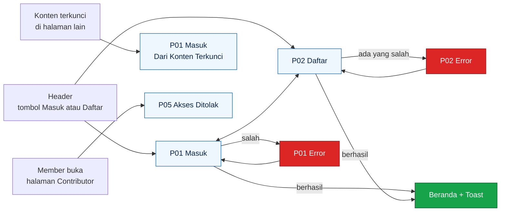

# UI Auth Build Sheet

Lembar kerja buat ngegambar halaman autentikasi Sparein di Figma: **Masuk (P01)**, **Daftar (P02)**, **Akses ditolak (P05)**, plus komponen yang dibutuhin dan teks yang tampil di tiap state. Masuk dan Daftar pakai layout **split-screen**: ilustrasi di satu sisi, form di sisi lain, dan di desktop dua sisi itu saling geser waktu pindah halaman. Ukuran, warna, dan gaya ngikutin [`UI-Specs.md`](UI-Specs.md) dan [`DESIGN-SYSTEM.md`](DESIGN-SYSTEM.md). Kalau ada yang beda, `UI-Specs.md` yang menang, kecuali di bagian [Catatan penyesuaian](#9-catatan-penyesuaian) yang sengaja nyebutin bedanya.

Tinggal ikutin urutan dari atas ke bawah. Semua angka dalam piksel (px).

Mau liat contoh jadinya? Ada mockup SVG 16 frame auth (semuanya) di [`design/auth/`](design/README.md). Tinggal drag ke Figma buat jadi patokan visual. Komponen dan auto layout-nya tetap dibangun manual, SVG ngga bawa itu.

## Daftar isi

1. [Yang bakal digambar](#1-yang-bakal-digambar)
2. [Siapin file dulu](#2-siapin-file-dulu)
3. [Komponen yang dibikin duluan](#3-komponen-yang-dibikin-duluan)
4. [Frame P01 Masuk](#4-frame-p01-masuk)
5. [Frame P02 Daftar](#5-frame-p02-daftar)
6. [Frame P05 Akses ditolak](#6-frame-p05-akses-ditolak)
7. [Frame pendukung](#7-frame-pendukung)
8. [Sambungan prototype](#8-sambungan-prototype)
9. [Catatan penyesuaian](#9-catatan-penyesuaian)
10. [Daftar teks yang tampil](#10-daftar-teks-yang-tampil)
11. [Checklist sebelum selesai](#11-checklist-sebelum-selesai)

---

## 1. Yang bakal digambar

Total ada **16 frame**: 8 buat desktop (1440) dan 8 buat mobile (390).

| # | Nama frame | Desktop | Mobile |
|---|---|---|---|
| 1 | `P01 / Masuk / Default` | ada | ada |
| 2 | `P01 / Masuk / Dari Konten Terkunci` | ada | ada |
| 3 | `P01 / Masuk / Error` | ada | ada |
| 4 | `P02 / Daftar / Default` | ada | ada |
| 5 | `P02 / Daftar / Error` | ada | ada |
| 6 | `P05 / Akses Ditolak / Member` | ada | ada |
| 7 | `P05 / Akses Ditolak / Umum` | ada | ada |
| 8 | `Mobile Menu / Visitor` | tidak perlu | ada |
| 9 | `Toast / Auth` (tiga toast dalam satu frame) | ada | tidak perlu |

P01 dan P02 pakai layout split-screen tanpa header dan footer (lihat [bagian 4.1](#41-layout-dasar-split-screen-dipake-p01-dan-p02)). Cuma P05 yang masih pakai header dan footer biasa. Nama lengkapnya ditambahin ukuran di tengah, contoh `P01 / Masuk / Desktop / Default`, sesuai aturan penamaan di `UI-Specs.md` bagian 2.3.

Flow-nya cuma gini:



---

## 2. Siapin file dulu

Ini cuma dikerjain sekali kalau file Figma tim belum punya isinya. Kalau udah ada, lewatin aja.

1. **Color Styles.** Bikin semua warna dari `UI-Specs.md` bagian 3.1 dengan nama persis (`blue/500`, `success`, `danger`, `ink`, `muted`, `surface`, dan seterusnya), termasuk tiga tint 10%: `danger/tint`, `success/tint`, `muted/tint`. Yang kepake di halaman auth: `blue/50`, `blue/200`, `blue/300`, `blue/400`, `blue/500`, `blue/600`, `blue/700`, `blue/950`, `danger`, `danger/tint`, `success`, `ink`, `muted`, `surface`, `white`.
2. **Text Styles.** Yang kepake: `Heading/H1` (32/40, 700), `Body` (16/26, 400), `Body/Strong` (16/26, 600), `Small` (14/20, 400), `Small/Strong` (14/20, 600). Font pakai Inter. Di mobile `Heading/H1` jadi 26/34.
3. **Layout grid.** Desktop: 12 kolom, gutter 24, lebar konten 1120. Mobile: 4 kolom, gutter 16, margin 16.
4. **Ikon Lucide** (pasang plugin Lucide di Figma). Yang kepake: `circle-alert`, `info`, `check-circle`, `eye`, `eye-off`, `shield-x`, `menu`, `x`, `loader-circle` (buat spinner loading), `chevron-right`, `arrow-left`.
5. **Logo.** Import `docs/brand/sparein-icon.svg` (ikon doang) dan `docs/brand/sparein-lockup.svg` (ikon plus tulisan). Versi dark (`sparein-lockup-dark.svg`) dipake di panel ilustrasi dan di footer.
6. **Ilustrasi auth.** Import `docs/brand/auth-illustration.svg` (720 x 900, buat panel desktop) dan `docs/brand/auth-illustration-banner.svg` (390 x 240, buat banner mobile). Cukup drag filenya ke Figma, hasilnya vektor jadi tetap tajam. Ilustrasi ini bikinan sendiri pakai palet Sparein, jadi aman dipakai.
7. **Text Style `Display`** (40/48, 700) juga dipake buat tagline di panel ilustrasi. Style aslinya `blue/700`, tapi di panel gelap warnanya diganti manual ke `white` dan `blue/300` (cukup override warna di layer, ngga usah bikin style baru).

Jarak cuma boleh dari angka ini: `4, 8, 12, 16, 24, 32, 48, 64`. Kalau butuh 20 pilih 16 atau 24, jangan bikin angka sendiri.

---

## 3. Komponen yang dibikin duluan

Semuanya pakai **auto layout**, dikasih nama `Kategori / Nama`, dan variannya diatur lewat property. Bikin di page `02 Components`. Kalau teman udah bikin komponen yang sama, pake punya dia, jangan bikin ulang.

### 3.1 Button

Nama: `Button / Primary`, `Button / Secondary`.

| Bagian | Nilai |
|---|---|
| Property | `variant` = primary, secondary. `size` = md, sm. `state` = default, hover, pressed, focus, disabled, loading. `fullWidth` = true, false |
| Tinggi | md 44, sm 36 |
| Padding kiri kanan | md 16, sm 12 |
| Radius | 10 |
| Gap ikon dan teks | 8 |
| Teks | md `Body/Strong`, sm `Small/Strong`, rata tengah |
| `fullWidth = true` | lebar Fill container |

| State | Primary | Secondary |
|---|---|---|
| default | isi `blue/500`, teks `white` | isi `white`, teks `blue/500`, garis 1 `blue/200` |
| hover | isi `blue/600` | isi `blue/50` |
| pressed | isi `blue/700` | isi `blue/100` |
| focus | tambah garis luar 2 `blue/400`, jarak 2 dari tombol | sama |
| disabled | isi `blue/300`, teks `white` | teks `blue/300`, garis `blue/100` |
| loading | ikon `loader-circle` 20 muncul di kiri teks, teks berubah jadi "Memproses...", warna kayak default | sama |

Di halaman auth yang kepake: Primary md fullWidth (Masuk, Daftar), Primary md (tombol di halaman 403), Secondary md (tombol kedua di 403), Primary sm dan Secondary sm (header).

### 3.2 Text Input

Nama: `Input / Text`.

| Bagian | Nilai |
|---|---|
| Property | `type` = text, password. `state` = default, hover, focus, filled, error, disabled |
| Tinggi | 44 |
| Lebar | Fill container |
| Padding | 12 kiri kanan |
| Radius | 10 |
| Isi | isi `white`, garis 1 `blue/200` |
| Teks isi | `Body`, `ink` |
| Placeholder | `Body`, `muted` |

| State | Beda dari default |
|---|---|
| hover | garis `blue/300` |
| focus | garis luar 2 `blue/400`, jarak 2 |
| filled | sama kayak default, tapi ada teks `ink` (bukan placeholder) |
| error | garis 1 `danger`. Kalau lagi fokus, ring tetap `blue/400` |
| disabled | isi `surface`, teks `muted` |

**Varian `type = password`:** padding kanan jadi 48, di ujung kanan ada Icon Button `eye` ukuran 44x44 (ikon 20, warna `muted`, hover `ink`). Kalau passwordnya lagi kelihatan, ikonnya jadi `eye-off`. Buat teks password yang lagi disembunyiin, tulis bulatan (••••••••) di Figma. Ikon ini wajib punya catatan teks `aria-label: Tampilkan password` atau `Sembunyikan password`, tulis di samping komponen pake sticky note.

### 3.3 Form Field

Nama: `Form / Field`. Ini pembungkus label, input, dan pesan.

| Bagian | Nilai |
|---|---|
| Susunan | vertikal, gap 8 |
| Label | `Small/Strong`, `ink`. Kalau wajib, tambah `*` warna `danger` di kanan teks, jarak 4 |
| Slot input | taruh instance `Input / Text` |
| Helper text | `Small`, `muted`. Tampil kalau `message = helper` |
| Error text | `Small`, `danger`, ada ikon `circle-alert` 16 di kiri, gap 4. Tampil kalau `message = error`. Gantiin helper text, bukan nambah |
| Property | `required` = true, false. `message` = none, helper, error |

Label selalu kelihatan. Jangan cuma ngandelin placeholder.

### 3.4 Info Card (dua varian)

Nama: `Card / Info`.

| Bagian | `variant = info` | `variant = error` |
|---|---|---|
| Isi | `blue/50` | `danger/tint` |
| Garis kiri | 4 `blue/500` | 4 `danger` |
| Ikon | `info` 20, `blue/500` | `circle-alert` 20, `danger` |
| Teks | `Small`, `ink` | `Small`, `ink` |
| Padding | 12 atas bawah, 16 kiri kanan | sama |
| Radius | 0 di sisi kiri, 10 di sisi kanan | sama |
| Gap ikon dan teks | 12 | 12 |
| Lebar | Fill container | Fill container |

Varian `error` ini baru, belum ada di `UI-Specs.md`. Dipake buat pesan "username atau password salah" di login. Tetap ada ikon dan teks jadi ngga cuma ngandelin warna.

### 3.5 Toast

Nama: `Toast`. Property `variant` = success, error, info.

| Bagian | Nilai |
|---|---|
| Lebar | 360 di desktop, Fill container (390 dikurangi margin 16 kiri kanan) di mobile |
| Isi | `white`, garis 1 `blue/200`, radius 14 |
| Garis kiri | 4, warna sesuai varian (`success`, `danger`, `blue/500`) |
| Padding | 16 |
| Susunan | horizontal, gap 12 |
| Ikon | 20, `check-circle` (success), `circle-alert` (error), `info` (info), warna sesuai varian |
| Teks | `Body`, `ink` |
| Tombol tutup | Icon Button `x`, 44x44 |

Posisi di frame: desktop pojok kanan atas, 16 di bawah header, 16 dari tepi kanan. Mobile di tengah atas, 8 di bawah header.

### 3.6 Link

Nama: `Link / Inline`. Teks `blue/700`, bergaris bawah, `Body/Strong`. Hover `blue/600`. Focus: garis luar 2 `blue/400`. Alasan pakai `blue/700` (bukan `blue/500`) ada di [bagian 9](#9-catatan-penyesuaian).

### 3.7 Header, Mobile Menu, dan Footer

Cuma dipake di **P05** (halaman Akses ditolak), karena P01 dan P02 pakai layout split-screen tanpa header dan footer. Cukup versi **Visitor**. Kalau komponen punya teman lain, pake punya dia.

| Komponen | Isi |
|---|---|
| `Header / Visitor / Desktop` | Tinggi 64, isi `white`, garis bawah 1 `blue/200`. Kiri: logo lockup tinggi 28, lalu menu teks `Perangkat`, `Diagnosa`, `Panduan`, `Suku Cadang` (`Body`, `ink`, gap 24). Kanan: `Button / Secondary` sm "Masuk" lalu `Button / Primary` sm "Daftar", gap 8. Padding kiri kanan ngikutin grid (160) |
| `Header / Visitor / Mobile` | Tinggi 56. Kiri: logo lockup. Kanan: Icon Button `menu` 44x44 |
| `Mobile Menu / Visitor` | Lihat [bagian 7.1](#71-mobile-menu-visitor) |
| `Footer / Desktop` dan `Footer / Mobile` | Isi `blue/950`. Isinya: lockup dark, tagline "Repair first, discard last.", kolom link, catatan iFixit, dan baris bawah "Kelompok 1 · Pemrograman Berbasis Platform · Fasilkom UI · 2026". Detail lengkap ada di `UI-Specs.md` komponen C34 |

Di halaman auth ngga ada menu yang diberi tanda aktif.

---

## 4. Frame P01 Masuk

URL kode: `/accounts/login/`. Template: `core/templates/registration/login.html`.

### 4.1 Layout dasar split-screen (dipake P01 dan P02)

Halaman Masuk dan Daftar **ngga pakai header dan footer biasa**. Layarnya dibagi dua panel yang lebarnya sama: panel ilustrasi (gelap) dan panel form (terang). Waktu pindah dari Masuk ke Daftar di desktop, dua panel itu saling tukar posisi, jadi kelihatan kayak geser kanan kiri. Di mobile panelnya ngga tukar posisi, yang berganti cuma isi form-nya.

| | Masuk (P01) | Daftar (P02) |
|---|---|---|
| Panel ilustrasi | di kiri (x = 0) | di kanan (x = 720) |
| Panel form | di kanan (x = 720) | di kiri (x = 0) |

**Aturan penting buat animasinya:** nama layer `Panel Ilustrasi` dan `Panel Form` harus **persis sama** di frame Masuk dan Daftar. Figma baru ngerti kalau dua layer itu "orang yang sama" kalau namanya sama, dan itu yang bikin Smart Animate ngegeser, bukan ngilangin lalu munculin.

**Struktur layer desktop** (`Panel Ilustrasi` dan `Panel Form` masing-masing 720 x 900, diletakkan bebas tanpa auto layout di level frame supaya posisinya bisa ditukar):

```
Frame 1440 x 900, isi white
├─ Panel Ilustrasi                     720 x 900, clip content
│   ├─ Gambar                          docs/brand/auth-illustration.svg, 720 x 900
│   ├─ Logo                            sparein-lockup-dark.svg, tinggi 32, x 64, y 48
│   └─ Tagline                         vertikal, gap 8, nempel kiri bawah (x 64, jarak 64 dari bawah)
│       ├─ Baris 1                     Display 40/48, warna white
│       ├─ Baris 2                     Display 40/48, warna blue/300
│       └─ Motto                       Small, warna blue/200, "Repair first, discard last."
└─ Panel Form                          720 x 900, isi white
    ├─ Link Kembali                    x 64, y 48, "Kembali ke beranda" + ikon arrow-left 16
    └─ Form Wrap                       lebar 400, vertikal, gap 24, di tengah panel (horizontal dan vertikal)
        ├─ Heading Group               vertikal, gap 8, rata kiri
        │   ├─ Judul                   Heading/H1, ink
        │   └─ Subjudul                Small, muted (cuma ada di Daftar)
        ├─ Card / Info                 opsional (state tertentu), lebar Fill
        ├─ Form                        vertikal, gap 24, lebar Fill
        │   ├─ Form / Field ...
        │   └─ Button / Primary        md, fullWidth
        └─ Teks bawah                  Body, muted, rata kiri
```

Catatan gambarnya:
- `Gambar` pakai file `docs/brand/auth-illustration.svg` (drag aja filenya ke Figma). Atur `Fill` biar nutup panel penuh, jangan di-stretch.
- Bagian bawah ilustrasi udah dikasih gradasi gelap, jadi teks Tagline tetap kebaca jelas.
- `Link Kembali` pakai `Small/Strong`, warna `muted`, hover `ink`.

### 4.2 Frame desktop, Default

**Frame:** `P01 / Masuk / Desktop / Default`. Lebar 1440, tinggi 900. Ikutin struktur di 4.1, posisi panel ilustrasi di kiri.

**Isi Tagline:**

| Elemen | Teks |
|---|---|
| Baris 1 | Masuk dan lanjutin |
| Baris 2 | perbaikanmu. |
| Motto | Repair first, discard last. |

**Isi Form Wrap:**

| Elemen | Isi |
|---|---|
| Judul | Masuk ke Sparein |
| Subjudul | tidak ada |
| Field Username | label "Username", wajib, type text, ngga ada helper |
| Field Password | label "Password", wajib, type password, ngga ada helper |
| Tombol | `Button / Primary` md fullWidth "Masuk" |
| Teks bawah | Belum punya akun? `Link / Inline` "Daftar" |

Dua field `state = default`, `message = none`. Tinggi Form Wrap kira-kira 350, ngga usah dikunci, biarin auto layout.

**Wireframe:**

```
┌──────────────────────────────────┬──────────────────────────────────┐
│ [Sparein]                        │ < Kembali ke beranda             │
│ (gelap, ilustrasi ponsel +       │                                  │
│  kunci inggris + roda gigi)      │   Masuk ke Sparein               │
│                                  │                                  │
│                                  │   Username *                     │
│                                  │   [                            ] │
│                                  │   Password *                     │
│                                  │   [                        (o) ] │
│                                  │                                  │
│                                  │   [          Masuk           ]   │
│                                  │                                  │
│ Masuk dan lanjutin               │   Belum punya akun? Daftar       │
│ perbaikanmu.                     │                                  │
│ Repair first, discard last.      │                                  │
└──────────────────────────────────┴──────────────────────────────────┘
```

### 4.3 Frame desktop, Dari Konten Terkunci

**Frame:** `P01 / Masuk / Desktop / Dari Konten Terkunci`. Duplikat Default, terus tambahin satu elemen di `Form Wrap`, antara `Heading Group` dan `Form`:

- `Card / Info` varian `info` dengan teks **"Masuk dulu ya buat lanjut."**

Sisanya sama persis. Frame ini muncul waktu Visitor ngeklik tombol di kotak `Locked Content` (contoh di detail panduan) atau tombol simpan panduan.

### 4.4 Frame desktop, Error

**Frame:** `P01 / Masuk / Desktop / Error`. Duplikat Default, terus ubah:

| Elemen | Perubahan |
|---|---|
| Antara `Heading Group` dan `Form` | Tambah `Card / Info` varian **error** dengan teks "Username atau password salah. Coba cek lagi ya." |
| Field Username | `state = filled`, isi contoh `sari_ayu` |
| Field Password | `state = default`, kosong (password dikosongin lagi setelah gagal) |

Di kode nanti, kotak error muncul sebagai satu pesan di atas form, bukan di bawah salah satu field, jadi ngga ada pesan error per field di frame ini.

### 4.5 Frame mobile

**Frame:** `P01 / Masuk / Mobile / Default`, `... / Dari Konten Terkunci`, `... / Error`. Lebar 390, tinggi 844, isi `blue/950`.

```
Frame 390 x 844
├─ Banner                              390 x 240, clip content
│   ├─ Gambar                          docs/brand/auth-illustration-banner.svg, 390 x 240
│   ├─ Logo                            sparein-lockup-dark.svg, tinggi 28, x 16, y 16
│   └─ Link Mode                       nempel kanan atas (jarak 16 dari kanan, y 20)
│       "Belum punya akun? " (Small, blue/200) + "DAFTAR" (Small/Strong, white, huruf kapital)
└─ Sheet                               lebar 390, y 216, tinggi sampai bawah, isi white
    radius 24 di dua sudut atas, padding 24, vertikal, gap 24
    ├─ Heading Group                   gap 8
    │   └─ Judul                       Heading/H1 versi mobile 26/34
    ├─ Card / Info                     opsional
    ├─ Form                            gap 24
    └─ Teks bawah                      Body, muted, rata kiri
```

`Sheet` y-nya 216 padahal `Banner` tingginya 240, jadi sheet nutupin 24 piksel bawah banner dan sudut atasnya yang bulat kelihatan nimpa gambar. Isi form sama persis kayak desktop (judul, field, tombol, teks bawah). Tagline dan motto ngga dipakai di mobile. `Link Kembali` juga ngga ada, logo di banner udah jadi link ke beranda.

Tombol dan input tinggi minimal 44, jangan dikecilin.

---

## 5. Frame P02 Daftar

URL kode: `/register/`. Template: `core/templates/core/register.html`. Isian cuma tiga karena form di kode pakai bawaan Django, jadi **ngga ada email**.

### 5.1 Frame desktop, Default

**Frame:** `P02 / Daftar / Desktop / Default`. Struktur layer sama persis kayak P01 di 4.1, bedanya:

- Posisi: `Panel Form` di kiri (x = 0), `Panel Ilustrasi` di kanan (x = 720).
- `Logo` tetap di pojok kiri atas **panel ilustrasinya** (jadi sekarang x-nya 784).
- `Link Kembali` tetap di pojok kiri atas panel form (x = 64).

**Isi Tagline:**

| Elemen | Teks |
|---|---|
| Baris 1 | Mulai perbaiki |
| Baris 2 | barangmu sendiri. |
| Motto | Repair first, discard last. |

**Isi Form Wrap:**

| Elemen | Isi |
|---|---|
| Judul | Bikin akun Sparein |
| Subjudul | Gratis. Buka langkah panduan lengkap, harga suku cadang, dan jurnal perbaikan. |
| Field Username | label "Username", wajib, type text, helper "Maksimal 150 karakter. Boleh huruf, angka, dan @ . + - _" |
| Field Password | label "Password", wajib, type password, helper "Minimal 8 karakter, jangan cuma angka, dan jangan terlalu mirip username." |
| Field Ulangi password | label "Ulangi password", wajib, type password, ngga ada helper |
| Tombol | `Button / Primary` md fullWidth "Daftar" |
| Teks bawah | Sudah punya akun? `Link / Inline` "Masuk" |

Dua field pertama `message = helper`, yang ketiga `message = none`. Tinggi Form Wrap kira-kira 600, ngga usah dikunci.

**Wireframe:**

```
┌──────────────────────────────────┬──────────────────────────────────┐
│ < Kembali ke beranda             │                         [Sparein]│
│                                  │ (gelap, ilustrasi ponsel +       │
│   Bikin akun Sparein             │  kunci inggris + roda gigi)      │
│   Gratis. Buka langkah panduan   │                                  │
│   lengkap, harga suku cadang...  │                                  │
│                                  │                                  │
│   Username *                     │                                  │
│   [                            ] │                                  │
│   Maksimal 150 karakter. ...     │                                  │
│   Password *                     │                                  │
│   [                        (o) ] │                                  │
│   Minimal 8 karakter, ...        │                                  │
│   Ulangi password *              │                                  │
│   [                        (o) ] │                                  │
│                                  │                                  │
│   [          Daftar          ]   │ Mulai perbaiki                   │
│   Sudah punya akun? Masuk        │ barangmu sendiri.                │
│                                  │ Repair first, discard last.      │
└──────────────────────────────────┴──────────────────────────────────┘
```

### 5.2 Frame desktop, Error

**Frame:** `P02 / Daftar / Desktop / Error`. Duplikat Default. Gambar **dua isian yang error sekaligus** biar dua pola error kelihatan:

| Field | State | Isi | Pesan |
|---|---|---|---|
| Username | `error` | `sari_ayu` | "Username ini sudah dipakai orang lain." |
| Password | `filled` + `message = helper` | `••••••••••` | helper biasa |
| Ulangi password | `error` | `•••••••••` (satu bulatan lebih sedikit) | "Password yang kamu ulangi tidak sama." |

Di field yang error, pesan error **menggantikan** helper text, jadi tinggi field tetap rata. Ngga ada kotak error di atas form (itu cuma buat login).

Kalau mau lebih lengkap, di page `99 Arsip` boleh bikin variasi error lain buat referensi tim, tapi ngga masuk handoff:

| Kondisi | Field | Pesan |
|---|---|---|
| Format username salah | Username | "Username cuma boleh huruf, angka, dan @ . + - _" |
| Password pendek | Password | "Password minimal 8 karakter." |
| Password cuma angka | Password | "Password jangan cuma angka." |
| Password terlalu umum | Password | "Password ini terlalu umum, coba yang lain." |
| Password mirip username | Password | "Password terlalu mirip sama username kamu." |
| Isian kosong | Field yang bersangkutan | "Username wajib diisi." / "Password wajib diisi." / "Ulangi password wajib diisi." |

### 5.3 Frame mobile

**Frame:** `P02 / Daftar / Mobile / Default` dan `... / Error`. Strukturnya sama kayak 4.5, bedanya:

| Elemen | Isi |
|---|---|
| `Link Mode` | "Sudah punya akun? " (Small, blue/200) + "MASUK" (Small/Strong, white) |
| Judul | Bikin akun Sparein |
| Subjudul | Gratis. Buka langkah panduan lengkap, harga suku cadang, dan jurnal perbaikan. (jadi dua baris karena lebih sempit) |
| Field, tombol, teks bawah | Sama kayak desktop 5.1 |

`Banner` dan `Logo` ngga berubah dari login. Yang beda cuma isi `Sheet`.

### 5.4 Animasi pindah halaman

| | Desktop | Mobile |
|---|---|---|
| Pemicu | klik link "Daftar" di P01 atau "Masuk" di P02 | tap link yang sama (di `Link Mode` atau di teks bawah form) |
| Tipe | Smart Animate | Smart Animate |
| Durasi | 500 ms | 300 ms |
| Easing | Ease in and out | Ease out |
| Yang bergerak | `Panel Ilustrasi` dan `Panel Form` saling tukar posisi horizontal | isi `Sheet` ganti (judul, field, tombol), banner diam |

Di desktop, isi `Form Wrap` bakal ke-dissolve karena layernya beda antara dua frame. Itu normal dan malah bagus, jadi ngga usah dipaksa.

---

## 6. Frame P05 Akses ditolak

Template di kode: `core/templates/403.html` (belum ada, usulan di Q23). Halaman ini muncul waktu user login tapi ngga punya izin.

### 6.1 Frame desktop

**Frame:** `P05 / Akses Ditolak / Desktop / Member` dan `... / Umum`.

**Header:** `Header / Visitor / Desktop` aja di Figma biar komponennya cukup satu. Di kode asli yang nongol header versi login (avatar), tapi buat latihan gambar auth, Visitor cukup. Kasih sticky note kecil di samping frame: "Header di kode: versi Member".

**Struktur layer:**

```
Frame 1440 x 900, isi surface
├─ Header
├─ Main                                 Fill container, padding 96 atas, 64 bawah
│   └─ Konten tengah                    lebar 480, gap 16, align tengah, rata tengah
│       ├─ Ikon shield-x 48, blue/400
│       ├─ Judul H1                     Heading/H1, ink
│       ├─ Teks                         Body, muted
│       └─ Grup tombol                  horizontal, gap 8, align tengah
└─ Footer / Desktop
```

| Isi | Varian Member | Varian Umum |
|---|---|---|
| Judul | "Kamu belum bisa buka halaman ini" | "Kamu belum bisa buka halaman ini" |
| Teks | "Halaman ini khusus Contributor. Cek halaman Profil buat tahu cara jadi Contributor." | "Akunmu tidak punya izin buat aksi ini." |
| Tombol | `Button / Primary` md "Ke profil" | `Button / Primary` md "Ke beranda" |

Halaman Profil (P03) belum digambar. Tombol "Ke profil" tinggal dibikin dulu aja, sambungan prototype-nya nyusul nanti.

### 6.2 Frame mobile

`P05 / Akses Ditolak / Mobile / Member` dan `... / Umum`. Perubahan: padding atas 64, lebar konten Fill (358), judul pakai H1 mobile 26/34, tombol jadi fullWidth. Header dan footer versi mobile.

---

## 7. Frame pendukung

### 7.1 Mobile Menu Visitor

**Frame:** `Mobile Menu / Visitor / Mobile`. Lebar 390, tinggi 844. Panel yang muncul dari kanan dan nutupin seluruh layar. Dipake dari header di `P05` mobile (P01 dan P02 ngga punya header).

```
Panel 390 x 844, isi white
├─ Baris atas                tinggi 56, padding 16 kiri kanan, garis bawah 1 blue/200
│   ├─ Logo lockup tinggi 28
│   └─ Icon Button x 44 x 44
├─ Daftar menu               padding 8 atas
│   ├─ Perangkat       tinggi 48, padding 16, Body, ikon smartphone 20 di kiri
│   ├─ Diagnosa        tinggi 48, ikon stethoscope
│   ├─ Panduan         tinggi 48, ikon book-open
│   └─ Suku Cadang     tinggi 48, ikon package
├─ Garis pemisah 1 blue/200, margin 8 atas bawah
└─ Grup tombol               padding 16, vertikal, gap 8
    ├─ Button / Primary  md fullWidth  "Daftar"
    └─ Button / Secondary md fullWidth "Masuk"
```

### 7.2 Toast Auth

**Frame:** `Toast / Auth / Desktop`. Lebar 1440, isi `surface`, tinggi 400. Taruh tiga Toast bertumpuk dengan jarak 16 buat dokumentasi:

| Varian | Teks |
|---|---|
| info | "Selamat datang lagi, sari_ayu." |
| success | "Akun berhasil dibuat. Selamat datang di Sparein!" |
| error | "Gagal masuk. Coba lagi ya." |

Dua toast pertama dipake setelah login dan setelah daftar. Yang ketiga cuma cadangan, kalau nanti ada error server.

---

## 8. Sambungan prototype

Pakai mode Prototype di Figma. Semua sambungan "On click". Animasi "Instant" buat sambungan biasa, tapi sambungan **Masuk <-> Daftar** pakai Smart Animate sesuai tabel di [bagian 5.4](#54-animasi-pindah-halaman).

| Dari | Elemen | Ke |
|---|---|---|
| Header (frame P05) | Tombol "Masuk" | `P01 / Masuk / Default` |
| Header (frame P05) | Tombol "Daftar" | `P02 / Daftar / Default` |
| Header (frame P05) | Logo | frame Beranda (nyusul, dari tim) |
| Logo di `Panel Ilustrasi` dan `Banner` (P01, P02) | Klik | frame Beranda (nyusul) |
| `Link Kembali` (P01, P02 desktop) | Klik | frame Beranda (nyusul) |
| `P01 Default` | Link "Daftar" | `P02 Default` |
| `P01 Default` | Tombol "Masuk" | `P01 Error` |
| `P01 Dari Konten Terkunci` | Link "Daftar" | `P02 Default` |
| `P01 Error` | Link "Daftar" | `P02 Default` |
| `P02 Default` | Link "Masuk" | `P01 Default` |
| `P02 Default` | Tombol "Daftar" | `P02 Error` |
| `P02 Error` | Link "Masuk" | `P01 Default` |
| P01 dan P02 mobile | `Link Mode` di banner | frame lawannya (Masuk <-> Daftar), Smart Animate 300 ms |
| `P05 Member` | Tombol "Ke profil" | nyusul, setelah P03 digambar |
| `P05 Umum` | Tombol "Ke beranda" | frame Beranda (nyusul) |
| Mobile (semua) | Icon Button `menu` | `Mobile Menu / Visitor` |
| `Mobile Menu / Visitor` | Icon Button `x` | frame sebelumnya (Back) |
| `Mobile Menu / Visitor` | "Masuk" dan "Daftar" | `P01 Mobile Default` dan `P02 Mobile Default` |

Login yang berhasil ngga disambungin, karena tujuannya Beranda dan itu digambar tim lain.

---

## 9. Catatan penyesuaian

Beberapa hal di sini sedikit beda dari `UI-Specs.md` atau perlu kamu tahu.

1. **Link pakai `blue/700`, bukan `blue/500`.** `DESIGN-SYSTEM.md` bilang teks kecil di atas putih ngga boleh `blue/500` karena kontrasnya cuma 3.6:1. Teks "Daftar" dan "Masuk" di bawah form ukurannya 16, jadi pakai `blue/700` plus garis bawah biar lolos. Ini beda dari komponen C03 (Link) di `UI-Specs.md`. Kalau disetujui, C03 perlu diupdate.
2. **Varian `error` di Info Card itu baru.** Di `UI-Specs.md` Info Card (C48) cuma satu gaya. Kalau disetujui dipake, tambahin juga ke daftar komponen.
3. **Helper username.** Di `UI-Specs.md` P02 tertulis "Huruf, angka, dan _ saja". Itu kurang tepat, karena aturan username Django ngebolehin juga `@ . + -`. Di lembar ini udah dibenerin. Kalau mau konsisten, teks di `UI-Specs.md` P02 ikut diubah.
4. **Tinggi Form Wrap hasil hitungan kasar.** Jangan dikunci. Biarin auto layout (Hug contents) yang nentuin, biar kalau teks error nambah baris isinya ikut membesar. Frame desktop tingginya 900, tapi kalau di Daftar isinya lebih panjang dari itu, frame boleh dipanjangin.
5. **Layout auth khusus, beda dari `UI-Specs.md`.** Di `UI-Specs.md` P01 dan P02 masih berupa kartu di tengah dengan header tetap tampil. Sekarang diganti split-screen tanpa header dan footer (logo di panel ilustrasi jadi jalan keluar ke beranda, plus link "Kembali ke beranda" di desktop). Kalau disetujui, `UI-Specs.md` bagian P01 dan P02 perlu diupdate.
6. **Buat kode nanti (ditulis manual di VS Code):** layout ini butuh template dasar sendiri yang ngga ikut `base.html`, karena `base.html` selalu masang header dan footer. Cuma template dan CSS, ngga nyentuh view, model, atau URL. Dua halaman tetap di `/accounts/login/` dan `/register/`, dan efek geser desktop bisa dibikin lewat animasi CSS waktu halaman kebuka. Tapi karena nyentuh `core/templates/`, tetap butuh dua approval.
7. **Ilustrasi disimpen di `docs/brand/`.** Waktu dipake di kode, file SVG-nya dipindah atau disalin ke folder `static` milik `core`.
8. **Teks error dan pesan lain itu target desain.** Di kode sekarang pesan masih bawaan Django (bahasa Indonesia versi Django). Penyesuaian teksnya jadi tugas backend nanti, ngga dikerjain di sini.
9. **Header di P05 tampil menu lengkap** (Perangkat, Diagnosa, Panduan, Suku Cadang) padahal di kode baru ada Perangkat. Itu sengaja, desain jadi targetnya.

---

## 10. Daftar teks yang tampil

Semua teks asli (bukan Lorem ipsum) biar gampang disalin ke Figma.

| Lokasi | Teks |
|---|---|
| P01 tagline | Masuk dan lanjutin / perbaikanmu. |
| P01 judul | Masuk ke Sparein |
| P01 label | Username, Password |
| P01 tombol | Masuk |
| P01 tombol saat loading | Memproses... |
| P01 teks bawah | Belum punya akun? **Daftar** |
| P01 Info (dari konten terkunci) | Masuk dulu ya buat lanjut. |
| P01 Error | Username atau password salah. Coba cek lagi ya. |
| P02 tagline | Mulai perbaiki / barangmu sendiri. |
| Motto (P01 dan P02) | Repair first, discard last. |
| Link kembali (desktop) | Kembali ke beranda |
| Link mode mobile di P01 | Belum punya akun? **DAFTAR** |
| Link mode mobile di P02 | Sudah punya akun? **MASUK** |
| P02 judul | Bikin akun Sparein |
| P02 subjudul | Gratis. Buka langkah panduan lengkap, harga suku cadang, dan jurnal perbaikan. |
| P02 label | Username, Password, Ulangi password |
| P02 helper username | Maksimal 150 karakter. Boleh huruf, angka, dan @ . + - _ |
| P02 helper password | Minimal 8 karakter, jangan cuma angka, dan jangan terlalu mirip username. |
| P02 tombol | Daftar |
| P02 teks bawah | Sudah punya akun? **Masuk** |
| P02 error username | Username ini sudah dipakai orang lain. |
| P02 error ulangi password | Password yang kamu ulangi tidak sama. |
| P05 judul | Kamu belum bisa buka halaman ini |
| P05 teks Member | Halaman ini khusus Contributor. Cek halaman Profil buat tahu cara jadi Contributor. |
| P05 teks Umum | Akunmu tidak punya izin buat aksi ini. |
| P05 tombol | Ke profil (Member), Ke beranda (Umum) |
| Toast info | Selamat datang lagi, sari_ayu. |
| Toast success | Akun berhasil dibuat. Selamat datang di Sparein! |
| Toast error | Gagal masuk. Coba lagi ya. |
| Aria-label ikon mata | Tampilkan password / Sembunyikan password |

---

## 11. Checklist sebelum selesai

- [ ] 16 frame ada, namanya sesuai aturan (`Kode / Nama / Ukuran / State`).
- [ ] Semua warna pakai Color Style, semua teks pakai Text Style, tidak ada hex atau font lepas.
- [ ] Semua jarak dari skala `4, 8, 12, 16, 24, 32, 48, 64`.
- [ ] Semua elemen berupa instance komponen, bukan gambar lepas.
- [ ] Button, Input, dan Toast punya semua state di tabelnya, terutama `focus` yang kelihatan jelas.
- [ ] Tombol dan input tingginya minimal 44 di mobile.
- [ ] Setiap input punya label yang selalu kelihatan.
- [ ] Layer `Panel Ilustrasi` dan `Panel Form` namanya sama persis di frame Masuk dan Daftar (biar Smart Animate jalan).
- [ ] Animasi Masuk <-> Daftar udah dicoba di mode Present, desktop dan mobile.
- [ ] Teks tagline di panel ilustrasi tetap kebaca (kontras lolos 4.5:1 di atas gradasi gelap).
- [ ] Pesan error ada ikon, ada teks, dan ngga cuma warna merah.
- [ ] Ikon mata di input password dikasih catatan `aria-label`.
- [ ] Teks di semua frame udah teks asli sesuai bagian 10.
- [ ] Kontras teks lolos 4.5:1 (cek pakai plugin Stark atau Contrast), terutama link `blue/700` dan teks `muted`.
- [ ] Lihat sekali dalam mode grayscale, error dan info masih bisa dibedain.
- [ ] Prototype bagian 8 bisa diklik dari Header sampai ke semua frame auth.
- [ ] Udah di-review satu anggota lain lewat komentar Figma.
