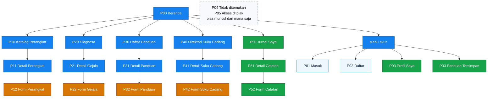
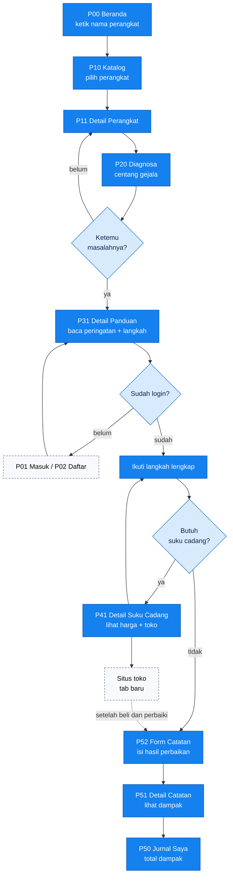
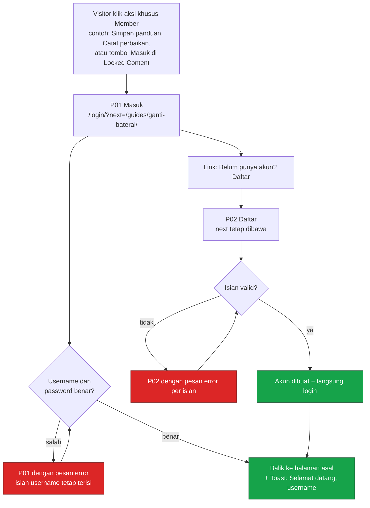
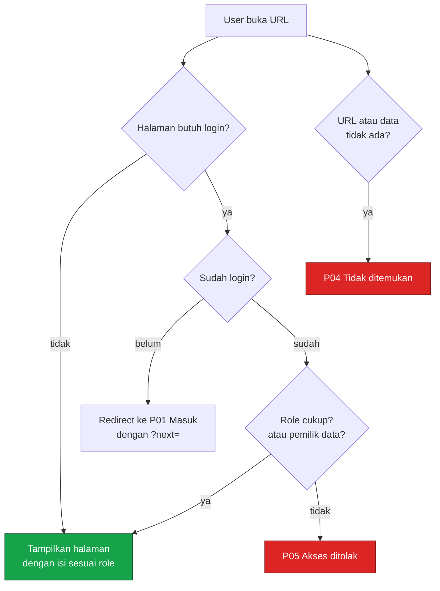
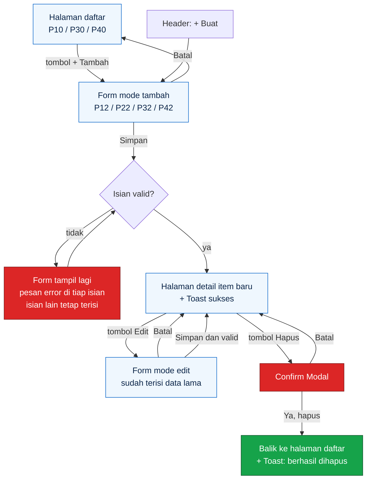
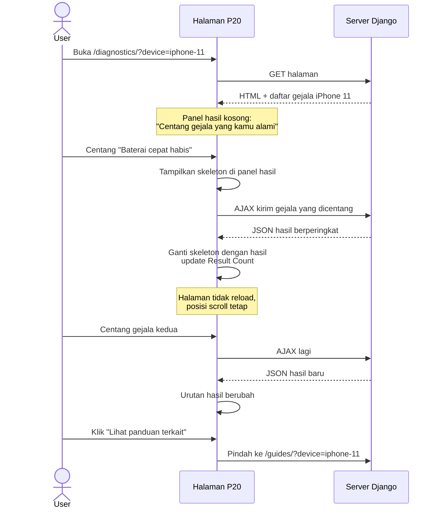
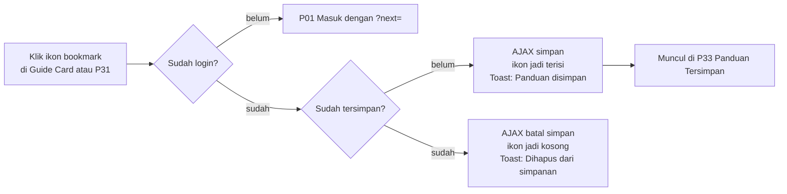
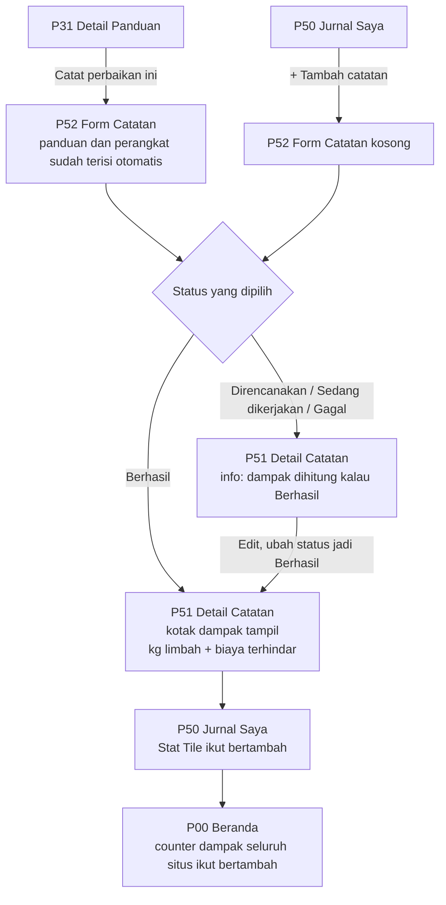
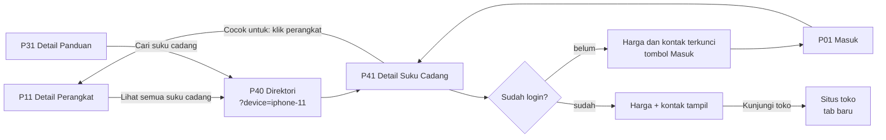
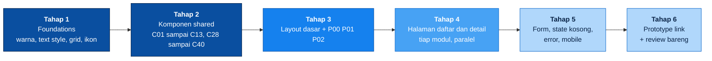

# UI Specifications

Dokumen ini jadi pegangan kita waktu mendesain Sparein di Figma. Isinya membahas semuwa komponen apa aja yang perlu dibikin, halaman apa aja yang harus digambar, isi tiap halaman dari atas sampai bawah, dan alur perpindahan antarhalaman :D.

Dokumen ini mengikuti tiga file lain, biar ngga tumpang tindih hirearki dokumen kita dibuat kayak ini aja:

1. [`MODULES.md`](MODULES.md) buat urusan data, rute, dan siapa boleh ngapain.
2. [`DESIGN-SYSTEM.md`](DESIGN-SYSTEM.md) buat warna, huruf, jarak, dan aturan komponen dasar.
3. Dokumen ini buat tampilan dan alur.

Kalau nemu hal yang beda antara dokumen ini dan dua file di atas, jangan dibenerin sendiri. Tulis di bagian [Hal yang masih perlu kita sepakati](#12-hal-yang-masih-perlu-kita-sepakati) atau bahas di grup.

---

## Daftar isi

1. [Setup awal](#1-sebelum-mulai)
2. [Aturan main di Figma](#2-aturan-main-di-figma)
3. [Foundations](#3-foundations)
4. [Komponen](#4-komponen)
5. [Daftar halaman](#5-daftar-halaman)
6. [Diagram alur](#6-diagram-alur)
7. [Spesifikasi per halaman](#7-spesifikasi-per-halaman)
8. [Matriks akses per role](#8-matriks-akses-per-role)
9. [State yang wajib digambar](#9-state-yang-wajib-digambar)
10. [Checklist aksesibilitas di Figma](#10-checklist-aksesibilitas-di-figma)
11. [Urutan kerja dan pembagian](#11-urutan-kerja-dan-pembagian)
12. [Hal yang masih perlu kita sepakati](#12-Hal-yang-masih-perlu-dibahas-next)
13. [Checklist sebelum handoff ke kode](#13-checklist-sebelum-handoff-ke-code)

---

## 1. Setup awal

### 1.1 Keputusan yang sudah disepakati dari `MODULES.md` dan `DESIGN-SYSTEM.md`

| Topik | Keputusan | Akibatnya ke desain |
|---|---|---|
| Halaman Admin | Pakai Django admin bawaan (`/admin/`) | Tidak ada halaman admin di Figma. Admin cuma dapat tombol Edit dan Hapus tambahan di halaman biasa, plus link "Panel admin" di menu akun. |
| Request naik Role untuk akun User | Admin ubah role manual lewat Django admin | Tidak ada form pengajuan. Cukup kartu info di halaman Profil yang bilang cara minta upgrade. |
| Ukuran frame | Desktop 1440 dan Mobile 390 | Tiap halaman minimal digambar dua kali. Tablet ngga perlu digambar, cukup ikut aturan breakpoint lewat CSS ajah. |
| Simpan panduan | Masuk, dipegang M3 | Ada tombol simpan di kartu dan detail panduan, plus satu halaman baru "Panduan Tersimpan". M3 perlu nambah model `SavedGuide` dan update `MODULES.md`. |
| Transaksi | Tidak ada jual beli | Tidak ada keranjang, checkout, atau tombol "Beli". Yang ada cuma tombol "Kunjungi toko" yang buka web penjual di tab baru. |
| Bahasa UI | Bahasa Indonesia | Semua label, tombol, dan pesan pakai bahasa Indonesia. Konten dari iFixit (judul panduan, nama perangkat) dibiarkan bahasa Inggris kalau memang aslinya begitu. |

### 1.2 Istilah yang sering muncul

Buat pegangan ajah, beberapa istilah yang sering dipakai di dokumen ini kedepannya.

| Istilah | Artinya |
|---|---|
| Frame | "Kanvas" satu layar di Figma. Satu frame = satu halaman di satu ukuran layar (misalnya 1440px x 900px). |
| Komponen (component) | Elemen UI yang dibikin sekali lalu dipakai ulang, misalnya tombol. Kalau komponen induknya diubah, semua salinannya ikut berubah. |
| Varian (variant) | Versi lain dari komponen yang sama. Contoh: tombol punya varian primary, secondary, danger. |
| State | Kondisi sebuah elemen atau halaman. Contoh state tombol: normal, hover, focus, disabled. Contoh state halaman: ada isi, kosong, loading, error. |
| Auto layout | Fitur Figma yang bikin isi frame otomatis tersusun rapi (atas ke bawah atau kiri ke kanan) dengan jarak tetap. Mirip flexbox di CSS. |
| Hover | Waktu kursor mouse ada di atas elemen. |
| Focus | Waktu elemen dipilih pakai keyboard (tombol Tab). Harus kelihatan jelas lewat garis biru di sekelilingnya (focus ring). |
| Disabled | Elemen yang lagi tidak bisa diklik. |
| Breakpoint | Lebar layar di mana tata letak berubah. Contoh: di bawah 768px, grid 3 kolom jadi 1 kolom. |
| Mobile-first | Cara mikirnya mulai dari layar HP dulu, baru dilebarin ke desktop. |
| AJAX | Cara ambil data dari server tanpa reload halaman. Contoh: centang gejala, hasil diagnosa langsung berubah tanpa pindah halaman. |
| Endpoint / API JSON | Alamat URL yang ngasih data mentah (JSON), bukan halaman HTML. Contoh `/api/devices/`. |
| Query param | Bagian URL setelah tanda `?`. Contoh `/guides/?device=iphone-11` artinya daftar panduan yang difilter ke iPhone 11. |
| Slug | Versi nama yang aman buat URL. "iPhone 11 Pro" jadi `iphone-11-pro`. |
| Modal | Kotak dialog yang muncul di tengah layar dan nutupin halaman di belakangnya. Dipakai buat konfirmasi hapus. |
| Toast | Notifikasi kecil yang muncul sebentar, misalnya "Panduan berhasil disimpan". Di Django ini asalnya dari `messages`. |
| Empty state | Tampilan waktu datanya kosong. Isinya satu kalimat plus satu tombol aksi. |
| Skeleton | Kotak abu-abu yang bentuknya mirip konten, muncul sebentar waktu data lagi dimuat. |
| Konten terkunci | Bagian yang cuma bisa dilihat kalau sudah login. Visitor lihat kotak ajakan login sebagai gantinya. |
| Repeater | Kumpulan baris input yang bisa ditambah atau dihapus, misalnya daftar langkah panduan. Di Django biasanya pakai formset. |

### 1.3 Cara lihat spesifikasi halaman

Tiap halaman di [bagian 7](#7-spesifikasi-per-halaman) struktur isinya sama:

- **Info singkat**: kode halaman, URL, modul, PIC, file template, dan siapa yang boleh buka.
- **Tujuan**: satu dua kalimat kenapa halaman ini ada.
- **Isi halaman**: urutan blok dari atas ke bawah, lengkap dengan data apa yang tampil dan dari field mana.
- **Beda tampilan per role**: apa yang berubah buat Visitor, Member, Contributor, dan Admin.
- **Interaksi**: apa yang terjadi kalau sesuatu diklik.
- **State**: kondisi yang perlu digambar selain kondisi normal.
- **Mobile**: perubahan tata letak di 390px.
- **Wireframe**: sketsa kasar tata letak buat patokan kita waktu desain UI nya.

Biar rapi kita pakai kode halaman dengan format `P-x-x`. x pertama buat nomor modul. x kedua buat nomor halaman (contoh P01 berarti halaman pertama di modul 0, P12 berarti halaman kedua di modul 1). Kode komponen pakai format `C-x-x`.

---

## 2. Aturan main di Figma

### 2.1 Struktur file Figma

Cukup satu file project Figma buat dipakai bareng-bareng, isinya dibagi jadi beberapa page:

| Page Figma | Isi |
|---|---|
| `00 Cover` | Judul proyek, nama tim, link ke repo, tanggal update terakhir |
| `01 Foundations` | Warna, text style, ikon, grid, jarak |
| `02 Components` | Semua komponen `C01` sampai `C49` beserta variannya |
| `03 Flows` | Salinan diagram alur di bagian 6, disambung pakai prototype link kalau sempat |
| `04 Desktop` | Semua halaman ukuran 1440 |
| `05 Mobile` | Semua halaman ukuran 390 |
| `99 Arsip` | Coretan, versi lama, eksperimen. Tidak dipakai buat handoff. |

Halaman di `04 Desktop` dan `05 Mobile` disusun per baris modul, baris pertama core, baris kedua M1, dan seterusnya.

### 2.2 Ukuran frame dan grid

| | Desktop | Mobile |
|---|---|---|
| Lebar frame | 1440 | 390 |
| Tinggi frame | Bebas, ikutin isi | Bebas, ikutin isi |
| Lebar konten maksimal | 1120 (sisa 160 di kiri dan kanan) | 358 (margin 16 di kiri dan kanan) |
| Grid kolom | 12 kolom, gutter 24 | 4 kolom, gutter 16 |
| Tinggi header | 64 | 56 |

Pasang layout grid di tiap frame lewat panel kanan Figma, jangan pakai garis manual. Tablet ngga perlu digambar. Patokannya grid 3 kolom di desktop jadi 2 kolom di tablet, lalu 1 kolom di bawah 768. Dan saranku kita desain dari mobile dulu atau istilahnya Mobile-First Design

### 2.3 Penamaan

**Frame halaman**: `Kode / Nama Halaman / Ukuran / Role atau State`

```
P31 / Detail Panduan / Desktop / Visitor
P31 / Detail Panduan / Desktop / Member
P31 / Detail Panduan / Mobile / Member
P50 / Jurnal Saya / Desktop / Kosong
```

Bagian terakhir boleh dihapus ajah kalau halamannya sama untuk semua role dan tidak ada state khusus.

**Komponen**: `Kategori / Nama`, lalu variannya diatur lewat property di Figma.

```
Button / Primary      property: size = md | sm, state = default | hover | focus | disabled | loading
Badge / Difficulty    property: level = very-easy | easy | moderate | difficult | very-difficult
Card / Guide          property: saved = true | false
```

**Layer**: kasih nama yang jelas buat layer penting, misalnya `title`, `meta-row`, `actions`. Jangan biarkan `Frame 238` atau `Rectangle 12`.

### 2.4 Auto layout dan jarak

- Semua komponen dan section pakai auto layout. Ini bikin desain gampang diterjemahkan ke Tailwind karena auto layout itu mirip `flex`.
- Jarak cuma boleh pakai angka dari skala: `4, 8, 12, 16, 24, 32, 48, 64`. Kalau kamu butuh 20, pilih 16 atau 24.
- Jarak antar section besar di halaman: 48 di desktop, 32 di mobile.
- Jarak antara judul section dan isinya: 16.
- Padding kartu: 16.

### 2.5 Font dan ikon

**Font.** Mengikuti `DESIGN-SYSTEM.md` kita pakai system font (font bawaan OS). Masalahnya, Figma ngga bisa pakai "font bawaan OS". Jadi di Figma kita pakai **Inter** sebagai wakilnya, karena bentuknya paling mirip font sistem di Windows dan Mac. Buat angka part number dan nomor langkah, pakai **JetBrains Mono** atau **Roboto Mono** sebagai `ui-monospace`(Sekedar ingfo sajah, ui-monospace sederhananya adalah font yang digunakan untuk menampilkan teks dalam format monospace atau code, penjelasan lengkapnya bisa baca-baca inih [ui-monospace-readme](https://diversekit.com/blog/ui-monospace-explained?srsltid=AU7gw4Ud-ttWqYjlresObrLX6f_L-9NEz-HbnMAAtPI1EcAFu60C8r2k)).

**Ikon.** Pakai **Lucide** (gratis, ada plugin Figma-nya, dan SVG-nya bisa langsung ditempel di template Django).

| Ukuran | Dipakai di |
|---|---|
| 16 | Di dalam badge, di samping teks kecil |
| 20 | Default: tombol, input, menu |
| 24 | Ikon di safety callout, empty state kecil |
| 48 | Ilustrasi di empty state dan halaman error |

Ikon yang bakal sering dipakai: `search`, `smartphone`, `laptop`, `wrench`, `stethoscope`, `book-open`, `package`, `notebook-pen`, `bookmark`, `bookmark-check`, `lock`, `info`, `triangle-alert`, `octagon-alert`, `clock`, `gauge`, `map-pin`, `external-link`, `pencil`, `trash-2`, `plus`, `x`, `chevron-down`, `menu`, `user`, `log-out`, `leaf`, `wallet`, `check-circle`, `x-circle`.

### 2.6 Bahasa di UI (microcopy)

Tulisan di UI juga bagian dari desain, jadi ditulis langsung di Figma, bukan cuma placeholder "Lorem ipsum dolor sir amet mbg enak sehat".

Btw buat bahasa casual/formal bebas sih tapi biar ngga kaku-kaku banget dan tetep friendly user kita pakai bahasa santai sehari-hari ajah. 

- Pakai "kamu", bukan "Anda". Nadanya santai tapi sopan.
- Tombol pakai kata kerja yang jelas: "Simpan", "Mulai diagnosa", "Kunjungi toko". Hindari "OK" atau "Submit".
- Pesan error bilang apa yang salah dan cara benerinnya. Contoh: "Judul wajib diisi" lebih jelas daripada "Input tidak valid".
- Angka dan satuan pakai format Indonesia:
  - Harga: `Rp 125.000`
  - Berat: `1,2 kg`
  - Tanggal: `28 Sep 2026`
  - Durasi: `30 menit`, `1 jam 15 menit`
- Konten contoh di Figma pakai data yang masuk akal, misalnya "iPhone 11", "Ganti baterai iPhone 11", "Toko Sinar Elektronik, Jakarta Pusat". Ini bikin kita cepat sadar kalau ada teks yang kepanjangan.

Label tetap untuk data yang disimpan dalam bahasa Inggris:

| Nilai di database | Label di UI |
|---|---|
| `Very easy` | Sangat mudah |
| `Easy` | Mudah |
| `Moderate` | Sedang |
| `Difficult` | Sulit |
| `Very difficult` | Sangat sulit |
| `planned` | Direncanakan |
| `in_progress` | Sedang dikerjakan |
| `succeeded` | Berhasil |
| `failed` | Gagal |
| `info` | Info |
| `caution` | Hati-hati |
| `danger` | Bahaya |

---

## 3. Foundations

Bagian ini ringkasan dari `DESIGN-SYSTEM.md` plus ada beberapa tambahan yang dibutuhkan buat Figma. Tambahannya ditandai **(baru)**, dan kalau disetujui nanti ikut dimasukkan ke `DESIGN-SYSTEM.md`.

### 3.1 Warna

Bikin semua warna ini jadi **Color Styles** di Figma dengan nama persis sama kayak token-nya (`blue/500`, `success`, `ink`, dan seterusnya). Jangan pernah pakai hex manual di desain.

| Token | Hex | Dipakai buat |
|---|---|---|
| `blue/50` | `#EFF7FE` | Latar section, latar empty state |
| `blue/100` | `#D7EBFD` | Hover di permukaan terang, chip filter |
| `blue/200` | `#B0D7FB` | Garis tepi kartu dan input |
| `blue/300` | `#7FBEF8` | Tombol primary disabled |
| `blue/400` | `#47A2F4` | Focus ring |
| `blue/500` | `#1581EE` | Tombol primary, link, menu aktif |
| `blue/600` | `#0A66C9` | Hover tombol primary |
| `blue/700` | `#0A4FA0` | Tombol ditekan, heading display |
| `blue/800` | `#0D4280` | Aksen di permukaan gelap |
| `blue/900` | `#10386A` | Latar section gelap (impact counter di beranda) |
| `blue/950` | `#0A2447` | Footer |
| `success` | `#16A34A` | Perbaikan berhasil, dampak positif, difficulty mudah |
| `warning` | `#D97706` | Peringatan hati-hati, difficulty sedang |
| `danger` | `#DC2626` | Langkah berbahaya, tombol hapus, pesan error |
| `ink` | `#0A0A0A` | Teks utama |
| `muted` | `#5B6472` | Teks kedua, metadata, placeholder |
| `surface` | `#F7F9FC` | Latar belakang halaman |
| `white` | `#FFFFFF` | Kartu, input |

**Tint 10% (baru).** Badge dan callout butuh versi pudar dari warna semantik. Di Figma, bikin style `success/tint`, `warning/tint`, `danger/tint`, dan `muted/tint` pakai warna aslinya dengan opacity 10%. Di Tailwind nanti jadi `bg-success/10`.

**Aturan kontras singkat:**
- Teks kecil dan teks biasa di atas putih pakai `ink` atau `muted`. `blue/500` di atas putih cuma boleh buat teks besar (minimal 18px tebal) atau link yang juga bergaris bawah waktu hover.
- Teks di atas `blue/500` ke atas pakai putih.
- Warna tidak boleh jadi satu-satunya tanda. Status, difficulty, dan peringatan selalu ditemani ikon atau tulisan.

### 3.2 Tipografi

Bikin semua ini jadi **Text Styles** di Figma.

| Nama text style | Ukuran / line height | Tebal | Warna default | Dipakai buat |
|---|---|---|---|---|
| `Display` | 40 / 48 | 700 | `blue/700` | Judul hero di beranda |
| `Heading/H1` | 32 / 40 | 700 | `ink` | Judul halaman |
| `Heading/H2` | 24 / 32 | 600 | `ink` | Judul section |
| `Heading/H3` | 20 / 28 | 600 | `ink` | Judul kartu besar, judul langkah |
| `Body` | 16 / 26 | 400 | `ink` | Teks paragraf |
| `Body/Strong` **(baru)** | 16 / 26 | 600 | `ink` | Label tombol, judul kartu kecil |
| `Small` | 14 / 20 | 400 | `muted` | Metadata, helper text |
| `Small/Strong` **(baru)** | 14 / 20 | 600 | `ink` | Label input, isi badge |
| `Mono` | 14 / 20 | 400 | `ink` | Part number, nomor langkah |

Di mobile, `Display` turun jadi 32/40 dan `Heading/H1` turun jadi 26/34 **(baru)** supaya judul panjang tidak makan satu layar.

### 3.3 Sudut, garis, dan bayangan

| Elemen | Radius | Garis |
|---|---|---|
| Kartu, panel, modal | 14 | 1px `blue/200` |
| Tombol, input, select **(baru)** | 10 | 1px `blue/200` untuk input dan tombol secondary |
| Badge dan chip **(baru)** | 999 (bulat penuh) | tidak ada |
| Gambar di dalam kartu **(baru)** | 10 | tidak ada |

CTA kita desain **Tanpa bayangan.** Sesuai `DESIGN-SYSTEM.md`, tidak ada drop shadow. Buat elemen yang "melayang" kayak dropdown dan modal, pemisahnya pakai garis `blue/200` dan latar gelap transparan di belakang modal (`ink` dengan opacity 40%).

### 3.4 Focus ring

Semua yang bisa diklik wajib punya state focus: garis luar 2px `blue/400` dengan jarak 2px dari elemen. Di Figma bikin pakai stroke outside, atau bikin satu komponen `Focus Ring` yang ditaruh di atas elemen.

---

## 4. Komponen

Komponen di bawah ini dibagi dua jenis:

- **Shared**: dipakai banyak modul, jadi file HTML-nya nanti ada di `core/templates/partials/`.
- **Modul**: cuma dipakai satu modul, file HTML-nya ada di folder template modul itu.

### 4.1 Ringkasan semua komponen

| Kode | Nama | Jenis | Pemilik kode | Dipakai di |
|---|---|---|---|---|
| C01 | Button | Shared | core | Hampir semua halaman |
| C02 | Icon Button | Shared | core | Header, kartu, modal |
| C03 | Link | Shared | core | Semua halaman |
| C04 | Text Input | Shared | core | Semua form |
| C05 | Textarea | Shared | core | Semua form |
| C06 | Select | Shared | core | Form dan filter |
| C07 | Checkbox | Shared | core | Filter, form |
| C08 | Radio dan Radio Card | Shared | core | Form jurnal |
| C09 | Currency Input | Shared | core | Form suku cadang, form jurnal |
| C10 | Date Input | Shared | core | Form jurnal |
| C11 | Search Bar | Shared | core | Beranda, katalog, header |
| C12 | Form Field (pembungkus label + input + pesan) | Shared | core | Semua form |
| C13 | Repeater Row | Shared | core | Form panduan, form suku cadang |
| C14 | Badge Difficulty | Modul | guides | Kartu dan detail panduan |
| C15 | Badge Status Jurnal | Modul | journal | Jurnal |
| C16 | Badge Severity | Modul | diagnostics | Gejala |
| C17 | Badge Role | Shared | core | Profil, menu akun |
| C18 | Badge Draf | Modul | guides | Panduan yang belum terbit |
| C19 | Filter Chip | Shared | core | Semua halaman daftar |
| C20 | Device Card | Modul | devices | Beranda, katalog |
| C21 | Guide Card | Modul | guides | Beranda, daftar panduan, tersimpan |
| C22 | Part Card | Modul | parts | Direktori suku cadang |
| C23 | Journal Card | Modul | journal | Jurnal Saya |
| C24 | Symptom Check Item | Modul | diagnostics | Halaman diagnosa |
| C25 | Diagnosis Result Item | Modul | diagnostics | Halaman diagnosa |
| C26 | Stat Tile | Shared | core | Beranda, jurnal |
| C27 | Category Tile | Modul | devices | Beranda, katalog |
| C28 | Header / Navbar | Shared | core | Semua halaman |
| C29 | Mobile Menu | Shared | core | Semua halaman (mobile) |
| C30 | Account Menu | Shared | core | Header |
| C31 | Create Menu | Shared | core | Header (Contributor dan Admin) |
| C32 | Breadcrumb | Shared | core | Halaman detail dan form |
| C33 | Pagination | Shared | core | Semua halaman daftar |
| C34 | Footer | Shared | core | Semua halaman |
| C35 | Filter Panel | Shared | core | Katalog, panduan, suku cadang |
| C36 | Page Header | Shared | core | Hampir semua halaman |
| C37 | Toast | Shared | core | Setelah simpan, hapus, login |
| C38 | Confirm Modal | Shared | core | Semua aksi hapus |
| C39 | Empty State | Shared | core | Semua daftar |
| C40 | Skeleton | Shared | core | Semua bagian yang dimuat AJAX |
| C41 | Locked Content | Shared | core | Detail panduan, detail suku cadang |
| C42 | Safety Callout | Modul | guides | Detail panduan |
| C43 | Step Item | Modul | guides | Detail panduan |
| C44 | Source Table | Modul | parts | Detail suku cadang |
| C45 | Bookmark Button | Modul | guides | Kartu dan detail panduan |
| C46 | Image with Fallback | Shared | core | Semua kartu dan detail |
| C47 | Avatar | Shared | core | Header, profil |
| C48 | Info Card | Shared | core | Profil, form, detail |
| C49 | Result Count | Shared | core | Semua daftar yang difilter |

### 4.2 Komponen dasar

#### C01 Button

Tombol utama buat semua aksi.

| Varian | Tampilan | Kapan dipakai |
|---|---|---|
| Primary | Isi `blue/500`, teks putih | Satu aksi terpenting di satu area. Contoh "Simpan", "Mulai diagnosa". |
| Secondary | Isi putih, teks `blue/500`, garis `blue/200` | Aksi kedua. Contoh "Batal", "Lihat semua". |
| Danger | Isi `danger`, teks putih | Aksi hapus, cuma di dalam Confirm Modal. |
| Danger Outline | Isi putih, teks `danger`, garis `danger` | Tombol "Hapus" di halaman detail (sebelum modal muncul). |
| Ghost | Tanpa isi dan garis, teks `blue/500` | Aksi kecil di dalam kartu, misalnya "Hapus dari simpanan". |

| Ukuran | Tinggi | Padding kiri kanan | Teks | Ikon |
|---|---|---|---|---|
| `md` (default) | 44 | 16 | `Body/Strong` | 20 |
| `sm` | 36 | 12 | `Small/Strong` | 16 |

State yang harus ada di setiap varian:

| State | Primary | Secondary |
|---|---|---|
| Default | `blue/500` | putih, garis `blue/200` |
| Hover | `blue/600` | latar `blue/50` |
| Pressed | `blue/700` | latar `blue/100` |
| Focus | focus ring `blue/400` | focus ring `blue/400` |
| Disabled | `blue/300`, kursor not-allowed | teks `blue/300`, garis `blue/100` |
| Loading | ikon spinner menggantikan ikon kiri, teks jadi "Menyimpan..." | sama |

Lebar mengikuti isi, kecuali di mobile untuk tombol utama form yang boleh selebar layar. Dalam satu grup tombol, primary selalu paling kanan di desktop dan paling atas di mobile.

Kira-kira di Tailwind: `inline-flex items-center gap-2 h-11 px-4 rounded-[10px] bg-blue-500 text-white font-semibold hover:bg-blue-600 focus-visible:ring-2 focus-visible:ring-blue-400 focus-visible:ring-offset-2 disabled:bg-blue-300`.

#### C02 Icon Button

Tombol yang isinya cuma ikon, misalnya tombol menu, tutup modal, atau bookmark. Ukuran 44x44 biar gampang dipencet. Wajib punya label teks tersembunyi buat screen reader (A11y) (tulis di Figma sebagai catatan, misalnya `aria-label: Tutup`). Varian: `default` (ikon `ink`) dan `on-dark` (ikon putih, buat di atas latar gelap).

#### C03 Link

Teks `blue/500`. Di dalam paragraf, link selalu bergaris bawah. Di navigasi dan kartu, garis bawah muncul waktu hover. Link ke situs luar (toko, iFixit) diberi ikon `external-link` ukuran 16 di kanannya dan buka di tab baru.

### 4.3 Komponen form

#### C04 Text Input

| Bagian | Aturan |
|---|---|
| Tinggi | 44 |
| Latar | putih |
| Garis | 1px `blue/200`, radius 10 |
| Padding | 12 kiri kanan |
| Teks isi | `Body`, `ink` |
| Placeholder | `Body`, `muted` |

State: default, hover (garis `blue/300`), focus (focus ring `blue/400`), filled (sudah ada isi), error (garis `danger` dan pesan error di bawah), disabled (latar `surface`, teks `muted`). Boleh ada ikon di kiri (contoh `search`) atau tombol di kanan (contoh ikon mata buat lihat password).

#### C05 Textarea

Sama kayak Text Input, tapi tingginya minimal 120 dan bisa ditarik ke bawah. Kalau ada batas karakter, tampilkan penghitung di kanan bawah: `120/500`.

#### C06 Select

Mirip Text Input dengan ikon `chevron-down` di kanan. Di Figma cukup gambar keadaan tertutup dan satu keadaan terbuka yang daftar pilihannya kelihatan (kotak putih, garis `blue/200`, radius 10, tiap opsi tinggi 40, opsi terpilih pakai latar `blue/50` dan ikon centang). Di kode kita pakai `<select>` biasa, jadi tampilan daftar pilihannya nanti ikut browser. Gambar yang terbuka cuma buat referensi.

**Varian searchable**: buat pilihan yang banyak (misalnya pilih perangkat dari 50+ data), ada kolom ketik di atas daftar. Di kode ini bisa pakai input teks + AJAX ke `/api/devices/?q=`.

#### C07 Checkbox

Kotak 20x20, radius 4, garis `blue/200`. Tercentang: isi `blue/500` dengan ikon centang putih. Label di kanan dengan jarak 8. Seluruh baris (kotak + label) bisa diklik, jadi tinggi area klik minimal 44.

#### C08 Radio dan Radio Card

Radio biasa: lingkaran 20x20. Radio Card: kartu kecil yang isinya ikon + label + deskripsi pendek, dipakai buat pilih status jurnal biar lebih enak dilihat. Terpilih: garis 2px `blue/500` dan latar `blue/50`.

#### C09 Currency Input

Text Input dengan awalan "Rp" di kiri (teks `muted`, dipisah garis tipis). Isi otomatis dikasih titik ribuan waktu diketik (`125.000`). Keyboard di HP harus angka.

#### C10 Date Input

Text Input dengan ikon `calendar` di kanan. Di kode pakai `<input type="date">`, jadi pemilih tanggalnya ikut browser. Format tampil `28 Sep 2026`.

#### C11 Search Bar

Input besar dengan ikon `search` di kiri dan tombol "Cari" di kanan.

| Varian | Tinggi | Dipakai di |
|---|---|---|
| `hero` | 56 | Beranda |
| `default` | 44 | Katalog, daftar panduan, suku cadang |
| `compact` | 40, tanpa tombol "Cari" | Header desktop (opsional) |

Di katalog perangkat, hasil berubah sambil mengetik (AJAX, jeda 300ms setelah berhenti mengetik). Di beranda, menekan Enter atau tombol Cari pindah ke `/devices/?q=`.

#### C12 Form Field

Pembungkus standar tiap isian form. Urutannya dari atas ke bawah:

1. Label (`Small/Strong`, `ink`). Kalau wajib diisi, tambahkan tanda `*` warna `danger`. Kalau opsional, tambahkan tulisan "(opsional)" warna `muted`.
2. Input (C04 sampai C11).
3. Helper text (`Small`, `muted`), misalnya "Tulis dalam menit, contoh 30".
4. Pesan error (`Small`, `danger`, dengan ikon `circle-alert` 16), menggantikan helper text waktu error.

Jarak antar bagian 8, jarak antar Form Field 24. Label selalu kelihatan, jangan cuma mengandalkan placeholder.

#### C13 Repeater Row

Satu baris isian yang bisa diulang, dipakai buat langkah panduan, peringatan keselamatan, kompatibilitas perangkat, dan sumber penjual.

| Bagian | Isi |
|---|---|
| Kepala baris | Nomor urut (`Mono`) + judul kecil ("Langkah 2") + tombol hapus baris (Icon Button `trash-2`) |
| Badan | Form Field yang dibutuhkan, disusun vertikal |
| Pembungkus | Kartu dengan latar `surface`, garis `blue/200`, radius 14, padding 16 |

Di bawah baris terakhir ada tombol secondary "+ Tambah langkah" (atau "+ Tambah peringatan", dan seterusnya). Di Figma gambar dua baris terisi dan tombol tambahnya. Buat urutan langkah, cukup tombol panah atas bawah (Icon Button `chevron-up` dan `chevron-down`), tidak perlu drag and drop biar gampang dibikin.

### 4.4 Penanda

Semua badge bentuknya pil (radius penuh), tinggi 24, padding 8 kiri kanan, teks `Small/Strong`, ikon 16 di kiri teks. Latar pakai tint 10%, teks dan ikon pakai warna penuh.

#### C14 Badge Difficulty

| Level | Label | Warna | Ikon |
|---|---|---|---|
| `very-easy` | Sangat mudah | `success` | `gauge` |
| `easy` | Mudah | `success` | `gauge` |
| `moderate` | Sedang | `warning` | `gauge` |
| `difficult` | Sulit | `danger` | `gauge` |
| `very-difficult` | Sangat sulit | `danger` | `gauge` |

Karena "Sangat mudah" dan "Mudah" sama-sama hijau, bedanya cuman ada di tulisan. Itu sebabnya label wajib tampil, jangan cuma warna CTA ajah.

#### C15 Badge Status Jurnal

| Status | Label | Warna | Ikon |
|---|---|---|---|
| `planned` | Direncanakan | `muted` | `calendar` |
| `in_progress` | Sedang dikerjakan | `blue/500` | `wrench` |
| `succeeded` | Berhasil | `success` | `check-circle` |
| `failed` | Gagal | `danger` | `x-circle` |

#### C16 Badge Severity

Tingkat keparahan gejala. Nilai field `severity` belum ditentukan di `MODULES.md`, jadi sementara kita pakai tiga level (lihat [bagian 12](#12-hal-yang-masih-perlu-kita-sepakati)).

| Level | Label | Warna |
|---|---|---|
| `low` | Ringan | `success` |
| `medium` | Sedang | `warning` |
| `high` | Parah | `danger` |

#### C17 Badge Role

| Role | Label | Tampilan |
|---|---|---|
| Member | Member | latar `blue/100`, teks `blue/700` |
| Contributor | Contributor | latar `success/tint`, teks `success`, ikon `pencil` |
| Admin | Admin | latar `blue/900`, teks putih, ikon `shield` |

#### C18 Badge Draf

Label "Draf", latar `muted/tint`, teks `muted`, ikon `eye-off`. Muncul di kartu dan detail panduan yang `published = False`. Cuma kelihatan oleh penulisnya dan Admin.

#### C19 Filter Chip

Chip yang menunjukkan filter yang lagi aktif, contoh "Kesulitan: Mudah". Latar `blue/100`, teks `blue/700`, tombol `x` kecil di kanan buat hapus filter itu. Di ujung deretan chip ada link "Hapus semua filter".

### 4.5 Kartu

Semua kartu: latar putih, garis 1px `blue/200`, radius 14, padding 16, tanpa bayangan. Hover: garis jadi `blue/400`. Seluruh kartu bisa diklik dan membuka halaman detail.

#### C20 Device Card

| Bagian | Isi | Sumber data |
|---|---|---|
| Gambar | Rasio 4:3, radius 10, `object-fit: contain` di atas latar `blue/50` biar foto produk tidak kepotong | `Device.image_url` |
| Nama | `Body/Strong`, maksimal 2 baris lalu dipotong `...` | `Device.name` |
| Merek dan kategori | `Small`, contoh "Apple · Smartphone" | `Device.brand`, `Device.category.name` |
| Skor | Ikon `wrench` + "Skor perbaikan 7/10" | `Device.repairability_score` |

Varian: `default` dan `compact` (gambar kecil 64x64 di kiri, teks di kanan, dipakai di hasil pencarian dropdown dan pemilih perangkat di diagnosa).

#### C21 Guide Card

| Bagian | Isi | Sumber data |
|---|---|---|
| Gambar | Rasio 16:9. Pakai gambar langkah pertama, kalau kosong pakai gambar perangkat. | `GuideStep.image_url` urutan 1 atau `Device.image_url` |
| Badge | Badge Difficulty di kiri atas gambar | `RepairGuide.difficulty` |
| Bookmark | Bookmark Button di kanan atas gambar, cuma buat Member ke atas | `SavedGuide` |
| Judul | `Body/Strong`, maksimal 2 baris | `RepairGuide.title` |
| Perangkat | `Small`, nama perangkat | `RepairGuide.device.name` |
| Meta | Ikon `clock` + "30 menit" · ikon `list-ordered` + "8 langkah" | `time_required_minutes`, jumlah `GuideStep` |

Varian: `saved = true/false`, `draft = true/false`.

#### C22 Part Card

| Bagian | Isi | Sumber data |
|---|---|---|
| Gambar | Rasio 1:1, `object-fit: contain` di atas `blue/50` | `SparePart.image_url` |
| Nama | `Body/Strong`, maksimal 2 baris | `SparePart.name` |
| Part number | `Mono`, `muted` | `SparePart.part_number` |
| Kategori | Chip kecil | `SparePart.category` |
| Kecocokan | `Small`, "Cocok untuk 3 perangkat" | jumlah `PartCompatibility` |
| Harga | Member: "Mulai Rp 85.000" (harga termurah dari semua sumber). Visitor: ikon `lock` + "Masuk untuk lihat harga". | `PartSource.price` |

#### C23 Journal Card

| Bagian | Isi | Sumber data |
|---|---|---|
| Baris atas | Judul (`Body/Strong`) di kiri, Badge Status di kanan | `RepairLog.title`, `status` |
| Terkait | `Small`, "iPhone 11 · Ganti baterai iPhone 11" | `device`, `guide` |
| Meta | Ikon `calendar` + tanggal, ikon `wallet` + biaya | `repaired_at`, `cost_spent` |
| Dampak | Cuma kalau status Berhasil: ikon `leaf` warna `success` + "0,2 kg limbah terhindar" | `ImpactEstimate.waste_avoided_kg` |

#### C24 Symptom Check Item

Satu baris gejala yang bisa dicentang di halaman diagnosa. Isinya Checkbox, judul gejala (`Body/Strong`), deskripsi singkat 1 baris (`Small`), dan Badge Severity di kanan. Tercentang: latar `blue/50`, garis `blue/500`. Ada link kecil "Detail" yang membuka halaman detail gejala.

#### C25 Diagnosis Result Item

Satu hasil di panel "Kemungkinan masalah".

| Bagian | Isi |
|---|---|
| Nomor peringkat | Lingkaran 28x28, `Mono`, latar `blue/100` |
| Judul | `Body/Strong` |
| Kemungkinan | Bar horizontal (tinggi 8, radius penuh) + label "Kemungkinan tinggi / sedang / rendah" |
| Catatan | `Small`, dari field `note` |
| Aksi | Link "Lihat panduan terkait" |

#### C26 Stat Tile

Kotak angka buat dampak.

| Bagian | Isi |
|---|---|
| Ikon | 24, di dalam lingkaran 40 latar tint |
| Angka | `Heading/H1`, contoh "128" |
| Satuan dan label | `Small`, contoh "kg limbah elektronik terhindar" |

Varian: `light` (kartu putih, dipakai di jurnal) dan `dark` (tanpa kartu, teks putih di atas `blue/900`, dipakai di beranda).

#### C27 Category Tile

Kotak kategori perangkat berupa ikon kategori 24 + nama kategori + jumlah perangkat ("24 perangkat"). Latar putih, garis `blue/200`, radius 14, padding 16. Klik membuka `/devices/?category=<slug>`.

### 4.6 Navigasi

#### C28 Header / Navbar

Tinggi 64 di desktop, 56 di mobile. Latar putih, garis bawah 1px `blue/200`. Menempel di atas waktu scroll (sticky).

Isi desktop dari kiri ke kanan:

1. Logo lockup Sparein (tinggi 28), link ke beranda.
2. Menu utama: Perangkat, Diagnosa, Panduan, Suku Cadang. Buat Member ke atas ditambah **Jurnal**.
3. Spacer.
4. Bagian kanan, beda per role:

| Role | Isi bagian kanan |
|---|---|
| Visitor | Button secondary `sm` "Masuk" + Button primary `sm` "Daftar" |
| Member | Avatar + nama, membuka Account Menu |
| Contributor | Button primary `sm` "+ Buat" (membuka Create Menu) + Avatar |
| Admin | Sama kayak Contributor |

Menu aktif: teks `blue/500` dan garis bawah 2px `blue/500`. Menu lain: teks `ink`, hover teks `blue/500`.

Isi mobile: logo di kiri, Icon Button `menu` di kanan yang membuka Mobile Menu.

#### C29 Mobile Menu

Panel penuh layar yang muncul dari kanan. Isinya:

1. Baris atas: logo + Icon Button `x`.
2. Kalau sudah login: Avatar, nama, Badge Role.
3. Daftar menu utama (tiap item tinggi 48, ikon di kiri).
4. Garis pemisah.
5. Kalau sudah login: Profil Saya, Panduan Tersimpan, (Contributor) daftar "Buat baru", (Admin) Panel admin, Keluar.
6. Kalau belum login: Button primary "Daftar" dan secondary "Masuk", dua-duanya selebar panel.

#### C30 Account Menu

Dropdown dari avatar di header. Lebar 240, latar putih, garis `blue/200`, radius 14.

| Item | Muncul buat |
|---|---|
| Nama + email + Badge Role (bukan tombol, cuma info) | Semua yang login |
| Profil Saya | Semua yang login |
| Jurnal Saya | Semua yang login |
| Panduan Tersimpan | Semua yang login |
| Panel admin (ikon `external-link`, buka `/admin/`) | Admin |
| Keluar (teks `danger`) | Semua yang login |

#### C31 Create Menu

Dropdown dari tombol "+ Buat". Isinya berupa Perangkat baru, Gejala baru, Panduan baru, Suku cadang baru. Tiap item punya ikon modulnya. Cuma buat Contributor dan Admin.

#### C32 Breadcrumb

Jejak lokasi, contoh `Panduan / iPhone 11 / Ganti baterai iPhone 11`. Teks `Small`, item terakhir `ink` dan bukan link, pemisah ikon `chevron-right` 16. Di mobile cukup tampil satu tingkat ke atas: `< iPhone 11`.

#### C33 Pagination

Tombol "Sebelumnya", nomor halaman (maks 5 terlihat, sisanya `...`), dan "Berikutnya". Halaman aktif: latar `blue/500`, teks putih. Di mobile cuma "Sebelumnya", "Hal 2 dari 8", "Berikutnya". Default 12 item per halaman.

#### C34 Footer

Latar `blue/950`, teks putih dan `blue/200`. Isi:

1. Logo lockup versi gelap + tagline "Repair first, discard last."
2. Kolom link: Jelajahi (Perangkat, Diagnosa, Panduan, Suku Cadang), Akun (Masuk, Daftar, Jurnal), Tentang (Tentang Sparein, GitHub).
3. Catatan sumber data: "Sebagian data perangkat dan panduan berasal dari iFixit, dipakai di bawah lisensi CC BY-NC-SA."
4. Baris bawah: "Kelompok 1 · Pemrograman Berbasis Platform · Fasilkom UI · 2026".

Di mobile kolom link jadi bertumpuk.

#### C35 Filter Panel

Kumpulan filter di halaman daftar.

- **Desktop**: kolom kiri selebar 3 dari 12 kolom grid, berisi grup filter yang tersusun vertikal. Tiap grup punya judul (`Small/Strong`) dan isiannya (Select, Checkbox list, dan sebagainya). Di bawahnya ada link "Reset filter".
- **Mobile**: disembunyikan di balik Button secondary "Filter (2)" (angka = jumlah filter aktif). Klik tombol membuka panel dari bawah layar (bottom sheet) setinggi 80% layar, dengan tombol "Terapkan" di bawah.

Filter langsung jalan tanpa reload (AJAX) di desktop. Di mobile jalan setelah tekan "Terapkan".

#### C36 Page Header

Bagian atas tiap halaman: Breadcrumb (kalau ada) -> judul `Heading/H1` -> deskripsi 1 baris `Body` `muted` (opsional) -> di kanan judul ada grup tombol aksi. Di mobile tombol aksi turun ke bawah judul.

### 4.7 Umpan balik (feedback)

#### C37 Toast

Muncul di kanan atas (desktop) atau atas tengah (mobile), hilang sendiri setelah 5 detik atau ditutup pakai `x`. Lebar 360 di desktop.

| Varian | Ikon | Garis kiri 4px | Contoh |
|---|---|---|---|
| Success | `check-circle` | `success` | "Panduan berhasil disimpan." |
| Error | `circle-alert` | `danger` | "Gagal menyimpan. Coba lagi ya." |
| Info | `info` | `blue/500` | "Kamu sudah keluar." |

Di Django ini datang dari `messages`, jadi tiap level message (`success`, `error`, `info`) harus punya pasangan varian.

#### C38 Confirm Modal

Dialog konfirmasi sebelum hapus. Lebar 440 di desktop, di mobile selebar layar dikurangi margin 16.

| Bagian | Isi |
|---|---|
| Ikon | `triangle-alert` 24 di lingkaran latar `danger/tint` |
| Judul | `Heading/H3`, contoh "Hapus panduan ini?" |
| Isi | `Body`, sebut nama item dan akibatnya, contoh "Panduan **Ganti baterai iPhone 11** akan dihapus permanen dan tidak bisa dikembalikan." |
| Tombol | Secondary "Batal" + Danger "Ya, hapus" |

Latar belakang: `ink` opacity 40%. Tombol `Esc` dan klik di luar modal sama dengan Batal. Fokus keyboard pertama kali jatuh ke tombol "Batal" biar tidak kehapus gara-gara kepencet Enter.

#### C39 Empty State

Latar `blue/50`, radius 14, padding 32, rata tengah. Isinya ikon 48 `blue/400`, satu kalimat penjelasan (`Body`), satu tombol aksi. Contoh teks tiap halaman ada di bagian 7.

#### C40 Skeleton

Kotak `blue/100` dengan radius yang sama kayak elemen aslinya, dipakai waktu data AJAX lagi dimuat. Bikin versi skeleton buat Device Card, Guide Card, Part Card, Journal Card, dan Diagnosis Result Item.

#### C41 Locked Content

Kotak pengganti konten yang cuma buat Member.

| Bagian | Isi |
|---|---|
| Latar | `blue/50`, garis putus-putus `blue/200`, radius 14 |
| Ikon | `lock` 24 `blue/500` |
| Judul | `Body/Strong`, contoh "Langkah lengkap cuma buat member" |
| Teks | `Small`, contoh "Daftar gratis buat lihat detail tiap langkah, simpan panduan, dan catat perbaikanmu." |
| Tombol | Primary "Daftar gratis" + Secondary "Masuk" |

Varian: `block` (kotak besar, di detail panduan) dan `inline` (cuma ikon `lock` + teks "Masuk untuk lihat", dipakai di sel tabel harga).

#### C42 Safety Callout

Peringatan keselamatan di panduan. Tidak pernah dihide di balik tombol "lihat selengkapnya".

| Level | Garis kiri 4px | Latar | Ikon | Label |
|---|---|---|---|---|
| `info` | `blue/500` | `blue/50` | `info` | Info |
| `caution` | `warning` | `warning/tint` | `triangle-alert` | Hati-hati |
| `danger` | `danger` | `danger/tint` | `octagon-alert` | Bahaya |

Isinya ikon 24 + label tebal ("Bahaya") + pesan (`Body`). Radius 10 di sisi kanan saja.

#### C49 Result Count

Teks kecil di atas daftar, contoh "Menampilkan 24 perangkat". Waktu hasil berubah karena AJAX, teks ini ikut berubah dan dibacakan screen reader (`aria-live="polite"`). Di Figma cukup ditulis catatan kecil di sebelahnya.

### 4.8 Konten

#### C43 Step Item

Satu langkah di detail panduan.

| Bagian | Isi |
|---|---|
| Nomor | Lingkaran 32x32, latar `blue/500`, angka putih `Mono` |
| Judul | `Heading/H3` |
| Gambar | Lebar penuh kolom, rasio 4:3, radius 10, bisa diklik buat diperbesar |
| Detail | `Body`, boleh beberapa paragraf |

Varian: `full` (Member ke atas) dan `locked` (Visitor, cuma nomor dan judul, tanpa gambar dan detail).

#### C44 Source Table

Tabel tempat beli suku cadang di detail suku cadang.

| Kolom | Isi | Visitor |
|---|---|---|
| Toko | `vendor_name`, `Body/Strong` | tampil |
| Kota | ikon `map-pin` + `city` | tampil |
| Harga | `Rp 125.000`, `Body/Strong` | Locked Content `inline` |
| Kontak | nomor atau handle | Locked Content `inline` |
| Dicek | "3 hari lalu", `Small`. Kalau lebih dari 30 hari, tambah ikon `triangle-alert` warna `warning` | tampil |
| Aksi | Button secondary `sm` "Kunjungi toko" + ikon `external-link` | tampil |

Header tabel latar `surface`, teks `Small/Strong`. Tiap baris tinggi minimal 56, garis pemisah `blue/100`. Di mobile tabel berubah jadi tumpukan kartu kecil, satu kartu per toko.

#### C45 Bookmark Button

Icon Button `bookmark`. Tersimpan: ikon `bookmark-check` isi `blue/500`. Diklik = simpan atau batal simpan lewat AJAX, lalu muncul Toast singkat. Di detail panduan, versinya Button secondary dengan teks "Simpan" atau "Tersimpan". Buat Visitor, tombol tetap kelihatan tapi mengarah ke halaman Masuk.

#### C46 Image with Fallback

Semua gambar datang dari URL luar (iFixit atau input manual), jadi bisa saja rusak atau kosong. Gambar pengganti: latar `blue/50` + ikon modulnya (`smartphone`, `package`, `book-open`) 48 warna `blue/300` di tengah.

#### C47 Avatar

Lingkaran berisi huruf depan username, latar `blue/100`, teks `blue/700`. Ukuran 32 (header) dan 64 (profil). Kita belum punya fitur foto profil.

#### C48 Info Card

Kotak info biasa: latar `blue/50`, garis kiri 4px `blue/500`, ikon `info`, judul + teks + (opsional) link. Dipakai buat kartu "Mau jadi Contributor?", catatan "Sparein tidak menjual barang", dan penjelasan hitungan dampak.

---

## 5. Daftar halaman

Total ada **22 halaman** plus satu modal konfirmasi hapus yang dipakai ulang. Kolom "Frame" menunjukkan frame minimal yang perlu digambar (D = Desktop, M = Mobile).

| Kode | Halaman | URL | Modul | PIC | Akses | Frame minimal |
|---|---|---|---|---|---|---|
| P00 | Beranda | `/` | core | Semua | Semua | D+M Visitor, D Member |
| P01 | Masuk | `/login/` | core | Semua | Belum login | D+M, D error |
| P02 | Daftar | `/register/` | core | Semua | Belum login | D+M, D error |
| P03 | Profil Saya | `/profile/` | core | Semua | Login | D+M Member, D Contributor |
| P04 | Halaman tidak ditemukan | semua URL salah | core | Semua | Semua | D+M |
| P05 | Akses ditolak | halaman yang dilarang | core | Semua | Semua | D+M |
| P10 | Katalog Perangkat | `/devices/` | M1 | Zidan | Semua | D+M, D kosong, D loading |
| P11 | Detail Perangkat | `/devices/<slug>/` | M1 | Zidan | Semua | D+M Visitor, D Contributor |
| P12 | Form Perangkat | `/devices/create/`, `/devices/<slug>/edit/` | M1 | Zidan | Contributor | D+M, D error |
| P20 | Diagnosa | `/diagnostics/?device=` | M2 | Kevin | Semua | D+M pilih perangkat, D+M centang gejala, D belum centang |
| P21 | Detail Gejala | `/diagnostics/<slug>/` | M2 | Kevin | Semua | D+M |
| P22 | Form Gejala | `/diagnostics/symptoms/create/`, `/diagnostics/<slug>/edit/` | M2 | Kevin | Contributor | D+M, D error |
| P30 | Daftar Panduan | `/guides/` | M3 | Hanna | Semua | D+M, D kosong |
| P31 | Detail Panduan | `/guides/<slug>/` | M3 | Hanna | Semua | D+M Visitor, D+M Member, D Author |
| P32 | Form Panduan | `/guides/create/`, `/guides/<slug>/edit/` | M3 | Hanna | Contributor | D+M, D error |
| P33 | Panduan Tersimpan | `/guides/saved/` | M3 | Hanna | Login | D+M, D kosong |
| P40 | Direktori Suku Cadang | `/parts/` | M4 | Ayrazhan | Semua | D+M Visitor, D Member, D kosong |
| P41 | Detail Suku Cadang | `/parts/<slug>/` | M4 | Ayrazhan | Semua | D+M Visitor, D+M Member |
| P42 | Form Suku Cadang | `/parts/create/`, `/parts/<slug>/edit/` | M4 | Ayrazhan | Contributor | D+M, D error |
| P50 | Jurnal Saya | `/journal/` | M5 | Marsya | Login | D+M, D+M kosong |
| P51 | Detail Catatan | `/journal/<id>/` | M5 | Marsya | Login, pemilik | D+M berhasil, D belum berhasil |
| P52 | Form Catatan | `/journal/create/`, `/journal/<id>/edit/` | M5 | Marsya | Login | D+M, D error |
| Modal | Konfirmasi hapus | tidak punya URL | core | Semua | Sesuai izin hapus | D+M, satu contoh |

Perkiraan totalnya sekitar **70 frame**. Lumayan banyak tapi sebenernya sebagian besar cuma salinan frame utama terus sedikit diubah kokk, jadi cepat kalau komponennya udah beres duluan di awal.

**Kenapa form tambah dan edit cuma satu kode?** Karena tampilannya sama. Bedanya cuma judul ("Tambah perangkat" atau "Edit perangkat"), isian yang sudah terisi, dan tombol "Hapus" yang cuma ada di mode edit. Di Figma cukup gambar mode tambah, lalu satu frame desktop mode edit.

**URL yang belum ada di `MODULES.md`**: `/login/`, `/register/`, `/profile/` (core), dan `/guides/saved/` (M3). Ini usulan baru, nanti harus di cek bareng-bareng.

---

## 6. Diagram alur

Diagram di bawah pakai Mermaid, jadi otomatis kegambar kalau dibuka di GitHub. Kalau mau dipindah ke Figma page `03 Flows`, gambar ulang pakai FigJam atau plugin diagram.

### 6.1 Sitemap

Peta semua halaman, disusun dengan konsep tree diagram dari beranda turun ke menu utama, lalu ke detail, lalu ke form. Warna kotak menunjukkan siapa yang bisa buka. Link silang antarmodul (misalnya dari Detail Panduan ke Suku Cadang) sengaja tidak digambar di sini biar ngga kelihatan messy. Link silang itu ada di diagram 6.2 sampai 6.9.



| Warna kotak | Artinya |
|---|---|
| Biru | Bisa dibuka semua orang, termasuk Visitor |
| Hijau | Harus login (Member ke atas) |
| Oranye | Khusus Contributor dan Admin |
| Biru muda | Khusus yang belum login |
| Abu putus-putus | Halaman sistem |

### 6.2 Alur utama pengguna

Ini UX flow utama, sesuai flow di README: cari perangkat, diagnosa gejala, ikuti panduan, temukan suku cadang, catat hasilnya.



### 6.3 Alur login dan konten terkunci

Visitor yang mencoba aksi khusus Member dilempar ke halaman Masuk, lalu setelah berhasil dikembalikan ke halaman asal. Di Django ini pakai query param `?next=`.



### 6.4 Apa yang terjadi kalau buka halaman tanpa izin



NOTE!!!! Ini security concern aja buat Jurnal (M5), kalau Member A buka catatan milik Member B, tampilkan **P04 Tidak ditemukan**, bukan P05. Soalnya kalau kita bilang "akses ditolak", orang jadi tahu catatan dengan ID itu memang ada. Dan kalau di ranah security data user kita bisa di brute force buat nyari ID aktif.

### 6.5 Alur CRUD buat Contributor

Pola ini sama untuk Perangkat, Gejala, Panduan, dan Suku Cadang.



Siapa yang lihat tombol Edit dan Hapus beda-beda per modul. Rinciannya di [bagian 8](#8-matriks-akses-per-role).

### 6.6 Alur diagnosa (contoh AJAX)

Halaman diagnosa ini nunjukin apa yang terjadi di balik layar waktu user mencentang gejala.



### 6.7 Alur simpan panduan



### 6.8 Alur dari panduan ke jurnal



### 6.9 Alur suku cadang



---

## 7. Spesifikasi per halaman

### 7.0 Layout dasar (base.html)

Semua halaman memakai kerangka yang sama. Kerangka ini milik `core` dan jadi `templates/base.html`.

```
┌──────────────────────────────────────────────────────────────┐
│ C28 Header (sticky)                                          │
├──────────────────────────────────────────────────────────────┤
│                                          ┌─────────────────┐ │
│                                          │ C37 Toast area  │ │
│                                          └─────────────────┘ │
│   ┌──────────────────────────────────────────────────────┐   │
│   │                                   │   │
│   │ lebar maks 1120, latar surface                       │   │
│   │ padding atas 32 (desktop) / 24 (mobile)              │   │
│   │ padding bawah 64 (desktop) / 48 (mobile)             │   │
│   └──────────────────────────────────────────────────────┘   │
├──────────────────────────────────────────────────────────────┤
│ C34 Footer                                                   │
└──────────────────────────────────────────────────────────────┘
```

Beberapa rules kerangka html kita:

- Latar halaman `surface`, kartu dan panel putih.
- Toast muncul di pojok kanan atas, tepat di bawah header.
- Ada link tersembunyi "Lewati ke konten utama" di paling atas yang muncul waktu ditekan Tab. Ini buat pengguna keyboard.
- Judul tab browser: `<Nama halaman> · Sparein`, contoh `Ganti baterai iPhone 11 · Sparein`.

---

### P00 Beranda

| | |
|---|---|
| URL | `/` |
| Modul | core |
| PIC | Semuwa |
| File template | `core/templates/core/home.html` |
| Akses | Semua |

**Tujuan.** Ngenalin Sparein dalam sekali lihat, lalu langsung ngajak orang mencari perangkatnya. Beranda juga pamer dampak kolektif pengguna biar orang tertarik ikut.

**Isi halaman dari atas ke bawah:**

1. **Hero** (latar putih, tinggi kira-kira 440 di desktop)
   - Kiri (7 kolom): judul `Display` "Barangmu rusak? Coba perbaiki dulu." lalu subjudul `Body` `muted` "Cari perangkatmu, cek gejalanya, lalu ikuti panduan perbaikan langkah demi langkah." lalu Search Bar varian `hero` dengan placeholder "Cari perangkat, misal iPhone 11 atau Kipas Angin". Di bawahnya ada baris "Populer:" dan 4 chip link perangkat populer.
   - Kanan (5 kolom): ilustrasi atau foto orang sedang memperbaiki barang. Kalau belum ada aset, pakai kotak placeholder `blue/50` dengan ikon `wrench` besar.
2. **Cara kerja Sparein** (5 langkah)
   - Judul H2 "Lima langkah sebelum buang barang".
   - Lima kotak berjajar, masing-masing: nomor, ikon, judul pendek, satu kalimat. Isinya:
     1. `search` Cari perangkat. "Temukan model barangmu di katalog."
     2. `stethoscope` Diagnosa gejala. "Centang gejalanya, lihat kemungkinan masalahnya."
     3. `book-open` Ikuti panduan. "Langkah demi langkah, lengkap dengan peringatan keselamatan."
     4. `package` Temukan suku cadang. "Cek toko yang jual dan kisaran harganya."
     5. `notebook-pen` Catat hasilnya. "Lihat berapa limbah dan biaya yang kamu hemat."
   - Tiap kotak bisa diklik dan membuka halaman modulnya (langkah 5 ke Jurnal, atau ke Masuk kalau belum login).
3. **Jelajahi kategori**
   - Judul H2 "Jelajahi kategori" + link "Lihat semua perangkat" di kanan.
   - Grid Category Tile, 4 kolom desktop, 2 kolom mobile, maksimal 8 kategori (kategori induk saja, yang `parent` kosong).
4. **Panduan terbaru**
   - Judul H2 "Panduan terbaru" + link "Lihat semua panduan".
   - 3 Guide Card (desktop), carousel geser horizontal (mobile).
5. **Dampak bareng-bareng** (latar `blue/900`, selebar layar)
   - Judul H2 putih "Yang sudah diselamatkan pengguna Sparein".
   - 3 Stat Tile varian `dark`:
     - `wrench` "128 barang batal dibuang" (jumlah `RepairLog` berstatus Berhasil)
     - `leaf` "54,3 kg limbah elektronik terhindar" (jumlah `waste_avoided_kg`)
     - `wallet` "Rp 18,4 juta biaya penggantian dihemat" (jumlah `cost_avoided`)
   - Teks kecil `blue/200`: "Dihitung dari catatan perbaikan yang berhasil. Angka berat dan harga adalah perkiraan rata-rata per kategori."
6. **Ajakan daftar** (Visitor saja)
   - Kartu `blue/50`, judul H2 "Mulai catat perbaikanmu", teks satu kalimat, Button primary "Daftar gratis".

**Beda tampilan per role:**

| Role | Perubahan |
|---|---|
| Visitor | Semua seperti di atas |
| Member dan yang lebih tinggi | Hero diganti sapaan lebih pendek: "Halo, {username}. Mau perbaiki apa hari ini?" + Search Bar. Di bawah hero muncul kartu ringkas "Jurnal kamu: 3 perbaikan berhasil, 0,6 kg limbah terhindar" + link "Buka jurnal". Bagian 6 (ajakan daftar) hilang. |

**Interaksi:**
- Search Bar: Enter atau klik Cari membuka `/devices/?q=<teks>`.
- Chip populer membuka detail perangkatnya.
- Stat Tile tidak bisa diklik.

**State:**
- Kalau counter dampak masih 0 semua (awal-awal deploy), tetap tampil angka 0 dan teks diganti "Jadi yang pertama mencatat perbaikan di Sparein."
- Kalau belum ada panduan, bagian 4 disembunyikan.

**Mobile:** hero jadi satu kolom (ilustrasi disembunyikan), lima langkah jadi daftar vertikal, kategori 2 kolom, panduan jadi carousel, stat tile bertumpuk.

**Wireframe desktop (Visitor):**

```
┌────────────────────────────────────────────────────────────────────┐
│ [Sparein]  Perangkat  Diagnosa  Panduan  Suku Cadang  [Masuk][Daftar]
├────────────────────────────────────────────────────────────────────┤
│                                                                    │
│  Barangmu rusak?                              ┌──────────────────┐ │
│  Coba perbaiki dulu.                          │                  │ │
│  Cari perangkatmu, cek gejalanya, ...         │   ilustrasi      │ │
│  ┌──────────────────────────────┐ [ Cari ]    │                  │ │
│  │ (ikon) Cari perangkat, ...   │             │                  │ │
│  └──────────────────────────────┘             └──────────────────┘ │
│  Populer: (iPhone 11) (Kipas) (Rice cooker) (Laptop ASUS)          │
│                                                                    │
│  Lima langkah sebelum buang barang                                 │
│  ┌──────┐ ┌──────┐ ┌──────┐ ┌──────┐ ┌──────┐                      │
│  │1 Cari│ │2 Diag│ │3 Pand│ │4 Suku│ │5 Cat │                      │
│  └──────┘ └──────┘ └──────┘ └──────┘ └──────┘                      │
│                                                                    │
│  Jelajahi kategori                        Lihat semua perangkat >  │
│  ┌────────┐ ┌────────┐ ┌────────┐ ┌────────┐                       │
│  │ HP     │ │ Laptop │ │ Dapur  │ │ Audio  │                       │
│  └────────┘ └────────┘ └────────┘ └────────┘                       │
│                                                                    │
│  Panduan terbaru                          Lihat semua panduan >    │
│  ┌────────────┐ ┌────────────┐ ┌────────────┐                      │
│  │ gambar     │ │ gambar     │ │ gambar     │                      │
│  │ judul      │ │ judul      │ │ judul      │                      │
│  │ 30 mnt · 8 │ │ 15 mnt · 5 │ │ 1 jam · 12 │                      │
│  └────────────┘ └────────────┘ └────────────┘                      │
├────────────────────────────────────────────────────────────────────┤
│ ███ latar blue/900 ██████████████████████████████████████████████  │
│  Yang sudah diselamatkan pengguna Sparein                          │
│   128 barang        54,3 kg limbah         Rp 18,4 juta            │
├────────────────────────────────────────────────────────────────────┤
│  ┌──────────────────────────────────────────────────────────────┐  │
│  │ Mulai catat perbaikanmu              [ Daftar gratis ]       │  │
│  └──────────────────────────────────────────────────────────────┘  │
├────────────────────────────────────────────────────────────────────┤
│ Footer                                                             │
└────────────────────────────────────────────────────────────────────┘
```

---

### P01 Masuk

| | |
|---|---|
| URL | `/login/` (boleh ada `?next=`) |
| Modul | core |
| File template | `core/templates/registration/login.html` |
| Akses | Belum login. Kalau sudah login, langsung dilempar ke beranda. |

**Tujuan.** Masuk ke akun secepat mungkin, lalu balik ke halaman sebelumnya.

**Isi halaman:**

1. Latar `surface`. Di tengah ada kartu putih lebar 440 (desktop) atau selebar layar (mobile).
2. Di dalam kartu:
   - Logo ikon Sparein (48) di tengah.
   - Judul H1 "Masuk ke Sparein".
   - Kalau datang dari konten terkunci (ada `next`): Info Card "Masuk dulu ya buat lanjut."
   - Form Field "Username" (Text Input, `autocomplete=username`).
   - Form Field "Password" (Text Input tipe password + Icon Button mata buat lihat atau sembunyikan).
   - Button primary "Masuk" selebar kartu.
   - Teks tengah: "Belum punya akun? **Daftar**" (link ke P02, `next` ikut dibawa).
3. Header tetap tampil biar user bisa kabur ke halaman lain.

**Validasi dan pesan:**

| Kondisi | Pesan |
|---|---|
| Username kosong | "Username wajib diisi." |
| Password kosong | "Password wajib diisi." |
| Username atau password salah | Kotak error di atas form: "Username atau password salah. Coba cek lagi ya." Username tetap terisi, password dikosongkan. |

**Setelah berhasil:** redirect ke `next` atau beranda, lalu Toast info "Selamat datang lagi, username."

**State:** default, error.

**Mobile:** kartu tanpa garis tepi, selebar layar dengan margin 16.

**Wireframe:**

```
┌──────────────────────────────────────────────┐
│               ┌──────────────────┐           │
│               │     (logo)       │           │
│               │ Masuk ke Sparein │           │
│               │                  │           │
│               │ Username *       │           │
│               │ [              ] │           │
│               │ Password *       │           │
│               │ [          (o) ] │           │
│               │                  │           │
│               │ [     Masuk    ] │           │
│               │ Belum punya akun?│           │
│               │ Daftar           │           │
│               └──────────────────┘           │
└──────────────────────────────────────────────┘
```

---

### P02 Daftar

| | |
|---|---|
| URL | `/register/` |
| Modul | core |
| File template | `core/templates/registration/register.html` |
| Akses | Belum login |

**Tujuan.** Bikin akun Member baru. Semua akun baru otomatis jadi Member.

**Isi halaman:** kerangka sama dengan P01, tapi isi kartunya:

1. Logo, judul H1 "Bikin akun Sparein", subjudul `Small` "Gratis. Buka langkah panduan lengkap, harga suku cadang, dan jurnal perbaikan."
2. Form Field:

| Label | Tipe | Wajib | Helper text | Validasi |
|---|---|---|---|---|
| Username | Text | Ya | "Huruf, angka, dan _ saja. Maks 150 karakter." | Unik, format Django |
| Email | Text (email) | Ya | kosong | Format email valid |
| Password | Password | Ya | "Minimal 8 karakter, jangan cuma angka." | Aturan password Django |
| Ulangi password | Password | Ya | kosong | Harus sama dengan Password |

3. Button primary "Daftar" selebar kartu.
4. Teks "Sudah punya akun? **Masuk**".

**Pesan error:**

| Kondisi | Pesan |
|---|---|
| Username sudah dipakai | "Username ini sudah dipakai orang lain." |
| Email tidak valid | "Format email belum benar." |
| Password terlalu pendek | "Password minimal 8 karakter." |
| Password cuma angka | "Password jangan cuma angka." |
| Password tidak sama | "Password yang kamu ulangi tidak sama." |

**Setelah berhasil** langsung login, redirect ke `next` atau beranda, Toast sukses "Akun berhasil dibuat. Selamat datang di Sparein!"

**State:** default, error (gambar minimal dua isian yang error sekaligus).

---

### P03 Profil Saya

| | |
|---|---|
| URL | `/profile/` |
| Modul | core |
| File template | `core/templates/core/profile.html` |
| Akses | Login |

**Tujuan.** Nunjukin info akun, role, dan jalan pintas ke fitur pribadi. Halaman ini juga tempat kartu info "Mau jadi Contributor?".

**Isi halaman:**

1. **Kartu identitas**: Avatar 64, username (`Heading/H2`), email (`Small`), Badge Role, "Bergabung sejak 12 Sep 2026" (`Small`).
2. **Jalan pintas** (grid 2 kolom desktop, 1 kolom mobile), tiap item kartu yang bisa diklik:
   - `notebook-pen` Jurnal Saya: "3 catatan" -> P50
   - `bookmark` Panduan Tersimpan: "5 panduan" -> P33
3. **Kartu role** (beda per role):

| Role | Isi |
|---|---|
| Member | Info Card judul "Mau jadi Contributor?", teks "Contributor bisa menulis panduan, menambah gejala, dan mendaftarkan suku cadang. Kalau kamu tertarik, hubungi admin Sparein dan sebutkan username kamu. Admin akan mengubah role akunmu." + link kontak admin (lihat bagian 12). |
| Contributor | Info Card judul "Kamu Contributor", teks "Kamu bisa menambah perangkat, gejala, panduan, dan suku cadang lewat tombol + Buat di header." |
| Admin | Info Card judul "Kamu Admin" + Button secondary "Buka panel admin" (ikon `external-link`) ke `/admin/`. |

4. Button Danger Outline `sm` "Keluar" di bagian bawah.

**Mobile:** semua bertumpuk satu kolom.

---

### P04 Halaman tidak ditemukan

| | |
|---|---|
| Template | `core/templates/404.html` |

Isi di tengah halaman berupa ikon `search-x` 48 `blue/400`, judul H1 "Halaman ini tidak ketemu", teks "Mungkin link-nya salah ketik, atau datanya sudah dihapus.", Button primary "Ke beranda" dan Button secondary "Cari perangkat". Header dan footer tetap ada.

### P05 Akses ditolak

| | |
|---|---|
| Template | `core/templates/403.html` |

Isi di tengah halaman berupa ikon `shield-x` 48 `blue/400`, judul H1 "Kamu belum bisa buka halaman ini", teks sesuai kasus:

- Member buka form Contributor: "Halaman ini khusus Contributor. Cek halaman Profil buat tahu cara jadi Contributor." + Button "Ke profil".
- Kasus lain: "Akunmu tidak punya izin buat aksi ini." + Button "Ke beranda".

---

### P10 Katalog Perangkat

| | |
|---|---|
| URL | `/devices/?q=&category=&brand=&page=` |
| Modul | M1 devices |
| PIC | Muhammad Sultan Zidan |
| File template | `devices/templates/devices/device_list.html` |
| Akses | Semua |

**Tujuan.** Tempat mencari dan menyaring semua perangkat. Ini pintu masuk utama ke fitur lain.

**Isi halaman:**

1. **Page Header**: judul H1 "Katalog Perangkat", deskripsi "Cari model barangmu buat lihat gejala, panduan, dan suku cadangnya." Di kanan: Button primary "+ Tambah perangkat" (Contributor ke atas).
2. **Search Bar** varian `default` selebar konten, placeholder "Cari nama atau merek perangkat".
3. **Area dua kolom** (desktop):
   - **Kiri, Filter Panel (3 kolom):**
     - Kategori: daftar Checkbox, dikelompokkan per kategori induk (induk tebal, anak menjorok 16). Tampil 6 dulu, sisanya di balik link "Lihat semua kategori".
     - Merek: Select searchable, isinya daftar merek unik.
     - Link "Reset filter".
   - **Kanan, hasil (9 kolom):**
     - Baris atas: Result Count "Menampilkan 24 perangkat" di kiri.
     - Deretan Filter Chip untuk filter aktif.
     - Grid Device Card 3 kolom, 12 per halaman.
     - Pagination di bawah.

**Beda tampilan per role:** cuma tombol "+ Tambah perangkat" yang beda (lihat bagian 8).

**Interaksi:**
- Ketik di Search Bar: hasil berubah otomatis 300ms setelah berhenti mengetik (AJAX ke `/api/devices/?q=`). URL browser ikut berubah (`?q=`) supaya bisa dibagikan dan tombol back tetap jalan.
- Centang kategori atau pilih merek: hasil langsung berubah (AJAX).
- Klik Device Card: buka P11.
- Klik `x` di Filter Chip: filter itu dilepas.

**State:**

| State | Tampilan |
|---|---|
| Loading | 6 skeleton Device Card |
| Kosong karena filter | Empty State: ikon `search-x`, "Belum ada perangkat yang cocok sama pencarianmu. Coba kata kunci lain atau lepas filternya." + Button secondary "Reset filter" |
| Kosong total (belum ada data) | Empty State: "Katalog masih kosong." + (Contributor) Button "Tambah perangkat pertama" |
| Error AJAX | Toast error "Gagal memuat perangkat. Coba lagi." dan hasil lama tetap tampil |

**Mobile:** Filter Panel jadi tombol "Filter" + bottom sheet. Grid jadi 1 kolom (sesuai aturan `DESIGN-SYSTEM.md`). Tombol "+ Tambah perangkat" jadi tombol kecil di bawah judul.

**Wireframe desktop:**

```
┌────────────────────────────────────────────────────────────────────┐
│ Header                                                             │
├────────────────────────────────────────────────────────────────────┤
│ Katalog Perangkat                          [ + Tambah perangkat ]  │
│ Cari model barangmu buat lihat gejala, panduan, dan suku cadangnya │
│ ┌────────────────────────────────────────────────────┐ [ Cari ]    │
│ │ (ikon) Cari nama atau merek perangkat              │             │
│ └────────────────────────────────────────────────────┘             │
│                                                                    │
│ ┌────────────┐  Menampilkan 24 perangkat                           │
│ │ KATEGORI   │  (Kategori: Smartphone x) (Merek: Apple x) Hapus    │
│ │ [x] HP     │  ┌──────────┐ ┌──────────┐ ┌──────────┐             │
│ │   [ ] iPhone│ │ gambar   │ │ gambar   │ │ gambar   │             │
│ │   [ ] Andr.│  │ iPhone 11│ │ iPhone 12│ │ Galaxy S9│             │
│ │ [ ] Laptop │  │ Apple·HP │ │ Apple·HP │ │ Samsung  │             │
│ │ [ ] Dapur  │  │ Skor 6/10│ │ Skor 6/10│ │ Skor 4/10│             │
│ │ Lihat semua│  └──────────┘ └──────────┘ └──────────┘             │
│ │            │  ┌──────────┐ ┌──────────┐ ┌──────────┐             │
│ │ MEREK      │  │   ...    │ │   ...    │ │   ...    │             │
│ │ [Pilih  v] │  └──────────┘ └──────────┘ └──────────┘             │
│ │            │                                                     │
│ │ Reset      │        < Sebelumnya  1 [2] 3 ... 8  Berikutnya >    │
│ └────────────┘                                                     │
└────────────────────────────────────────────────────────────────────┘
```

---

### P11 Detail Perangkat

| | |
|---|---|
| URL | `/devices/<slug>/` |
| Modul | M1 devices |
| PIC | Muhammad Sultan Zidan |
| File template | `devices/templates/devices/device_detail.html` |
| Akses | Semua |

**Tujuan.** Jadi "rumah" satu perangkat. Dari sini user bisa lanjut ke diagnosa, panduan, atau suku cadang untuk perangkat itu.

**Isi halaman:**

1. **Breadcrumb**: `Perangkat / Smartphone / iPhone 11` (kategori induk dan anak kalau ada).
2. **Bagian atas, dua kolom:**
   - Kiri (5 kolom): gambar besar rasio 4:3 dengan Image with Fallback.
   - Kanan (7 kolom):
     - Nama perangkat (`Heading/H1`).
     - Baris meta `Small`: "Apple · Smartphone · Rilis 2019".
     - Skor perbaikan: label "Skor kemudahan perbaikan", bar horizontal 10 kotak (terisi sesuai skor, warna `success` kalau 7 ke atas, `warning` kalau 4 sampai 6, `danger` kalau 3 ke bawah), dan angka "6/10". Ikon `info` kecil dengan tooltip "Makin tinggi, makin gampang diperbaiki sendiri."
     - Ringkasan (`Body`) dari `Device.summary`.
     - Grup tombol: Button primary "Mulai diagnosa" (ikon `stethoscope`) -> P20 dengan `?device=<slug>`, Button secondary "Lihat panduan" -> P30 dengan `?device=<slug>`.
     - Kalau punya izin: Button secondary `sm` "Edit" (ikon `pencil`) dan Button Danger Outline `sm` "Hapus" (ikon `trash-2`).
     - Kalau datanya dari iFixit (`ifixit_wikiid` terisi): teks `Small` "Data dari iFixit" + link ikon `external-link`.
3. **Section "Gejala yang sering muncul"**
   - Judul H2 + link "Diagnosa sekarang".
   - Daftar maksimal 5 gejala: judul + Badge Severity, tiap baris link ke P21.
   - Empty: "Belum ada gejala yang dicatat buat perangkat ini."
4. **Section "Panduan perbaikan"**
   - Judul H2 + link "Lihat semua (8)".
   - 3 Guide Card.
   - Empty: "Belum ada panduan buat perangkat ini." + (Contributor) Button "Tulis panduan".
5. **Section "Suku cadang yang cocok"**
   - Judul H2 + link "Lihat semua (5)".
   - 4 Part Card.
   - Empty: "Belum ada suku cadang yang terdaftar."

**Beda tampilan per role:**

| Role | Perubahan |
|---|---|
| Visitor, Member | Tanpa tombol Edit dan Hapus |
| Contributor | Tombol Edit muncul kalau dia yang membuat perangkat ini (`created_by`) |
| Admin | Tombol Edit dan Hapus selalu muncul |

**Interaksi:**
- Hapus -> Confirm Modal "Hapus perangkat ini?" dengan teks "Perangkat **iPhone 11** akan dihapus. Gejala, panduan, dan data kecocokan suku cadang yang terhubung bisa ikut hilang." -> setelah hapus, balik ke P10 + Toast.
- Section 3, 4, 5 dimuat lewat AJAX ke `/api/symptoms/?device=`, `/api/guides/?device=`, dan `/api/parts/?device=`. Masing-masing punya skeleton sendiri, jadi kalau satu gagal, yang lain tetap tampil.

**State:** normal, section kosong (gambar minimal satu), loading per section.

**Mobile:** gambar di atas, info di bawahnya. Tombol aksi selebar layar dan bertumpuk. Guide Card dan Part Card jadi carousel geser.

**Catatan buat yang ngoding:** M1 tidak boleh import kode M2, M3, atau M4 (mereka yang bergantung ke M1, bukan kebalikannya). Makanya section 3 sampai 5 diambil lewat AJAX ke endpoint JSON publik mereka.

**Wireframe desktop:**

```
┌────────────────────────────────────────────────────────────────────┐
│ Perangkat / Smartphone / iPhone 11                                 │
│ ┌────────────────────┐  iPhone 11                                  │
│ │                    │  Apple · Smartphone · Rilis 2019            │
│ │      gambar        │  Skor kemudahan perbaikan (i)               │
│ │                    │  [■■■■■■□□□□] 6/10                           │
│ │                    │  Ringkasan perangkat dua sampai tiga        │
│ └────────────────────┘  baris dari field summary...                │
│                         [ Mulai diagnosa ] [ Lihat panduan ]       │
│                         [ Edit ] [ Hapus ]        Data dari iFixit │
│                                                                    │
│ Gejala yang sering muncul                      Diagnosa sekarang > │
│ ┌────────────────────────────────────────────────────────────────┐ │
│ │ Baterai cepat habis                                  (Sedang)  │ │
│ │ Layar tidak merespon sentuhan                        (Parah)   │ │
│ │ Speaker suaranya pecah                               (Ringan)  │ │
│ └────────────────────────────────────────────────────────────────┘ │
│                                                                    │
│ Panduan perbaikan                                 Lihat semua (8) >│
│ ┌──────────┐ ┌──────────┐ ┌──────────┐                             │
│ │ Guide    │ │ Guide    │ │ Guide    │                             │
│ └──────────┘ └──────────┘ └──────────┘                             │
│                                                                    │
│ Suku cadang yang cocok                            Lihat semua (5) >│
│ ┌───────┐ ┌───────┐ ┌───────┐ ┌───────┐                            │
│ │ Part  │ │ Part  │ │ Part  │ │ Part  │                            │
│ └───────┘ └───────┘ └───────┘ └───────┘                            │
└────────────────────────────────────────────────────────────────────┘
```

---

### P12 Form Perangkat

| | |
|---|---|
| URL | `/devices/create/` dan `/devices/<slug>/edit/` |
| Modul | M1 devices |
| PIC | Muhammad Sultan Zidan |
| File template | `devices/templates/devices/device_form.html` |
| Akses | Tambah: Contributor ke atas. Edit: Contributor pembuat atau Admin. |

**Tujuan.** Menambah atau mengubah data perangkat.

**Isi halaman:** Page Header (Breadcrumb + judul "Tambah perangkat" atau "Edit iPhone 11"), lalu satu kartu form lebar 720 di tengah.

| Label | Komponen | Wajib | Helper text | Field |
|---|---|---|---|---|
| Nama perangkat | Text Input | Ya | "Tulis lengkap dengan modelnya, contoh iPhone 11 Pro." | `name` |
| Kategori | Select (dikelompokkan per induk) | Ya | kosong | `category` |
| Merek | Text Input | Ya | "Contoh Apple, Samsung, Miyako." | `brand` |
| Tahun rilis | Text Input angka | Tidak | "4 digit, contoh 2019." | `release_year` |
| URL gambar | Text Input | Tidak | "Tempel link gambar. Pratinjau muncul di bawah." | `image_url` |
| (pratinjau gambar) | Image with Fallback 160x120 | | | |
| Ringkasan | Textarea, maks 500 | Ya | "Jelaskan singkat perangkat ini." | `summary` |
| Skor kemudahan perbaikan | Text Input angka 0 sampai 10 | Tidak | "0 artinya susah banget, 10 artinya gampang banget." | `repairability_score` |

Slug dibikin otomatis dari nama, jadi tidak ada isiannya.

**Tombol di bawah form:** Button secondary "Batal" (balik ke halaman sebelumnya) + Button primary "Simpan perangkat". Di mode edit ada Button Danger Outline "Hapus perangkat" di kiri bawah, cuma buat Admin.

**Pesan error:**

| Kondisi | Pesan |
|---|---|
| Wajib tapi kosong | "<Label> wajib diisi." |
| Tahun di luar akal | "Tahun rilis harus antara 1950 dan tahun ini." |
| URL tidak valid | "Link gambar belum benar. Pastikan diawali https://" |
| Skor di luar 0 sampai 10 | "Skor harus di antara 0 dan 10." |
| Nama sudah ada | "Perangkat dengan nama ini sudah ada." + link ke perangkatnya |

Kalau ada error, form di-scroll ke isian error pertama dan kotak ringkasan error muncul di atas form: "Ada 2 isian yang perlu dibenerin."

**Setelah simpan:** ke P11 perangkat itu + Toast "Perangkat berhasil disimpan."

**Mobile:** kartu jadi selebar layar, tombol bertumpuk dengan tombol Simpan di atas.

---

### P20 Diagnosa

| | |
|---|---|
| URL | `/diagnostics/` dan `/diagnostics/?device=<slug>` |
| Modul | M2 diagnostics |
| PIC | Kevin Fauzan Arjuna |
| File template | `diagnostics/templates/diagnostics/diagnose.html` |
| Akses | Semua |

**Tujuan.** Bantu user yang belum tahu barangnya rusak apa. User centang gejala yang dia alami, lalu Sparein menampilkan kemungkinan masalah berurutan dari yang paling mungkin.

Halaman ini punya **dua keadaan** tergantung ada `?device=` atau tidak.

**Keadaan A: belum pilih perangkat** (`/diagnostics/`)

1. Page Header: judul H1 "Diagnosa masalah", deskripsi "Pilih perangkatmu dulu, lalu centang gejala yang kamu alami."
2. Kartu besar di tengah (lebar 720):
   - Label "Perangkat apa yang bermasalah?"
   - Search Bar `default`, placeholder "Ketik nama perangkat".
   - Hasil pencarian muncul di bawahnya sebagai daftar Device Card `compact` (AJAX ke `/api/devices/?q=`). Klik salah satu = pindah ke keadaan B.
3. Di bawah kartu: "Atau pilih dari kategori" + deretan Category Tile kecil.

**Keadaan B: perangkat sudah dipilih** (`/diagnostics/?device=iphone-11`)

1. **Baris perangkat**: Device Card `compact` (gambar kecil, nama, merek) + link "Ganti perangkat" (balik ke keadaan A).
2. **Dua kolom** (desktop):
   - **Kiri, "Gejala yang kamu alami" (7 kolom):**
     - Judul H2 + teks `Small` "Centang semua yang sesuai. Boleh lebih dari satu."
     - Daftar Symptom Check Item.
     - Link di bawah: "Gejalamu tidak ada di daftar? Lihat semua panduan buat iPhone 11" -> P30.
   - **Kanan, "Kemungkinan masalah" (5 kolom, sticky waktu scroll):**
     - Judul H2 + Result Count "3 kemungkinan ditemukan".
     - Daftar Diagnosis Result Item berurutan.
     - Di bawahnya Info Card kecil: "Hasil ini perkiraan. Kalau ragu atau barangnya berisiko (misal listrik tegangan tinggi), bawa ke teknisi."

**Beda tampilan per role:** Contributor ke atas lihat link tambahan "+ Tambah gejala buat perangkat ini" di bawah daftar gejala, yang membuka P22 dengan perangkat sudah terisi.

**Interaksi:**
- Centang atau lepas centang gejala -> panel kanan diperbarui lewat AJAX tanpa reload (lihat diagram 6.6). Selama menunggu, panel kanan menampilkan 3 skeleton Diagnosis Result Item.
- Klik "Lihat panduan terkait" di hasil -> P30 difilter ke perangkat (dan gejala, kalau M3 mendukung filter gejala).
- Klik "Detail" di gejala -> P21.

**State:**

| State | Tampilan panel kanan |
|---|---|
| Belum ada centang | Empty State kecil: ikon `stethoscope`, "Centang gejala di sebelah kiri buat lihat kemungkinan masalahnya." |
| Loading | 3 skeleton |
| Ada hasil | Daftar hasil |
| Tidak ada hasil | "Belum ada kemungkinan yang cocok buat kombinasi gejala ini." + link ke P30 |
| Perangkat belum punya gejala | Seluruh area dua kolom diganti Empty State: "Belum ada gejala yang dicatat buat iPhone 11." + link "Lihat panduan" |

**Mobile:** daftar gejala di atas, lalu panel hasil di bawahnya (tidak sticky). Setelah centang, muncul bar kecil menempel di bawah layar "3 kemungkinan ditemukan · Lihat" yang kalau diklik scroll ke panel hasil.

**Wireframe desktop keadaan B:**

```
┌────────────────────────────────────────────────────────────────────┐
│ Diagnosa masalah                                                   │
│ ┌──────────────────────────────────────┐                           │
│ │ [img] iPhone 11 · Apple              │  Ganti perangkat          │
│ └──────────────────────────────────────┘                           │
│                                                                    │
│ Gejala yang kamu alami             │ Kemungkinan masalah           │
│ Centang semua yang sesuai.         │ 2 kemungkinan ditemukan       │
│ ┌────────────────────────────────┐ │ ┌───────────────────────────┐ │
│ │[x] Baterai cepat habis (Sedang)│ │ │(1) Baterai sudah aus      │ │
│ │    Dari 100% ke 20% < 3 jam    │ │ │    [██████████░░] tinggi  │ │
│ └────────────────────────────────┘ │ │    Umum di HP > 2 tahun   │ │
│ ┌────────────────────────────────┐ │ │    Lihat panduan terkait >│ │
│ │[x] HP panas walau tidak dipakai│ │ ├───────────────────────────┤ │
│ │    (Sedang)                    │ │ │(2) Aplikasi boros daya    │ │
│ └────────────────────────────────┘ │ │    [█████░░░░░░░] sedang  │ │
│ ┌────────────────────────────────┐ │ │    Lihat panduan terkait >│ │
│ │[ ] Layar tidak merespon (Parah)│ │ └───────────────────────────┘ │
│ └────────────────────────────────┘ │ (i) Hasil ini perkiraan...    │
│ Gejalamu tidak ada? Lihat panduan >│                               │
└────────────────────────────────────────────────────────────────────┘
```

---

### P21 Detail Gejala

| | |
|---|---|
| URL | `/diagnostics/<slug>/` |
| Modul | M2 diagnostics |
| PIC | Kevin Fauzan Arjuna |
| File template | `diagnostics/templates/diagnostics/symptom_detail.html` |
| Akses | Semua |

**Tujuan.** Menjelaskan satu gejala dengan lengkap dan mengarahkan ke panduan yang bisa mengatasinya.

**Isi halaman:**

1. Breadcrumb: `Diagnosa / iPhone 11 / Baterai cepat habis`.
2. Judul H1 + Badge Severity di sampingnya.
3. Baris meta `Small`: "Perangkat: **iPhone 11**" (link ke P11) · "Ditambahkan oleh username".
4. Deskripsi lengkap (`Body`).
5. Kalau punya izin: tombol Edit dan Hapus.
6. Section "Panduan yang bisa membantu": Guide Card dari panduan yang `symptom`-nya menunjuk ke gejala ini (AJAX ke endpoint panduan). Empty: "Belum ada panduan khusus buat gejala ini." + link "Lihat semua panduan iPhone 11".
7. Button secondary "Kembali ke diagnosa" -> P20 dengan perangkat yang sama.

**Beda tampilan per role:** Edit untuk Contributor pembuat dan Admin. Hapus cuma Admin.

**Mobile:** satu kolom, Guide Card bertumpuk.

---

### P22 Form Gejala

| | |
|---|---|
| URL | `/diagnostics/symptoms/create/` dan `/diagnostics/<slug>/edit/` |
| Modul | M2 diagnostics |
| PIC | Kevin Fauzan Arjuna |
| File template | `diagnostics/templates/diagnostics/symptom_form.html` |
| Akses | Tambah: Contributor ke atas. Edit: Contributor pembuat atau Admin. |

Kerangka sama dengan P12 (kartu form 720 di tengah).

| Label | Komponen | Wajib | Helper text | Field |
|---|---|---|---|---|
| Perangkat | Select searchable | Ya | Terisi otomatis kalau datang dari P20 atau P11 | `device` |
| Judul gejala | Text Input, maks 120 | Ya | "Tulis dari sudut pandang pengguna, contoh Baterai cepat habis." | `title` |
| Deskripsi | Textarea, maks 1000 | Ya | "Kapan gejalanya muncul? Seberapa sering?" | `description` |
| Tingkat keparahan | Radio (Ringan, Sedang, Parah) dengan penjelasan singkat tiap pilihan | Ya | kosong | `severity` |

Penjelasan tiap pilihan keparahan:
- Ringan: "Masih bisa dipakai normal."
- Sedang: "Mengganggu, tapi masih bisa dipakai."
- Parah: "Tidak bisa dipakai atau berbahaya."

**Tombol:** "Batal" + "Simpan gejala". Setelah simpan, ke P21 + Toast "Gejala berhasil disimpan."

---

### P30 Daftar Panduan

| | |
|---|---|
| URL | `/guides/?device=&difficulty=&max_time=&page=` |
| Modul | M3 guides |
| PIC | Hanna Zerlina Razaq Putri Wicaksono |
| File template | `guides/templates/guides/guide_list.html` |
| Akses | Semua |

**Tujuan.** Menjelajah semua panduan perbaikan dan menyaringnya sesuai perangkat, tingkat kesulitan, dan waktu yang dimiliki.

**Isi halaman:**

1. **Page Header**: H1 "Panduan Perbaikan", deskripsi "Langkah demi langkah memperbaiki barangmu sendiri." Kanan: Button primary "+ Tulis panduan" (Contributor ke atas).
2. **Dua kolom** (desktop):
   - **Filter Panel (3 kolom):**
     - Perangkat: Select searchable.
     - Tingkat kesulitan: 5 Checkbox, masing-masing dengan Badge Difficulty mini di sampingnya.
     - Waktu maksimal: Radio (Semua, 15 menit, 30 menit, 1 jam, 2 jam).
     - Link "Reset filter".
   - **Hasil (9 kolom):**
     - Result Count "Menampilkan 12 panduan" + Filter Chip.
     - Grid Guide Card 3 kolom, 12 per halaman.
     - Pagination.

**Beda tampilan per role:**

| Role | Perubahan |
|---|---|
| Visitor | Bookmark di Guide Card tetap tampil, klik mengarah ke P01 |
| Member | Bookmark berfungsi |
| Contributor | Tombol "+ Tulis panduan". Panduan draf miliknya ikut tampil dengan Badge Draf |
| Admin | Semua panduan termasuk draf milik siapa pun ikut tampil |

**Interaksi:** filter jalan lewat AJAX dan URL ikut berubah. Bookmark sesuai diagram 6.7.

**State:**

| State | Tampilan |
|---|---|
| Loading | 6 skeleton Guide Card |
| Kosong karena filter | "Belum ada panduan yang cocok. Coba longgarkan filter waktunya." + "Reset filter" |
| Kosong untuk satu perangkat | "Belum ada panduan buat iPhone 11." + (Contributor) "Tulis panduan pertama" |

**Mobile:** filter di balik tombol "Filter", grid 1 kolom.

---

### P31 Detail Panduan

| | |
|---|---|
| URL | `/guides/<slug>/` |
| Modul | M3 guides |
| PIC | Hanna Zerlina Razaq Putri Wicaksono |
| File template | `guides/templates/guides/guide_detail.html` |
| Akses | Semua. Langkah lengkap cuma Member ke atas. Draf cuma penulis dan Admin. |

**Tujuan.** Halaman paling penting di Sparein. User membaca peringatan keselamatan, menyiapkan alat, lalu mengikuti langkah perbaikan.

**Isi halaman:**

1. **Breadcrumb**: `Panduan / iPhone 11 / Ganti baterai iPhone 11`.
2. **Header panduan** (selebar konten):
   - Badge Draf (kalau belum terbit).
   - Judul H1.
   - Baris meta: Badge Difficulty · ikon `clock` "45 menit" · ikon `list-ordered` "12 langkah" · ikon `user` "oleh username".
   - Ringkasan (`Body`).
   - Grup tombol:
     - Bookmark Button versi teks "Simpan" / "Tersimpan".
     - Button primary "Catat perbaikan ini" (ikon `notebook-pen`) -> P52 dengan panduan terisi.
     - Kalau punya izin: Edit dan Hapus.
3. **Dua kolom** (desktop):
   - **Kolom utama (8 kolom):**
     - **Section "Peringatan keselamatan"**: semua Safety Callout, diurutkan Bahaya dulu, lalu Hati-hati, lalu Info. Selalu tampil untuk semua role, tidak pernah dilipat. Kalau tidak ada peringatan, section ini tidak tampil.
     - **Section "Langkah-langkah"**: daftar Step Item berurutan, jarak antar langkah 32.
     - **Kotak penutup** (Member ke atas, setelah langkah terakhir): kartu `blue/50` "Sudah selesai? Catat hasilnya biar dampaknya kehitung." + Button primary "Catat perbaikan ini".
   - **Sidebar (4 kolom, sticky):**
     - Kartu "Perangkat": Device Card `compact` -> P11.
     - Kartu "Alat yang dibutuhkan": daftar bertitik dari field `tools` (dipisah per baris).
     - Kartu "Masalah yang diatasi": nama gejala + Badge Severity -> P21 (kalau `symptom` terisi).
     - Kartu "Butuh suku cadang?": teks singkat + link "Cari suku cadang iPhone 11" -> P40 `?device=`.
     - Kalau dari iFixit: teks `Small` "Diadaptasi dari iFixit, lisensi CC BY-NC-SA" + link ke panduan aslinya.

**Beda tampilan per role:**

| Role | Perubahan |
|---|---|
| Visitor | Step Item varian `locked`: cuma nomor dan judul langkah. Setelah daftar judul langkah, tampil Locked Content `block` "Langkah lengkap cuma buat member". Tombol "Simpan" dan "Catat perbaikan ini" tetap tampil tapi mengarah ke P01. Kotak penutup tidak tampil. |
| Member | Step Item `full`. Semua tombol berfungsi. |
| Contributor (penulis) | Tambah tombol Edit dan Hapus. Kalau draf, ada Info Card di atas: "Panduan ini masih draf, cuma kamu dan Admin yang bisa lihat." + Button "Terbitkan" |
| Contributor (bukan penulis) | Sama kayak Member |
| Admin | Edit dan Hapus selalu ada |

Peringatan keselamatan **selalu** tampil buat Visitor juga. Ini disengaja karena menyangkut keselamatan orang.

**Interaksi:**
- Klik gambar langkah -> gambar diperbesar dalam modal sederhana (latar gelap, gambar di tengah, tombol `x`).
- Hapus -> Confirm Modal "Hapus panduan ini?" -> P30 + Toast.
- Simpan -> diagram 6.7.

**State:** Visitor, Member, penulis dengan draf, panduan tanpa peringatan, gambar langkah rusak (pakai Image with Fallback).

**Mobile:**
- Sidebar pindah ke antara header dan peringatan keselamatan, dalam bentuk kartu-kartu kecil bertumpuk. Kartu "Alat yang dibutuhkan" bisa dilipat (default terbuka).
- Tombol "Catat perbaikan ini" jadi bar menempel di bawah layar (Member ke atas).

**Wireframe desktop (Member):**

```
┌────────────────────────────────────────────────────────────────────┐
│ Panduan / iPhone 11 / Ganti baterai iPhone 11                      │
│ Ganti baterai iPhone 11                                            │
│ (Sedang) · 45 menit · 12 langkah · oleh hanna                      │
│ Ringkasan panduan dua baris...                                     │
│ [ Simpan ]  [ Catat perbaikan ini ]                                │
│                                                                    │
│ ┌──────────────────────────────────────┐ ┌───────────────────────┐ │
│ │ Peringatan keselamatan               │ │ Perangkat             │ │
│ │ ┃ (!) Bahaya                         │ │ [img] iPhone 11       │ │
│ │ ┃ Baterai yang bengkak jangan ...    │ ├───────────────────────┤ │
│ │ ┃ (!) Hati-hati                      │ │ Alat yang dibutuhkan  │ │
│ │ ┃ Matikan HP sebelum membuka ...     │ │ • Obeng pentalobe P2  │ │
│ │                                      │ │ • Spudger             │ │
│ │ Langkah-langkah                      │ │ • Suction cup         │ │
│ │ (1) Lepas sekrup bawah               │ ├───────────────────────┤ │
│ │ ┌──────────────────────────┐         │ │ Masalah yang diatasi  │ │
│ │ │ gambar langkah           │         │ │ Baterai cepat habis   │ │
│ │ └──────────────────────────┘         │ ├───────────────────────┤ │
│ │ Detail langkah paragraf ...          │ │ Butuh suku cadang?    │ │
│ │                                      │ │ Cari suku cadang >    │ │
│ │ (2) Panaskan tepi layar              │ └───────────────────────┘ │
│ │ ...                                  │                           │
│ │ ┌──────────────────────────────────┐ │                           │
│ │ │ Sudah selesai? [Catat perbaikan] │ │                           │
│ │ └──────────────────────────────────┘ │                           │
│ └──────────────────────────────────────┘                           │
└────────────────────────────────────────────────────────────────────┘
```

**Wireframe bagian langkah (Visitor):**

```
│ Langkah-langkah                        │
│ (1) Lepas sekrup bawah                 │
│ (2) Panaskan tepi layar                │
│ (3) Buka layar pakai suction cup       │
│ ... (12 judul langkah)                 │
│ ┌ ─ ─ ─ ─ ─ ─ ─ ─ ─ ─ ─ ─ ─ ─ ─ ─ ─ ┐  │
│   (gembok)                             │
│ │ Langkah lengkap cuma buat member  │  │
│   Daftar gratis buat lihat detail...   │
│ │ [ Daftar gratis ]  [ Masuk ]      │  │
│ └ ─ ─ ─ ─ ─ ─ ─ ─ ─ ─ ─ ─ ─ ─ ─ ─ ─ ┘  │
```

---

### P32 Form Panduan

| | |
|---|---|
| URL | `/guides/create/` dan `/guides/<slug>/edit/` |
| Modul | M3 guides |
| PIC | Hanna Zerlina Razaq Putri Wicaksono |
| File template | `guides/templates/guides/guide_form.html` |
| Akses | Tambah: Contributor ke atas. Edit: penulis atau Admin. |

**Tujuan.** Menulis panduan beserta peringatan dan langkahnya dalam satu halaman. Ini form paling panjang, jadi dibagi jadi tiga bagian yang jelas.

**Isi halaman:** Page Header, lalu form lebar 800 di tengah dengan tiga kartu bertumpuk. Di desktop, di kiri form ada navigasi kecil yang menempel (sticky): "1 Info dasar · 2 Peringatan · 3 Langkah" buat lompat antar bagian.

**Kartu 1: Info dasar**

| Label | Komponen | Wajib | Helper text | Field |
|---|---|---|---|---|
| Judul panduan | Text Input, maks 150 | Ya | "Mulai dengan kata kerja, contoh Ganti baterai iPhone 11." | `title` |
| Perangkat | Select searchable | Ya | kosong | `device` |
| Gejala yang diatasi | Select, isinya gejala dari perangkat yang dipilih | Tidak | "Pilih perangkat dulu." Kalau M2 belum siap, isian ini disembunyikan. | `symptom` |
| Ringkasan | Textarea, maks 500 | Ya | "Ceritakan singkat apa yang dikerjakan di panduan ini." | `summary` |
| Tingkat kesulitan | Select 5 pilihan dengan badge | Ya | kosong | `difficulty` |
| Perkiraan waktu | Text Input angka + akhiran "menit" | Ya | "Contoh 45." | `time_required_minutes` |
| Alat yang dibutuhkan | Textarea | Tidak | "Satu alat per baris." | `tools` |

**Kartu 2: Peringatan keselamatan** (Repeater Row)

Tiap baris: Select "Level" (Info, Hati-hati, Bahaya) + Textarea "Pesan" (wajib, maks 300). Tombol "+ Tambah peringatan". Di atas kartu ada Info Card: "Kalau ada langkah yang berisiko (listrik, panas, baterai, benda tajam), wajib kasih peringatan."

**Kartu 3: Langkah-langkah** (Repeater Row)

Tiap baris: nomor otomatis, tombol naik dan turun, tombol hapus, lalu:

| Label | Komponen | Wajib | Field |
|---|---|---|---|
| Judul langkah | Text Input, maks 120 | Ya | `GuideStep.title` |
| Penjelasan | Textarea | Ya | `GuideStep.detail` |
| URL gambar | Text Input + pratinjau kecil | Tidak | `GuideStep.image_url` |

Tombol "+ Tambah langkah". Minimal 1 langkah.

**Bagian bawah form (menempel di bawah layar waktu scroll):**
- Checkbox "Terbitkan sekarang" (`published`). Kalau tidak dicentang, panduan tersimpan sebagai draf.
- Button secondary "Batal" + Button primary "Simpan panduan".

**Pesan error khusus:**

| Kondisi | Pesan |
|---|---|
| Tidak ada langkah | "Panduan butuh minimal satu langkah." (muncul di atas kartu 3) |
| Waktu 0 atau minus | "Perkiraan waktu minimal 1 menit." |
| Gejala tidak sesuai perangkat | "Gejala ini bukan milik perangkat yang kamu pilih." |

**Setelah simpan:** ke P31 + Toast "Panduan berhasil disimpan." atau "Draf tersimpan." kalau tidak diterbitkan.

**Mobile:** navigasi kiri hilang, kartu bertumpuk penuh. Tombol simpan jadi bar menempel di bawah.

**Catatan buat yang ngoding:** kartu 2 dan 3 di Django pakai inline formset. Tombol "+ Tambah" butuh sedikit JavaScript buat menyalin baris kosong. Kalau terlalu ribet di awal, versi paling sederhananya: form menyediakan 3 baris kosong, dan baris yang dibiarkan kosong tidak disimpan.

---

### P33 Panduan Tersimpan

| | |
|---|---|
| URL | `/guides/saved/` (usulan) |
| Modul | M3 guides |
| PIC | Hanna Zerlina Razaq Putri Wicaksono |
| File template | `guides/templates/guides/saved_list.html` |
| Akses | Login |

**Tujuan.** Kumpulan panduan yang disimpan user buat dibaca lagi nanti.

**Isi halaman:**

1. Page Header: H1 "Panduan Tersimpan", deskripsi "Panduan yang kamu tandai buat dibaca lagi."
2. Result Count "5 panduan tersimpan".
3. Grid Guide Card 3 kolom dengan `saved = true`. Di bawah tiap kartu ada Button Ghost `sm` "Hapus dari simpanan".
4. Pagination kalau lebih dari 12.

**Interaksi:** "Hapus dari simpanan" jalan lewat AJAX, kartunya hilang dengan animasi pudar singkat, Result Count berkurang, dan Toast muncul dengan link "Batalkan" (klik = simpan lagi).

**State kosong:** Empty State ikon `bookmark`, "Belum ada panduan yang kamu simpan. Tekan ikon simpan di panduan mana pun biar gampang dicari lagi." + Button primary "Cari panduan" -> P30.

**Mobile:** grid 1 kolom.

---

### P40 Direktori Suku Cadang

| | |
|---|---|
| URL | `/parts/?device=&category=&max_price=&page=` |
| Modul | M4 parts |
| PIC | Muhamad Ayrazhan |
| File template | `parts/templates/parts/part_list.html` |
| Akses | Semua. Harga cuma Member ke atas. |

**Tujuan.** Menemukan suku cadang yang cocok dengan perangkat dan tahu di mana belinya.

**Isi halaman:**

1. **Page Header**: H1 "Suku Cadang", deskripsi "Cek suku cadang yang cocok dan toko yang menjualnya." Kanan: "+ Tambah suku cadang" (Contributor ke atas).
2. **Info Card** tipis di bawah header: "Sparein tidak menjual barang. Kami cuma menunjukkan toko yang menjual." Bisa ditutup (`x`).
3. **Dua kolom** (desktop):
   - **Filter Panel (3 kolom):**
     - Perangkat: Select searchable.
     - Kategori suku cadang: daftar Checkbox (Baterai, Layar, Charger, Kabel, Motor, dan seterusnya).
     - Harga maksimal (Member ke atas): Currency Input + beberapa tombol cepat (Rp 50.000, Rp 100.000, Rp 250.000, Rp 500.000).
     - Link "Reset filter".
   - **Hasil (9 kolom):** Result Count + Filter Chip + grid Part Card 3 kolom + Pagination.

**Beda tampilan per role:**

| Role | Perubahan |
|---|---|
| Visitor | Part Card tampil "Masuk untuk lihat harga". Filter harga **tidak tampil** sama sekali, karena kalau Visitor bisa filter berdasarkan harga, harganya jadi bisa ditebak. |
| Member | Harga termurah tampil di kartu, filter harga tersedia |
| Contributor | Tambah tombol "+ Tambah suku cadang" |

**State:**

| State | Tampilan |
|---|---|
| Loading | 6 skeleton Part Card |
| Kosong karena filter | "Belum ada suku cadang yang cocok." + "Reset filter" |
| Perangkat belum punya suku cadang | "Belum ada suku cadang terdaftar buat iPhone 11." + (Contributor) "Daftarkan suku cadang" |
| Data harga gagal dimuat dari Mock API | Kartu tetap tampil, bagian harga jadi "Harga belum tersedia" |

**Mobile:** filter di balik tombol "Filter", grid 1 kolom.

---

### P41 Detail Suku Cadang

| | |
|---|---|
| URL | `/parts/<slug>/` |
| Modul | M4 parts |
| PIC | Muhamad Ayrazhan |
| File template | `parts/templates/parts/part_detail.html` |
| Akses | Semua. Harga dan kontak cuma Member ke atas. |

**Tujuan.** Menampilkan info lengkap satu suku cadang, perangkat apa aja yang cocok, dan toko mana aja yang jual.

**Isi halaman:**

1. Breadcrumb: `Suku Cadang / Baterai / Baterai iPhone 11 (A2111)`.
2. **Dua kolom atas:**
   - Kiri (5 kolom): gambar rasio 1:1.
   - Kanan (7 kolom):
     - Chip kategori.
     - Judul H1.
     - Part number: label `Small` "Nomor part" + nilai `Mono`, dengan Icon Button `copy` kecil buat salin.
     - Deskripsi (`Body`).
     - Ringkasan harga: Member lihat "Kisaran Rp 185.000 sampai Rp 320.000 dari 4 toko". Visitor lihat Locked Content `inline` "Masuk untuk lihat harga".
     - Tombol Edit dan Hapus kalau punya izin.
3. **Section "Cocok untuk perangkat"**: daftar perangkat (Device Card `compact`) + catatan kecocokan di bawah nama kalau ada (dari `PartCompatibility.note`, contoh "Cuma untuk versi global").
4. **Section "Tempat beli"**:
   - Info Card: "Harga bisa berubah. Selalu cek lagi di toko sebelum beli."
   - Source Table, diurutkan dari harga termurah (Member) atau nama toko (Visitor).
   - Buat Visitor, di bawah tabel ada Locked Content `block`: "Harga dan kontak penjual cuma buat member." + Daftar + Masuk.

**Beda tampilan per role:** Visitor tidak lihat kolom harga dan kontak (diganti Locked Content inline). Edit untuk Contributor pembuat dan Admin. Hapus cuma Admin.

**Interaksi:**
- "Kunjungi toko" buka situs toko di tab baru.
- Klik perangkat di "Cocok untuk" -> P11.
- Salin part number -> Toast "Nomor part disalin."

**State:** Visitor, Member, belum ada toko ("Belum ada toko yang terdaftar buat suku cadang ini."), data toko lebih dari 30 hari (ikon peringatan di kolom Dicek).

**Mobile:** gambar di atas, info di bawah. Source Table jadi kartu per toko:

```
┌──────────────────────────────┐
│ Toko Sinar Elektronik        │
│ (pin) Jakarta Pusat          │
│ Rp 185.000                   │
│ Kontak: 0812-xxxx-xxxx       │
│ Dicek 3 hari lalu            │
│ [ Kunjungi toko (ext) ]      │
└──────────────────────────────┘
```

**Wireframe desktop (Member):**

```
┌────────────────────────────────────────────────────────────────────┐
│ Suku Cadang / Baterai / Baterai iPhone 11 (A2111)                  │
│ ┌────────────────┐  (Baterai)                                      │
│ │                │  Baterai iPhone 11 (A2111)                      │
│ │    gambar      │  Nomor part  616-00644 [salin]                  │
│ │                │  Deskripsi suku cadang...                       │
│ └────────────────┘  Kisaran Rp 185.000 sampai Rp 320.000, 4 toko   │
│                                                                    │
│ Cocok untuk perangkat                                              │
│ [img] iPhone 11            [img] iPhone 11 (versi global)          │
│                                                                    │
│ Tempat beli                                                        │
│ (i) Harga bisa berubah. Selalu cek lagi di toko sebelum beli.      │
│ ┌────────────┬─────────┬───────────┬─────────┬────────┬──────────┐ │
│ │ Toko       │ Kota    │ Harga     │ Kontak  │ Dicek  │          │ │
│ ├────────────┼─────────┼───────────┼─────────┼────────┼──────────┤ │
│ │ Sinar Elek.│ Jakarta │ Rp185.000 │ 0812... │ 3 hr   │[Kunjungi]│ │
│ │ Mega Part  │ Bandung │ Rp210.000 │ @mega.. │ 40 hr! │[Kunjungi]│ │
│ └────────────┴─────────┴───────────┴─────────┴────────┴──────────┘ │
└────────────────────────────────────────────────────────────────────┘
```

---

### P42 Form Suku Cadang

| | |
|---|---|
| URL | `/parts/create/` dan `/parts/<slug>/edit/` |
| Modul | M4 parts |
| PIC | Muhamad Ayrazhan |
| File template | `parts/templates/parts/part_form.html` |
| Akses | Tambah: Contributor ke atas. Edit: Contributor pembuat atau Admin. |

Kerangka sama dengan P32 (beberapa kartu bertumpuk, lebar 800).

**Kartu 1: Info suku cadang**

| Label | Komponen | Wajib | Helper text | Field |
|---|---|---|---|---|
| Nama suku cadang | Text Input | Ya | "Contoh Baterai iPhone 11." | `name` |
| Nomor part | Text Input (font mono) | Tidak | "Kode resmi dari pabrik kalau ada." | `part_number` |
| Kategori | Select | Ya | kosong | `category` |
| Deskripsi | Textarea | Tidak | kosong | `description` |
| URL gambar | Text Input + pratinjau | Tidak | kosong | `image_url` |

**Kartu 2: Cocok untuk perangkat** (Repeater Row)

Tiap baris: Select searchable "Perangkat" (wajib) + Text Input "Catatan" (opsional, contoh "Cuma versi global"). Minimal 1 perangkat. Perangkat yang sama tidak boleh dipilih dua kali ("Perangkat ini sudah ada di daftar.").

**Kartu 3: Tempat beli** (Repeater Row, opsional)

Tiap baris: Nama toko (wajib), Kota (wajib), Harga (Currency Input, wajib), Link toko (wajib, harus https), Kontak (opsional). Info Card di atas kartu: "Sebagian data toko diambil otomatis dari Sparein Mock API. Tambahkan di sini kalau kamu tahu toko lain." (Lihat bagian 12 soal ini.)

**Tombol:** "Batal" + "Simpan suku cadang". Setelah simpan, ke P41 + Toast.

---

### P50 Jurnal Saya

| | |
|---|---|
| URL | `/journal/?status=&page=` |
| Modul | M5 journal |
| PIC | Marsya Rizka Aulia |
| File template | `journal/templates/journal/log_list.html` |
| Akses | Login. Cuma catatan milik sendiri. |

**Tujuan.** Dashboard pribadi. User lihat semua catatan perbaikannya dan total dampak yang sudah dia hasilkan.

**Isi halaman:**

1. **Page Header**: H1 "Jurnal Perbaikan", deskripsi "Catatan semua perbaikan yang kamu kerjakan." Kanan: Button primary "+ Tambah catatan".
2. **Stat Tile** (4 kolom desktop, 2x2 mobile), varian `light`:

| Ikon | Angka | Label | Sumber |
|---|---|---|---|
| `check-circle` (`success`) | 3 | perbaikan berhasil | jumlah status `succeeded` |
| `leaf` (`success`) | 0,6 kg | limbah elektronik terhindar | jumlah `waste_avoided_kg` |
| `wallet` (`blue/500`) | Rp 2,1 juta | biaya ganti baru yang dihemat | jumlah `cost_avoided` |
| `notebook-pen` (`muted`) | 5 | total catatan | jumlah semua `RepairLog` |

   Di bawahnya link kecil `Small` "Gimana dampak dihitung?" yang membuka Info Card penjelasan.
3. **Tab status**: Semua (5) · Direncanakan (1) · Sedang dikerjakan (1) · Berhasil (3) · Gagal (0). Tab aktif pakai garis bawah `blue/500`.
4. **Daftar Journal Card**, satu kolom lebar penuh, diurutkan dari tanggal terbaru. Di kanan tiap kartu ada Icon Button `more-vertical` yang membuka menu kecil: Ubah status, Edit, Hapus.
5. Pagination kalau lebih dari 12.

**Interaksi:**
- Ganti tab status -> daftar berubah lewat AJAX, URL ikut berubah.
- Menu "Ubah status" -> sub menu 4 status. Pilih salah satu -> status berubah lewat AJAX, badge berubah, Stat Tile ikut diperbarui, Toast "Status diubah jadi Berhasil."
- Hapus -> Confirm Modal "Hapus catatan ini?".
- Klik kartu -> P51.

**State:**

| State | Tampilan |
|---|---|
| Belum ada catatan sama sekali | Stat Tile semua 0. Daftar diganti Empty State ikon `notebook-pen`, "Jurnalmu masih kosong. Catat perbaikan pertamamu, sekecil apa pun." + Button primary "Tambah catatan" + link "atau cari panduan dulu" |
| Tab kosong | "Belum ada catatan dengan status ini." |
| Loading | 3 skeleton Journal Card |

**Mobile:** Stat Tile 2x2, tab status jadi deretan yang bisa digeser horizontal, tombol "+ Tambah catatan" jadi tombol bulat melayang di kanan bawah (ikon `plus`, 56x56, `blue/500`).

**Wireframe desktop:**

```
┌────────────────────────────────────────────────────────────────────┐
│ Jurnal Perbaikan                               [ + Tambah catatan ]│
│ Catatan semua perbaikan yang kamu kerjakan.                        │
│ ┌──────────┐ ┌──────────┐ ┌──────────┐ ┌──────────┐                │
│ │ (v) 3    │ │ (daun)   │ │ (dompet) │ │ (buku) 5 │                │
│ │ berhasil │ │ 0,6 kg   │ │ Rp 2,1 jt│ │ catatan  │                │
│ └──────────┘ └──────────┘ └──────────┘ └──────────┘                │
│ Gimana dampak dihitung?                                            │
│                                                                    │
│ Semua (5) | Direncanakan (1) | Sedang dikerjakan (1) | Berhasil (3)│
│ ──────────                                                         │
│ ┌────────────────────────────────────────────────────────────────┐ │
│ │ Ganti baterai HP adik                         (Berhasil)   [:] │ │
│ │ iPhone 11 · Ganti baterai iPhone 11                            │ │
│ │ 20 Sep 2026 · Rp 210.000 · (daun) 0,2 kg limbah terhindar      │ │
│ └────────────────────────────────────────────────────────────────┘ │
│ ┌────────────────────────────────────────────────────────────────┐ │
│ │ Kipas angin kamar bunyi                (Sedang dikerjakan) [:] │ │
│ │ Kipas Miyako KAD-16 · (tanpa panduan)                          │ │
│ │ 25 Sep 2026 · Rp 0                                             │ │
│ └────────────────────────────────────────────────────────────────┘ │
└────────────────────────────────────────────────────────────────────┘
```

---

### P51 Detail Catatan

| | |
|---|---|
| URL | `/journal/<id>/` |
| Modul | M5 journal |
| PIC | Marsya Rizka Aulia |
| File template | `journal/templates/journal/log_detail.html` |
| Akses | Login, pemilik saja. Bukan pemilik = P04. |

**Tujuan.** Lihat detail satu catatan dan dampak yang dihasilkannya.

**Isi halaman:**

1. Breadcrumb: `Jurnal / Ganti baterai HP adik`.
2. Judul H1 + Badge Status Jurnal.
3. Grup tombol: Edit, Hapus.
4. **Kartu info** (grid 2 kolom di dalam kartu):
   - Tanggal perbaikan: "20 Sep 2026"
   - Biaya yang dikeluarkan: "Rp 210.000"
   - Perangkat: link ke P11 (atau "Tidak diisi")
   - Panduan yang dipakai: link ke P31 (atau "Tanpa panduan")
5. **Catatan**: isi `notes` (`Body`), atau teks `muted` "Tidak ada catatan." kalau kosong.
6. **Kotak dampak** (tergantung status):
   - **Berhasil**: kartu latar `success/tint`, garis kiri 4px `success`, judul "Dampak perbaikan ini", dua Stat Tile kecil: "0,2 kg limbah elektronik terhindar" dan "Rp 3.500.000 biaya ganti baru terhindar". Di bawahnya `Small`: "Dihitung dari rata-rata berat dan harga baru kategori Smartphone. Dihitung pada 20 Sep 2026."
   - **Selain Berhasil**: Info Card "Dampak dihitung otomatis kalau status catatan ini Berhasil." + Button secondary `sm` "Tandai berhasil" (AJAX, lalu halaman menampilkan kotak dampak).
   - **Berhasil tapi perangkat dan panduan kosong**: Info Card "Dampak belum bisa dihitung karena perangkatnya tidak diisi." + link "Lengkapi catatan".

**Mobile:** satu kolom, kartu info jadi daftar bertumpuk.

---

### P52 Form Catatan

| | |
|---|---|
| URL | `/journal/create/` (boleh ada `?guide=<slug>`) dan `/journal/<id>/edit/` |
| Modul | M5 journal |
| PIC | Marsya Rizka Aulia |
| File template | `journal/templates/journal/log_form.html` |
| Akses | Login. Edit cuma pemilik. |

**Tujuan.** Mencatat perbaikan dengan cepat. Form ini dibikin sependek mungkin supaya orang mau mengisi.

**Isi halaman:** Page Header ("Catat perbaikan" atau "Edit catatan"), lalu kartu form lebar 720.

| Label | Komponen | Wajib | Helper text | Field |
|---|---|---|---|---|
| Judul | Text Input, maks 120 | Ya | "Contoh Ganti baterai HP adik." | `title` |
| Status | Radio Card 4 pilihan (ikon + label) | Ya | kosong | `status` |
| Panduan yang dipakai | Select searchable | Tidak | "Kosongkan kalau tidak pakai panduan Sparein." | `guide` |
| Perangkat | Select searchable | Tidak* | "Terisi otomatis dari panduan." | `device` |
| Tanggal perbaikan | Date Input | Ya | Default hari ini | `repaired_at` |
| Biaya yang dikeluarkan | Currency Input | Tidak | "Total beli suku cadang dan alat. Isi 0 kalau gratis." | `cost_spent` |
| Catatan | Textarea, maks 2000 | Tidak | "Apa yang berhasil, apa yang susah, tips buat diri sendiri nanti." | `notes` |

*Usulan: minimal salah satu dari Panduan atau Perangkat harus diisi, karena dampak dihitung dari kategori perangkat. Pesan error kalau dua-duanya kosong: "Isi panduan atau perangkat biar dampaknya bisa dihitung." (lihat bagian 12)

**Interaksi:**
- Datang dari P31 lewat "Catat perbaikan ini": Panduan dan Perangkat sudah terisi, Judul terisi "Perbaikan: <judul panduan>", Status default "Sedang dikerjakan". Di atas form ada Info Card kecil "Dari panduan: Ganti baterai iPhone 11".
- Pilih Panduan -> Perangkat terisi otomatis sesuai perangkat panduan itu.
- Pilih status Berhasil -> muncul teks kecil hijau di bawah Radio Card: "Dampak perbaikan ini akan dihitung setelah kamu simpan."

**Pesan error:**

| Kondisi | Pesan |
|---|---|
| Judul kosong | "Judul wajib diisi." |
| Tanggal di masa depan dengan status Berhasil | "Tanggal perbaikan yang berhasil tidak bisa di masa depan." |
| Biaya minus | "Biaya tidak bisa minus." |

**Tombol:** "Batal" + "Simpan catatan". Setelah simpan, ke P51 + Toast "Catatan tersimpan." (kalau Berhasil: "Catatan tersimpan. Kamu baru saja menyelamatkan 0,2 kg limbah!").

**Mobile:** Radio Card jadi 2x2, tombol bertumpuk.

---

### Modal Konfirmasi Hapus

Satu komponen (C38) dipakai di semua modul. Isi teksnya per konteks:

| Dari halaman | Judul | Isi | Setelah hapus |
|---|---|---|---|
| P11, P12 | Hapus perangkat ini? | "Perangkat **X** akan dihapus. Gejala, panduan, dan data kecocokan suku cadang yang terhubung bisa ikut hilang." | P10 + Toast "Perangkat dihapus." |
| P21, P22 | Hapus gejala ini? | "Gejala **X** akan dihapus. Panduan yang terhubung tetap ada." | P20 perangkat itu + Toast |
| P31, P32 | Hapus panduan ini? | "Panduan **X** beserta semua langkah dan peringatannya akan dihapus permanen." | P30 + Toast |
| P41, P42 | Hapus suku cadang ini? | "Suku cadang **X** beserta data toko dan kecocokannya akan dihapus." | P40 + Toast |
| P50, P51 | Hapus catatan ini? | "Catatan **X** akan dihapus. Dampaknya juga ikut dikurangi dari total kamu." | P50 + Toast |

Isi "bisa ikut hilang" di baris perangkat tergantung setting `on_delete` di model. Pastikan teksnya jujur sesuai perilaku sebenarnya.

---

## 8. Matriks akses per role

Tabel ini jadi patokan tombol dan konten mana yang muncul untuk siapa. Istilah "pembuat" artinya user yang tercatat di `created_by` atau `author`.

**Keterangan:** Ya = tampil dan bisa dipakai. Kunci = tampil tapi terkunci atau mengarah ke Masuk. Tidak = tidak tampil sama sekali.

### 8.1 Menu dan navigasi

| Elemen | Visitor | Member | Contributor | Admin |
|---|---|---|---|---|
| Menu Perangkat, Diagnosa, Panduan, Suku Cadang | Ya | Ya | Ya | Ya |
| Menu Jurnal di header | Tidak | Ya | Ya | Ya |
| Tombol Masuk dan Daftar | Ya | Tidak | Tidak | Tidak |
| Avatar dan Account Menu | Tidak | Ya | Ya | Ya |
| Tombol "+ Buat" dan Create Menu | Tidak | Tidak | Ya | Ya |
| Link Panel admin | Tidak | Tidak | Tidak | Ya |

### 8.2 Konten

| Elemen | Visitor | Member | Contributor | Admin |
|---|---|---|---|---|
| Daftar dan detail perangkat | Ya | Ya | Ya | Ya |
| Diagnosa dan detail gejala | Ya | Ya | Ya | Ya |
| Ringkasan, kesulitan, waktu panduan | Ya | Ya | Ya | Ya |
| Peringatan keselamatan | Ya | Ya | Ya | Ya |
| Judul tiap langkah panduan | Ya | Ya | Ya | Ya |
| Detail dan gambar tiap langkah | Kunci | Ya | Ya | Ya |
| Panduan berstatus draf | Tidak | Tidak | Punya sendiri | Ya |
| Info suku cadang dan kecocokan | Ya | Ya | Ya | Ya |
| Harga suku cadang | Kunci | Ya | Ya | Ya |
| Kontak penjual | Kunci | Ya | Ya | Ya |
| Filter harga di direktori | Tidak | Ya | Ya | Ya |
| Tombol "Kunjungi toko" | Ya | Ya | Ya | Ya |
| Counter dampak seluruh situs | Ya | Ya | Ya | Ya |
| Jurnal pribadi | Tidak | Punya sendiri | Punya sendiri | Punya sendiri |

### 8.3 Aksi

| Aksi | Visitor | Member | Contributor | Admin |
|---|---|---|---|---|
| Simpan panduan | Kunci | Ya | Ya | Ya |
| Catat perbaikan | Kunci | Ya | Ya | Ya |
| Tambah perangkat, gejala, panduan, suku cadang | Tidak | Tidak | Ya | Ya |
| Edit perangkat | Tidak | Tidak | Pembuat | Ya |
| Hapus perangkat | Tidak | Tidak | Tidak | Ya |
| Edit gejala | Tidak | Tidak | Pembuat | Ya |
| Hapus gejala | Tidak | Tidak | Tidak | Ya |
| Edit panduan | Tidak | Tidak | Penulis | Ya |
| Hapus panduan | Tidak | Tidak | Penulis | Ya |
| Edit suku cadang | Tidak | Tidak | Pembuat | Ya |
| Hapus suku cadang | Tidak | Tidak | Tidak | Ya |
| Edit dan hapus catatan jurnal | Tidak | Punya sendiri | Punya sendiri | Punya sendiri |

NOTE!!!! Panduan satu-satunya konten yang boleh dihapus penulisnya sendiri. Mengikuti `MODULES.md`.

---

## 9. State yang wajib digambar

Centang tiap state setelah frame-nya ada di Figma. Kalau satu state ngga relevan, ntar kita revisi.

| Halaman | Normal | Loading | Kosong | Error form | Visitor | Member | Pemilik/Contributor |
|---|---|---|---|---|---|---|---|
| P00 Beranda | [ ] | | [ ] counter 0 | | [ ] | [ ] | |
| P01 Masuk | [ ] | | | [ ] | | | |
| P02 Daftar | [ ] | | | [ ] | | | |
| P03 Profil | [ ] | | | | | [ ] | [ ] |
| P04, P05 | [ ] | | | | | | |
| P10 Katalog | [ ] | [ ] | [ ] | | | | [ ] tombol tambah |
| P11 Detail Perangkat | [ ] | [ ] per section | [ ] per section | | [ ] | | [ ] |
| P12 Form Perangkat | [ ] | | | [ ] | | | [ ] mode edit |
| P20 Diagnosa | [ ] A dan B | [ ] | [ ] belum centang | | | | |
| P21 Detail Gejala | [ ] | | [ ] tanpa panduan | | | | [ ] |
| P22 Form Gejala | [ ] | | | [ ] | | | |
| P30 Daftar Panduan | [ ] | [ ] | [ ] | | | | [ ] draf |
| P31 Detail Panduan | [ ] | | | | [ ] | [ ] | [ ] draf |
| P32 Form Panduan | [ ] | | | [ ] | | | [ ] mode edit |
| P33 Tersimpan | [ ] | | [ ] | | | [ ] | |
| P40 Suku Cadang | [ ] | [ ] | [ ] | | [ ] | [ ] | |
| P41 Detail Suku Cadang | [ ] | | [ ] tanpa toko | | [ ] | [ ] | |
| P42 Form Suku Cadang | [ ] | | | [ ] | | | |
| P50 Jurnal | [ ] | [ ] | [ ] | | | [ ] | |
| P51 Detail Catatan | [ ] berhasil | | | | | [ ] belum berhasil | |
| P52 Form Catatan | [ ] | | | [ ] | | [ ] dari panduan | |

---

## 10. Checklist aksesibilitas di Figma

Setiap desain pastiin udah ada A11y nya biar sesuai sama konsep `DESIGN-SYSTEM.md`.

- [ ] Semua teks kecil dan teks biasa lolos kontras 4.5:1. Cek pakai plugin Figma "Stark" atau "Contrast".
- [ ] Semua yang bisa diklik minimal 44x44 di mobile.
- [ ] Semua komponen interaktif punya state focus yang kelihatan jelas.
- [ ] Semua input punya label yang selalu kelihatan, bukan cuma placeholder.
- [ ] Pesan error pakai warna **dan** ikon **dan** teks.
- [ ] Badge difficulty, status, severity, dan safety callout selalu ada teksnya, bukan cuma warna.
- [ ] Icon Button punya catatan `aria-label` di Figma.
- [ ] Gambar penting punya catatan teks alternatif (alt), gambar hiasan ditandai "dekoratif".
- [ ] Urutan baca di mobile masuk akal kalau dibaca dari atas ke bawah.
- [ ] Bagian yang berubah lewat AJAX (hasil filter, hasil diagnosa, stat tile jurnal) ditandai catatan "aria-live".
- [ ] Coba lihat desain dalam mode grayscale (Figma: plugin "Color Blind"). Semua informasi masih bisa dipahami.

---

## 11. Urutan kerja dan pembagian

Sesuai timeline di README, Checkpoint 2 (2 Oktober 2026) butuh link Figma dan `base.html` beserta komponen UI. Waktunya mepet cukup mepet jadi urutannya ngikut ini ajah.



| Tahap | Siapa | Keluaran |
|---|---|---|
| 1 Foundations | Satu orang, disepakati bareng | Page `01 Foundations` lengkap |
| 2 Komponen shared | Dibagi rata ke 5 orang, masing-masing 5 sampai 6 komponen | Page `02 Components` |
| 3 Layout dasar dan halaman core | Satu atau dua orang | P00 sampai P05 |
| 4 Halaman modul | Masing-masing PIC | P1x sampai P5x versi desktop normal |
| 5 Form, state, mobile | Masing-masing PIC | Sisa frame di tabel bagian 9 |
| 6 Review | Seluruh tim | Alur utama (6.2) bisa diklik dari awal sampai akhir di mode prototype |

---

## 12. Hal yang masih perlu dibahas next

Beberapa hal yang perlu kita bahas kalau sempet, kalau ngga kita ikuti ajah skema sekarang :DDDDD

| # | Pertanyaan | Tebakan sementara di dokumen ini | Pengaruh ke | Status |
|---|---|---|---|---|
| Q1 | Font di kode: tetap system font atau pakai Inter beneran? | Figma pakai Inter sebagai wakil system font | Tampilan akhir | [ ] |
| Q2 | Set ikon mana yang dipakai? | Lucide | Semua komponen | [ ] |
| Q3 | Radius tombol dan input berapa? `DESIGN-SYSTEM.md` cuma atur kartu. | 10px | C01, C04 sampai C11 | [ ] |
| Q4 | Nilai field `severity` di model `Symptom` apa aja? | `low`, `medium`, `high` | C16, P20, P21, P22 | [ ] |
| Q5 | Format `likelihood` di `DiagnosisResult` angka persen atau level? Cara ngurutin hasil diagnosa gimana? | Level tinggi, sedang, rendah + bar | C25, P20 | [ ] |
| Q6 | Nilai field `category` di `SparePart` bebas diketik atau pilihan tetap? | Pilihan tetap: Baterai, Layar, Charger, Kabel, Motor, Lainnya | P40, P42 | [ ] |
| Q7 | Data toko (`PartSource`) diisi manual lewat form, diambil dari Mock API, atau dua-duanya? | Dua-duanya | P42 kartu 3 | [ ] |
| Q8 | Beranda dan detail perangkat butuh data modul lain. Setuju diambil lewat AJAX ke endpoint JSON biar aturan antarmodul tidak dilanggar? | Setuju, lewat AJAX | P00, P11, P21 | [ ] |
| Q9 | Counter dampak di beranda butuh endpoint publik. `/api/journal/summary/` sekarang cuma buat Member. Bikin endpoint baru, misalnya `/api/journal/impact/`? | Iya, M5 bikin endpoint publik yang cuma kasih angka total | P00 | [ ] |
| Q10 | `/api/guides/` perlu filter `symptom=` buat P20 dan P21? | Iya, M3 tambah param `symptom` | P20, P21 | [ ] |
| Q11 | Visitor boleh lihat gambar langkah panduan? `MODULES.md` cuma mengunci `detail`. | Gambar juga dikunci (cuma judul yang tampil) | P31 | [ ] |
| Q12 | Link toko (`PartSource.url`) boleh dilihat Visitor? `MODULES.md` cuma mengunci `price` dan `contact`. | Boleh | P41 | [ ] |
| Q13 | Kontak admin buat minta jadi Contributor lewat apa? Email tim, form Google, atau lainnya? | Belum ada, di desain ditulis "hubungi admin" | P03 | [ ] |
| Q14 | URL `/login/`, `/register/`, `/profile/`, `/guides/saved/` sudah oke? | Oke | Rute | [ ] |
| Q15 | Catatan jurnal wajib isi minimal Panduan atau Perangkat? | Wajib salah satu, biar dampak bisa dihitung | P52 | [ ] |
| Q16 | Lupa password perlu ada? Butuh pengiriman email, lumayan ribet di PWS. | Tidak ada di versi ini | P01 | [ ] |
| Q17 | Butuh halaman "Tentang Sparein" yang ada di link footer? | Belum dibikin, link footer diarahkan ke README GitHub | C34 | [ ] |
| Q18 | Model `SavedGuide` di M3 perlu ditambahkan ke `MODULES.md` beserta endpoint AJAX-nya | Belum ditambahkan | M3 | [ ] |

---

## 13. Checklist sebelum handoff ke code

Satu halaman desain siap di tulis html nya kalau udah menuhin checklist dibawah :DD tapi ga seketat itu ajah yaa sekalian latihan Software Development Cycle aja wkkwkwk :DDD

- [ ] Frame desktop dan mobile ada, dengan nama sesuai aturan 2.3.
- [ ] Semua state di bagian 9 buat halaman itu sudah digambar.
- [ ] Semua elemen pakai komponen dari page `02 Components`, bukan gambar lepas.
- [ ] Semua warna pakai Color Style, semua teks pakai Text Style.
- [ ] Semua jarak pakai skala 4, 8, 12, 16, 24, 32, 48, 64.
- [ ] Teks di desain sudah teks asli bahasa Indonesia, bukan Lorem ipsum.
- [ ] Beda tampilan per role sudah sesuai tabel bagian 8.
- [ ] Checklist aksesibilitas bagian 10 sudah dicek.
- [ ] Sudah di-review minimal satu anggota lain lewat komentar Figma.
- [ ] Pertanyaan terkait di bagian 12 sudah terjawab, atau tebakannya sudah disetujui.

---
